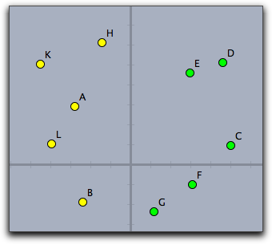

## Accessing Geometric Elements

The main communication between CindyScript and the geometry part of Cinderella is accomplished by accessing the geometric objects of a construction.
Geometric elements can be accessed in two different ways: either one can access an element by the name of its label or one can access lists of elements by special CindyScript operators.
The interaction between Cinderella and CindyScript gives CindyScript the possibility to read essentially all properties of the elements of a geometric construction.
Most properties can also be set by CindyScript.
The following sections first describe the possible ways to address geometric objects and then provide a detailed list of the supported properties.

### Accessing Elements by Their Names

Every element in a geometric construction has a unique name, its label.
This name can be used as a handle in CindyScript.
Formally, in CindyScript the element plays the role of a predefined variable.
The different properties can be read and set via the . operator (dot operator).
For instance, the line of code

    > A.size=20

sets the size of point *A* in a construction to the value 20.
If a point or a line is contained in an arithmetic operator without a dot operator, then it is automatically converted to a vector representing its position.
Thus a point is converted into an `[x,y]` vector representing its two-dimensional coordinates.
A line is converted to an `[x,y,z]` vector representing its homogeneous coordinates.
However,if one intends to set the coordinates of a point, then one has to use the dot operator explicitly.
If a handle to a geometric object is not used in an arithmetic expression, then it is still passed to the calculation as the geometric object.
Since these concepts are a bit subtle, we will clarify them with a few examples.

Assume that *A*, *B*, and *C* are points in a Cinderella construction.
The line

    > A.xy=(B+C)/2

sets the point *A* to be the midpoint of *B* and *C*.
These two points are contained in an arithmetic expression, and therefore they are immediately inverted to an `[x,y]` vector.
Setting the position of point *A* has to be done by explicitly using the `.xy` property.

The following program sets the color of all three points to green:

    > pts=[A,B,C];
    > forall(pts,p,
    >   p.color=[0,1,0];
    > )

In this code the point names are passed as handles to the list `pts`.
Traversing the list with the `forall` operator puts this handles one after the other into the variable `p`, from which their color property is accessed.

### Lists of Elements

Sometimes it is not necessary to access points individually by their name.
In particular, this happens whenever one is interested in performing an operation on all points in a construction.
This may happen, for instance, when one wants to calculate the convex hull of a point set.
For this, CindyScript provides several operators that return lists of elements.
For instance, the operator `allpoints()` returns a list of all points of a construction.
We will demonstrate this with a very tiny example.
The following program changes the color of the points depending on their position relative to the *y*-axis:

    > pts=allpoints();
    > forall(pts,p,
    >   if(p.x<0,
    >     p.color=[1,1,0],
    >     p.color=[0,1,0];
    >    )
    > )

The following picture shows the application of the code to a random collection of points.

|      |
| -------------------------------- |
| **Working with lists of points** |

### Properties of Geometric Objects

We now start with a complete description of all properties that are currently accessible via CindyScript.
Every property is at least readable.
For each property we list the type of value expected for the property, whether it is read only or also writeable, and a short description of its purpose.
Possible property types are usually as follows:

* **real:**
a real number

* **int:**
an integer number

* **bool:**
either `true` or `false`

* **string:**
a sequence of characters

* **2-vector:**
a two-dimensional vector

* **3-vector:**
a three-dimensional vector

* **3x3-matrix:**
a 3 by 3 matrix

Some properties, like the current position, are only writable for free objects.
We mark this by the word "free" in the corresponding column.

#####  Properties Common to All Geometric Objects

| Name          | Writeable | Type     | Purpose                                                                                   |
| ------------- | --------- | -------- | ----------------------------------------------------------------------------------------- |
| `color`       | yes       | 3-vector | The (red, green, blue) color vector of the object                                         |
| `colorhsb`    | yes       | 3-vector | The (hue, saturation, black) color vector of the object                                   |
| `isshowing`   | yes       | bool     | Whether the object is shown (this is inherited by all elements that depend on the object) |
| `visible`     | yes       | bool     | Whether the object is shown (not inherited by dependent objects)                          |
| `alpha`       | yes       | real     | The opacity of the object (between 0.0 and 1.0)                                           |
| `labelled`    | yes       | bool     | Whether the object shows its label                                                        |
| `name`        | no        | string   | The label of the object                                                                   |
| `caption`     | yes       | string   | A caption that may replace the name                                                       |
| `trace`       | yes       | bool     | Whether the object leaves a trace                                                         |
| `tracelength` | yes       | int      | The length of the trace                                                                   |
| `selected`    | yes       | bool     | Whether the object is currently selected                                                  |

Each geometric element has a unique name.
the string that represents this name may be accessed by `.name`.
So for instance `A.name` returns the string `"A"`.
The name may not be identical with the caption of the element shown in the construction.
If `A.caption` is the empty string the name is shown, otherwise the caption.

#####  Properties of Points

| Name       | Writeable | Type     | Purpose                                                                     |
| ---------- | --------- | -------- | --------------------------------------------------------------------------- |
| `x`        | free      | real     | The *x*-coordinate of the point                                             |
| `y`        | free      | real     | The *y*-coordinate of the point                                             |
| `xy`       | free      | 2-vector | The *xy*-coordinates of the point                                           |
| `coord`    | free      | 2-vector | The *xy*-coordinates of the point                                           |
| `homog`    | free      | 3-vector | The homogeneous coordinates of the point                                    |
| `angle`    | free      | real     | Applies only to PointOnCircle objects. The angle of the point on the circle |
| `size`     | yes       | int      | The size of the point (0..40)                                               |
| `imagerot` | yes       | real     | A rotation angle if the point is equipped with an image                     |

#####  Properties of Lines

| Name    | Writeable | Type     | Purpose                                 |
| ------- | --------- | -------- | --------------------------------------- |
| `homog` | free      | 3-vector | The homogeneous coordinates of the line |
| `angle` | free      | real     | The angle of the line                   |
| `slope` | free      | real     | The slope of the line                   |
| `size`  | yes       | int      | The size of the line (0..10)            |

#####  Properties of Circles and Conics

| Name     | Writeable | Type | Purpose                                                         |
| -------- | --------- | ---- | --------------------------------------------------------------- |
| `center` | no        | real | The center of the circle                                        |
| `radius` | free      | real | The radius of the circle                                        |
| `matrix` | no        | real | The matrix describing the quadratic form of the circle or conic |
| `size`   | yes       | int  | The size of the border line (0..10)                             |

#####  Properties of Texts

| Name      | Writeable | Type     | Purpose                                  |
| --------- | --------- | -------- | ---------------------------------------- |
| `text`    | yes       | string   | The content of the text                  |
| `pressed` | yes       | boolean  | The state of this text if it is a button |
| `xy`      | yes       | 2-vector | The position of the text                 |

#####  Properties of Animations

| Name    | Writeable | Type | Purpose                          |
| ------- | --------- | ---- | -------------------------------- |
| `run`   | yes       | bool | Whether the animation is running |
| `speed` | yes       | real | The relative animation speed     |

#####  Properties of Transformations

| Name      | Writeable | Type       | Purpose                                              |
| --------- | --------- | ---------- | ---------------------------------------------------- |
| `matrix`  | no        | 3x3 matrix | The homogeneous matrix of the transformation         |
| `inverse` | no        | 3x3 matrix | The homogeneous matrix of the inverse transformation |

####  Properties of CindyLab Objects

It is not only geometric properties that can be accessed by CindyScript.
The simulation parameters of [CindyLab](CindyLab.md) constructions can also be read and sometimes set via CindyScript.

#####  Properties of All [CindyLab](CindyLab.md) Elements

| Name       | Writeable | Type | Purpose                                                                 |
| ---------- | --------- | ---- | ----------------------------------------------------------------------- |
| `simulate` | yes       | bool | Whether the object takes part in the physics simulation or is neglected |

#####  Properties of Masses

| Name       | Writeable | Type     | Purpose                                               |
| ---------- | --------- | -------- | ----------------------------------------------------- |
| `mass`     | yes       | real     | The mass of the object                                |
| `charge`   | yes       | int      | The charge of the object                              |
| `friction` | yes       | real     | The individual friction of the object                 |
| `radius`   | yes       | real     | The radius if the mass is treated as a ball           |
| `posx`     | yes       | real     | The *x*-component of the mass's position              |
| `posy`     | yes       | real     | The *y*-component of the mass's position              |
| `pos`      | yes       | 2-vector | The mass's position vector                            |
| `vx`       | yes       | real     | The *x*-component of the velocity                     |
| `vy`       | yes       | real     | The *y*-component of the velocity                     |
| `v`        | yes       | 2-vector | The velocity vector                                   |
| `fx`       | no        | real     | The *x*-component of the force acting on the particle |
| `fy`       | no        | real     | The *y*-component of the force acting on the particle |
| `f`        | no        | 2-vector | The force vector acting on the particle               |
| `kinetic`  | no        | real     | The kinetic energy of the particle                    |
| `ke`       | no        | real     | The kinetic energy of the particle                    |

Sometimes one is interested to add a user defined force potential between masses.
This can be done by scripting a suitable piece of code in the `Integeration Tick` event.
Since internally the position of masses has a finer time scale than usual geometric movements it is necessary to access their position via the `pos`, `posx` and `posy` accessors.

#####  Properties of Springs and Coulomb Forces

| Name        | Writeable | Type | Purpose                                       |
| ----------- | --------- | ---- | --------------------------------------------- |
| `l`         | no        | real | The current length of the spring              |
| `lrest`     | no        | real | The rest length of the spring                 |
| `ldiff`     | no        | real | The distance to the rest length of the spring |
| `strength`  | yes       | real | The spring constant                           |
| `f`         | no        | real | The force vector caused by the spring         |
| `amplitude` | yes       | real | The amplitude for actuation                   |
| `speed`     | yes       | real | The speed for actuation                       |
| `phase`     | yes       | real | The phase for actuation (between 0.0 and 1.0) |
| `potential` | no        | real | The potential energy in the spring            |
| `pe`        | no        | real | The potential energy in the spring            |

#####  Property for Velocities

| Name     | Writeable | Type | Purpose                                                                        |
| -------- | --------- | ---- | ------------------------------------------------------------------------------ |
| `factor` | yes       | real | The multiplication factor between graphical representation and actual velocity |

#####  Properties of Gravity

| Name        | Writeable | Type | Purpose                                                 |
| ----------- | --------- | ---- | ------------------------------------------------------- |
| `strength`  | yes       | real | The strength of the gravity field                       |
| `potential` | no        | real | The potential energy of all masses in the gravity field |
| `pe`        | no        | real | The potential energy of all masses in the gravity field |

#####  Properties of Suns

| Name        | Writeable | Type | Purpose                                             |
| ----------- | --------- | ---- | --------------------------------------------------- |
| `mass`      | yes       | real | The mass of the sun                                 |
| `potential` | no        | real | The potential energy of all masses in the sun field |
| `pe`        | no        | real | The potential energy of all masses in the sun field |

#####  Properties of Magnetic Areas

| Name       | Writeable | Type | Purpose                            |
| ---------- | --------- | ---- | ---------------------------------- |
| `strength` | yes       | real | The strength of the magnetic field |
| `friction` | yes       | real | The friction in the magnetic area  |

#####  Properties of Bouncers and Floors

| Name    | Writeable | Type | Purpose                      |
| ------- | --------- | ---- | ---------------------------- |
| `xdamp` | yes       | real | Damping in the *x*-direction |
| `ydamp` | yes       | real | Damping in the *y*-direction |

#####  Properties of the Environment

The environment can be accessed by the built-in operator `simulation()`.
The following slots of the environment can be accessed:

| Name        | Writeable | Type | Purpose                      |
| ----------- | --------- | ---- | ---------------------------- |
| `gravity`   | yes       | real | The global gravity           |
| `friction`  | yes       | real | The global friction          |
| `kinetic`   | no        | real | The overall kinetic energy   |
| `ke`        | no        | real | The overall kinetic energy   |
| `potential` | no        | real | The overall potential energy |
| `pe`        | no        | real | The overall potential energy |

### Inspecting Elements

You can also use the generic CindyScript function `inspect(‹element›)` to access all the attributes that are available in the [Inspector](Inspector.md).
For example, if a point *A* exists in the construction, the function

    > inspect(A)

will return the array of strings

    > [name,definition,color,visibility,drawtrace,tracelength,
    > traceskip,tracedim,render,isvisible,text.fontfamily,
    > pinning,incidences,labeled,textsize,textbold,textitalics,
    > ptsize,pointborder,printname,point.image,
    > point.image.rotation,freept.pos]

Using the two-parameter form `inspect(‹element›,‹string›)` you can read all the attributes of *A* that are listed in the above array:

    > inspect(A,"text.fontfamily")

returns

    > SansSerif

With the three-parameter form `inspect(‹element›,‹string›,‹expr›)` you can also set the attributes that are not read-only (for example, you cannot change the list of incidences or the definition of an element).
The following function will set the font of *A* to a Serif font:

    > inspect(A,"text.fontfamily","Serif")

The inspect command is very powerful, as you can automate all actions you normally would have to do in the Inspector using the mouse.
Also, it gives you fine grained control over all properties.

------

#### Set a user attribute: `attribute(‹geo›,‹string1›,‹string2›)`

**Description:**
Sets the user attribute of &lt;geo&gt; identified by &lt;string1&gt; to the value &lt;string2&gt;.

#### Read a user attribute: `attribute(‹geo›,‹string›)`

**Description:**
Returns the user attribute identified by &lt;string&gt; of the geometric element &lt;geo&gt; .

Both versions of the attribute function are mainly used for interaction with the [Visage Extension](Visage.md).

------

### Creating and Destroying Elements

Starting with Cinderella version 2.1 you can also create points on the fly from CindyScript.
The function

    > p = createpoint("A",[4,6])

creates a point labelled *A* at coordinates [4,6], unless there is already an element *A*.
If it exists, it will be moved to the position given as second argument.
The value of the function is the point or the already existing element *A*.
This means that repeated executions of the function are not harmful to your code - if you need a free point at "*A*" you can ensure that it exists using the `createpoint`-command.

Using the `removeelement` function you can also remove elements from your construction.
Be aware that all dependent elements will be removed as well.
The function expects an element as argument, so you can use either

    > removeelement(A)

or

    > removeelement(element("A"))

to remove the element named "*A*".

More functions to create arbitrary elements are also available and discussed in the section [section on special operators](Interaction_with_Geometry#createandremove.md).
