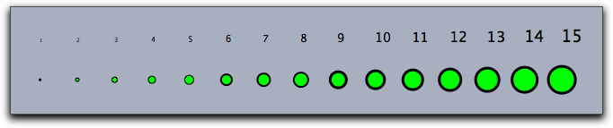
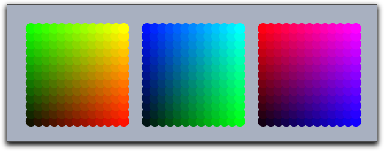
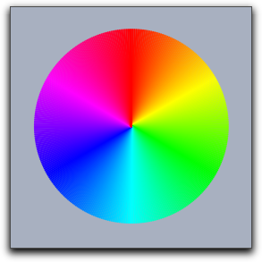

##  Appearance of Objects

The drawing engine of Cinderella stores a default appearance for each kind of element (point, line, text) that can be drawn.
Whenever a drawing statement is invoked without any modifiers, the default appearance is used to render the object.
This is very useful for drawing objects that look graphically identical.
The main attributes that are influenced by the appearance are the **color**, **size**, and **opacity** of the object.

#### Push elements on the appearance stack: `gsave()`

#### Pop elements from the appearance stack: `grestore()`

#### Clear the appearance stack: `greset()`

**Description:**
It is often necessary to switch to temporarily a different default appearance.
For this purpose the operators `gsave()` and `grestore()` are provided.
The `gsave` operator stores all information about the graphic state (sizes, colors, opacities) in a stack.
The `grestore` operator reverses this effect by popping the information from the stack.
Finally, the `greset` operator sets the stack back to its initial state.
In addition to appearance information, information on the local coordinate system is stored as well.

**See also:**
[Script Coordinate System](Script_Coordinate_System.md)

------

------

### Size

#### Set point size: `pointsize(‹number›)`

#### Set line size: `linesize(‹number›)`

#### Set text size: `textsize(‹number›)`

Default sizes can be set by three operators: `pointsize(‹number›)`, `linesize(‹number›)`, and `textsize(‹number›)`.
The size is represented by a real number.
For lines and points, the sizes are assumed to be integers between `1` and `20`.
The sizes encode absolute pixel values.
The following code produces the picture below:

    > sizes=1..15;
    > forall(sizes,
    >   pointsize(#);
    >   textsize(#+4);
    >   draw((#,0));
    >   drawtext((#,1),#);
    > )

|  |
| ------------------------ |
| ****                     |

------

###  Colors

Colors are represented by lists of three real numbers that represent the red/green/blue component of the color.
Each number is assumed to lie between 0 and 1, where 0 means black and 1 means the full color value.
With this RGB color scheme the eight fundamental colors are represented by the following vectors:

| color:  | vector: |
| ------- | ------- |
| black   | (0,0,0) |
| red     | (1,0,0) |
| green   | (0,1,0) |
| blue    | (0,0,1) |
| cyan    | (0,1,1) |
| magenta | (1,0,1) |
| yellow  | (1,1,0) |
| white   | (1,1,1) |

#### Set point color: `pointcolor(‹colorvec›)`

#### Set line color: `linecolor(‹colorvec›)`

#### Set text color: `textcolor(‹colorvec›)`

**Not available in CindyJS yet!**

#### Set color: `color(‹colorvec›)`

The default colors can be set by three operators: `pointcolor(‹colorvec›)`, `linecolor(‹colorvec›)`, and `textcolor(‹colorvec›)`.
Furthermore, the operator `color(‹colorvec›)` simultaneously sets the color of all types of objects.

If real values are interpreted as color components, then values below `0` will be replaced by `0` and values above `1` will be replaced by `1`.

**Example:**
The following code produces the picture below:

    > n=13;
    > ind=1..n;
    > pointsize(9);
    > forall(ind,i,
    >   forall(ind,j,
    >     pointcolor((i/n,j/n,0));
    >     draw((i,j),noborder->true);
    >     pointcolor((0,i/n,j/n));
    >     draw((i+15,j),noborder->true);
    >     pointcolor((j/n,0,i/n));
    >     draw((i+30,j),noborder->true);
    >   )
    > )

|  |
| ------------------------- |
| ****                      |

------

###  Opacity

#### Set opacity: `alpha(‹number›)`

**Description:**
Opacity is encoded by a real value between `0` and `1`.
Here `0` stands for completely transparent and `1` for completely opaque.
Values that are outside this range are set to either `0` or to `1`.

------

------

###  Color Functions

To make calculations with colors slightly simpler, a few default functions are declared that return color values.

#### Red colors: `red(‹number›)`

**Description:**
This operator creates an RGB vector whose green and blue values are set to `0`.
The red value is set to `‹number›`.

------

#### Green colors: `green(‹number›)`

**Description:**
This operator creates an RGB vector whose red and blue values are set to `0`.
The green value is set to `‹number›`.

------

#### Blue colors: `blue(‹number›)`

**Description:**
This operator creates an RGB vector whose red and green values are set to `0`.
The blue value is set to `‹number›`.

------

#### Gray colors: `gray(‹number›)`

**Description:**
This operator creates an RGB vector whose red, green, and blue values are all set to `‹number›`.

------

#### Rainbow colors: `hue(‹number›)`

**Description:**
This operator creates an RGB vector that creates one of the fully saturated rainbow colors.
The value of `‹number›` lies between 0 and 1.
This range of values represents a full rainbow color cycle.
For larger numbers, the cycle repeats periodically.

**Example:**
The following code produces the picture below:

    > n=360;
    > ind=(1..n)/n;
    > linesize(2);
    > forall(ind,
    >   color(hue(#));
    >   draw((0,0),(sin(#*2*pi),cos(#*2*pi)))
    > )

|  |
| ---------------------- |
| ****                   |
