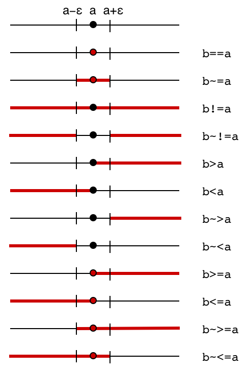

## Boolean Operators

Conditional branching may very much depend on the outcome of a boolean query.
in this section we describe all such types of queries as well as the different ways to process boolean values.

### Infix Operators

#### Testing equality: `‹expr1› == ‹expr2›`

**Description:**
This operator tests whether two expressions evaluate to the same value.
The result of this operator is either `true` or `false`.

    > 1 == 2
    < false
    > 1.0 == 1 + 0*i
    < true
    > -3*0 == 2*0
    < true
    > 3 == 3 + i
    < false

Note that `NaN` (Not a Number) compares not equal even to itself:

    > a = 0/0
    * DIVISION BY ZERO
    > a == a
    < false

Objects other than numbers may be compared as well.
To be compared equal, two objects have to be of the same type.

    > 0 == "0"
    < false
    > "true" == true
    < false

------

#### Testing inequality: `‹expr1› != ‹expr2›`

**Description:**
This operator tests whether two expressions do not evaluate to the same value.
The result of this operator is either `true` or `false`.
It is the logical negation of `‹expr1› == ‹expr2›`.

    > 1 != 2
    < true
    > 1.0 != 1 + 0*i
    < false
    > -3*0 != 2*0
    < false
    > 3 != 3 + i
    < true

Note that `NaN` (Not a Number) compares different from itself:

    > a = 0/0
    * DIVISION BY ZERO
    > a != a
    < true

Objects of different types are always different from one another.

    > 0 != "0"
    < true
    > "true" != true
    < true

------

#### Greater than: `‹expr1› > ‹expr2›`

**Description:**
This operator tests whether the expression `‹expr1›` is **greater than** the expression `‹expr2›`.
It returns a `‹bool›` value.
The comparison is available only for two situations: If both expressions are **real numbers**, then the order of size is the usual ordering of real numbers.

    > 1 > 2
    < false
    > 2 > 1
    < true
    > 1*0 > -1*0
    < false

If both expressions are **strings**, then the order is the lexicographic (dictionary) order.

    > "a" > "b"
    < false
    > "ab" > "a"
    < true
    > "ab" > "b"
    < false
    > "aa" > "a" + "a"
    < false

In all other cases (if the values are not comparable) the value `_?_` is returned.

    > 1 > 1 + i
    < _?_
    > "2" > 1
    < _?_

------

#### Less than: `‹expr1› < ‹expr2›`

**Description:**
This operator is similar to **&gt;** but tests for **less than**.

    > 1 < 2
    < true
    > 2 < 1
    < false
    > 1*0 < -1*0
    < false
    > "a" < "b"
    < true
    > "ab" < "a"
    < false
    > "ab" < "b"
    < true
    > "aa" < "a" + "a"
    < false
    > 1 < 1 + i
    < _?_
    > "2" < 1
    < _?_

------

#### Greater than or equal: `‹expr1› >= ‹expr2›`

**Description:**
This operator is similar to **&gt;** but tests for **greater than or equal to**.

    > 1 >= 2
    < false
    > 2 >= 1
    < true
    > 1*0 >= -1*0
    < true
    > "a" >= "b"
    < false
    > "ab" >= "a"
    < true
    > "ab" >= "b"
    < false
    > "aa" >= "a" + "a"
    < true
    > 1 >= 1 + i
    < _?_
    > "2" >= 1
    < _?_

------

#### Less than or equal: `‹expr1› <= ‹expr2›`

**Description:**
This operator is similar to **&gt;** but tests for **less than or equal to**.

    > 1 <= 2
    < true
    > 2 <= 1
    < false
    > 1*0 <= -1*0
    < true
    > "a" <= "b"
    < true
    > "ab" <= "a"
    < false
    > "ab" <= "b"
    < true
    > "aa" <= "a" + "a"
    < true
    > 1 <= 1 + i
    < _?_
    > "2" <= 1
    < _?_

------

#####  Fuzzy comparisons: `~=`, `~!=`, `~<`, `~>`, `~>=`, `~<=`

**Description:**
CindyScript provides a *fuzzy* variant for each comparison operator.
This version tests whether the condition is satisfied up to an epsilon bound.
Thus the test `a~=0` tests whether is the variable `a` lies between `+epsilon` and `-epsilon`.
The small value epsilon is set to `0.0000000001`.
This operator is sometimes very useful to circumvent inaccuracies which are unavoidable in purely numerical calculations.

The exact semantics of the exact and the fuzzy operators can be read off from the following diagram.
Here for each operator the picture shows for which region of `b` (marked in red) the operator evaluates to true.

------

#### Logical and: `‹bool1› & ‹bool2›`

**Description:**
Logical **and** of two Boolean values defined by the following truth table:

| `A`     | `B`     | `A & B` |
| ------- | ------- | ------- |
| `false` | `false` | `false` |
| `false` | `true`  | `false` |
| `true`  | `false` | `false` |
| `true`  | `true`  | `true`  |

If one of the two arguments is not a Boolean expression, the operator returns `_?_`.

------

#### Logical or: `‹bool1› % ‹bool2›`

**Description:**
Logical **or** of two Boolean values defined by the following truth table:

| `A`     | `B`     | `A % B` |
| ------- | ------- | ------- |
| `false` | `false` | `false` |
| `false` | `true`  | `true`  |
| `true`  | `false` | `true`  |
| `true`  | `true`  | `true`  |

If one of the two arguments is not a Boolean expression, the operator returns `_?_`.

------

#### Logical not: `!‹bool›`

**Description:**
Logical **not** of one Boolean value defined by the following truth table:

| `A`     | `!A`    |
| ------- | ------- |
| `false` | `true`  |
| `true`  | `false` |

If the argument is not a Boolean expression, the operator returns `_?_`.

    > !(1 < 0)
    < true
    > !(1 > 0)
    < false
    > !1
    < _?_

------

------

### Functional Operators

#### Logical and: `and(‹bool1›,‹bool2›)`

**Description:**
`and(x,y)` is equivalent to `x & y`.

------

#### Logical or: `or(‹bool1›,‹bool2›)`

**Description:**
`or(x,y)` is equivalent to `x % y`.

------

#### Logical not: `not(‹bool›)`

**Description:**
`not(x)` is equivalent to `!x`.

    > not(1 < 0)
    < true
    > not(1 > 0)
    < false
    > not(1)
    < _?_

------

#### Logical exclusive or: `xor(‹bool1›,‹bool2›)`

**Description:**
Logical **exclusive or** of two Boolean values defined by the following truth table:

| `A`     | `B`     | `xor(A,B)` |
| ------- | ------- | ---------- |
| `false` | `false` | `false`    |
| `false` | `true`  | `true`     |
| `true`  | `false` | `true`     |
| `true`  | `true`  | `false`    |

If one of the two arguments is not a Boolean expression, the operator returns `_?_`.

------

------

### Type Predicates

The following predicates test whether the expression `‹expr›` belongs to a certain class of objects.
The predicates are important in defining functions whose behavior depends on the type of input expressions.
Furthermore, these arguments are very useful for debugging, since they can be used to test assertions on the typing of the values in a program.

------

#### Is an integer: `isinteger(‹expr›)`

**Description:**
This operator tests whether the expression `‹expr›` is an integer.

------

#### Is a real number: `isreal(‹expr›)`

**Description:**
This operator tests whether the expression `‹expr›` is a real number.
Note that integers are also real numbers.

------

#### Is a complex number: `iscomplex(‹expr›)`

**Description:**
This operator tests whether the expression `‹expr›` is a complex number.
Note that real numbers are also complex numbers.

------

#### Is even: `iseven(‹expr›)`

**Description:**
This operator tests whether the expression `‹expr›` is an even integer.

------

#### Is odd: `isodd(‹expr›)`

**Description:**
This operator tests whether the expression `‹expr›` is an odd integer.

------

#### Is a list: `islist(‹expr›)`

**Description:**
This operator tests whether the expression `‹expr›` is a list.

------

#### Is a matrix: `ismatrix(‹expr›)`

**Description:**
This operator tests whether the expression `‹expr›` has the shape of a matrix.
This means that the entries of the list are themselves lists, all of equal length.
If there are *n* entries each of length *m* the expression represents an *n* × *m* matrix.

------

#### Is a number vector: `isnumbervector(‹expr›)`

**Description:**
This operator tests whether the expression `‹expr›` is a list all of whose entries are numbers (integer, real, or complex).

------

#### Is a number matrix: `isnumbermatrix(‹expr›)`

**Description:**
This operator tests whether the expression `‹expr›` is a matrix all of whose entries are numbers (integer, real, or complex).

------

#### Is a string: `isstring(‹expr›)`

**Description:**
This operator tests whether the expression `‹expr›` is a string.

------

#### Is a geometric element: `isgeometric(‹expr›)`

**Description:**
This operator tests whether the expression `‹expr›` represents a geometric element.

------

#### Is selected: `isselected(‹expr›)`

**Description:**
This operator tests whether the expression `‹expr›` represents a geometric element and is selected.
For a geometric element you can also use the .selected property to check this.

------

#### Is a point: `ispoint(‹expr›)`

**Description:**
This operator tests whether the expression `‹expr›` represents a geometric point.

------

#### Is a line: `isline(‹expr›)`

**Description:**
This operator tests whether the expression `‹expr›` represents a geometric line.

------

#### Is a circle: `iscircle(‹expr›)`

**Description:**
This operator tests whether the expression `‹expr›` represents a geometric circle.

------

#### Is a conic: `isconic(‹expr›)`

**Description:**
This operator tests whether the expression `‹expr›` represents a geometric conic.

------

#### Is a mass: `ismass(‹expr›)`

**Description:**
This operator tests whether the expression `‹expr›` represents a [CindyLab](CindyLab.md) mass.

------

#### Is a sun: `issun(‹expr›)`

**Description:**
This operator tests whether the expression `‹expr›` represents a [CindyLab](CindyLab.md) sun.

------

#### Is a spring: `isspring(‹expr›)`

**Description:**
This operator tests whether the expression `‹expr›` represents a [CindyLab](CindyLab.md) spring.

------

#### Is a bouncer: `isbouncer(‹expr›)`

**Description:**
This operator tests whether the expression `‹expr›` represents a [CindyLab](CindyLab) bouncer.

------
#### Is undefined: `isundefined(‹expr›)`

**Description:**
This operator tests whether the expression `‹expr›` returns an undefined element (`_?_`).
