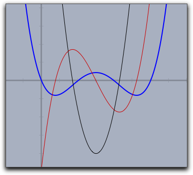
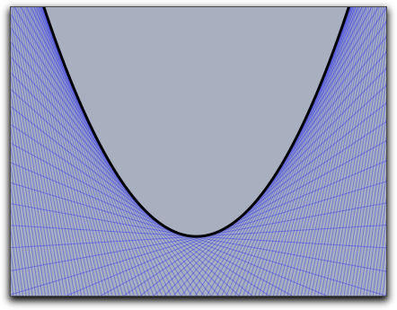
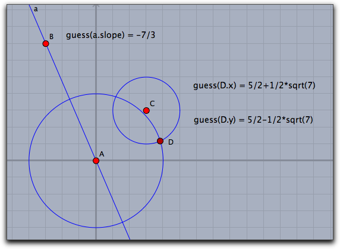
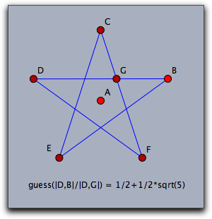
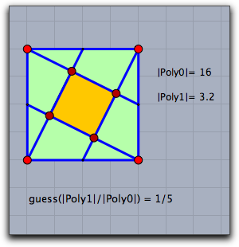
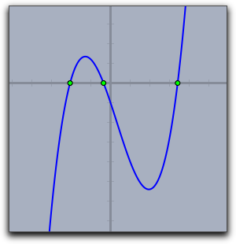

#  Calculus

CindyScript is a purely numerical language.
No symbolic computations are performed.
Nonetheless, it is possible to do some operations that can usually be done only in symbolic systems.
For instance, one can numerically calculate the derivative of a function or construct a tangent to a given function.
This section illustrates the use of these two functions.

##  Derivatives and Tangents

#### Calculating a derivative: `d(‹function›,‹var›)`

**Description:**
This operator creates a function that is the derivative of another function, which is passed as a first argument.
The variable of `‹function›` with respect to which the derivative should be calculated has to be the standard run variable `#`.
The free variable of the derivative is given as second argument.

**Example:**
The following code demonstrates the use of the operator:

    > f(x):=(x-3)*(x-2)*(x-1)*x*.4;
    > g(x):=d(f(#),x);
    > h(x):=d(g(#),x);
    > plot(f(x),size->2);
    > plot(g(x),color->(0.8,0,0));
    > plot(h(x),color->(0,0,0));
    >

The output generated by this program is the following drawing.
The blue line is the original function `f(x)`, the red line is the first derivative `g(x)`, and the black line is the second derivative `h(x)`.

|  |
| ------------------------- |
| ****                      |

The second derivative was calculated as the derivative of the first derivative.
However, a word of caution has to be said.
The derivative operator is based entirely on numerical principles.
If `f(x)` is the function that should be derived, then the corresponding derivative can be defined as `d(f(#),x)`.
Here `x` denotes the position at which the derivative should be evaluated.
The value of the derivative is then calculated by the formula

| `(f(x+eps)-f(x-eps))/2eps` |
| -------------------------- |

for a sufficiently small number `eps`.
This gives a reasonable approximation to the real derivative at this point.
However, applying this operator several times in succession increases the error significantly.
After about five iterations, the result is no longer usable.
Thus one cannot expect to perform a reasonable calculation with a fifth derivative.

**Modifiers:**
By default, the constant `eps` in the above formula is set to 0.0001.
This value forms a reasonable compromise between reliability in higher derivatives and precision.
This value can be altered using the modifier `eps->‹number›`.

------

#### Tangent: `tangent(‹function›,‹var›)`

**Description:**
This operator is very similar to the operator that calculates the derivative of a function.
However, instead of calculating the value of the derivative, this operator calculates the homogeneous coordinates of a tangent to the function at a point.
The point is entered as second argument.

**Example:**
The following sample code calculates many tangents to a parabola:

    > f(x):=(x^2)/4;
    > repeat(250,start->-30,stop->30,x,
    >   t=tangent(f(#),x);
    >   draw(t,alpha->.3);
    > );
    > plot(f(x),size->3,color->(0,0,0));
    >

The picture below shows the resulting image created by the program.

|  |
| --------------------------- |
| ****                        |

The result of the tangent function is a three-vector of homogeneous coordinates.
In addition, the line attribute of this vector is set (see [Geometric Operators](Geometric_Operators.md)) so that the coordinates are automatically drawn as a line.

------

------

##  Advanced calculations

#### Guessing the value of a real number: `guess(‹number›)`

**Description:**
The guess operator is perhaps one of the most sophisticated and powerful operators of CindyScript.
It can be used to recover a symbolic meaning from a numerical floating-point value.
The guess operator expects a number as input and returns a string.
The string should be a symbolic expression describing the input number.
The guess operator tries to generate a string of the form

| `a+b*sqrt(c)`, |
| -------------- |

where `a`, `b`, and `c` are rational numbers with numerator and denominator not larger than about 1000.
If the input number is expressible in the described way with a reasonable numeric precision, then the guess operator will generate this expression.
If not, the guess operator will return the original input number.

Thus it is possible to use the guess operator to discover whether a number is rational (then `b` is 0) or the solution of a quadratic equation.

**Examples:**
This operator is sometimes extremely useful for finding hidden properties of geometric constructions.
We illustrate this with a few examples.
The first picture shows a construction in which the slope of the line and the coordinates of the intersection of two circles are "guessed":

|  |
| ------------------------ |
| ****                     |

If the input coordinates and radii are integers, the resulting numbers will be rational or solutions of quadratic equations with relatively small coefficients.
The next two examples show two serious applications of guessing.
The first one compares two lengths in a regular pentagram.
The length ratio will be exactly the golden ratio.
The second example shows a nice connection between two areas of squares in a simple construction.

**Remark:**
The workhorse behind the guessing operator is the so-called PSLQ algorithm, a truly ingenious algorithm that is able to discover (if real numbers *x*, *y*, and *z* are given) integer dependencies *a*·*x*+*b*·*y*+*c*·*z*=0.
If one wants to check whether the real number *x* is the solution of a quadratic relation, one has to look for an integer relation of the form *a*+*b*·*x*+*c*·*x*²=0.
This is how the implementation of the guess operator works.
The solution is then reconstructed from the calculated integral coefficients.

------

#### Roots of a polynomial: `roots(‹list›)`

**Description:**
The function roots can calculate the roots of a univariate polynomial.
As input it accepts the coefficients of the polynomial, ordered from lowest degree to highest degree.
The results as well of the coefficients may be complex numbers.

**Examples:**
For instance if one wants to calculate the roots of the polynomial *1+x2=0* one can simply call `roots([1,0,1])`.
The resulting expression is `[-0-i*1,-0+i*1]`, since the polynomial has the two complex roots *+i* and *-i*.

The code below calculates and draws the roots of a cubic polynomial given by its coefficients.

    > a=0.4;
    > b=-0.4;
    > c=-3;
    > d=-1;
    > f(x):=a*x^3+b*x^2+c*x+d;
    > plot(f(x),size->2);
    > r=roots([d,c,b,a]);
    > forall(r,draw((#,0)))
    >

|  |
| ------------------------ |
| ****                     |
