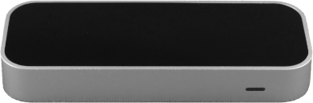

# CindyLeap

<figure>
<center>

</center>
<figcaption>Figure 1: The Leap Motion controller.</figcaption>
</figure>

The Leap Motion controller (https://www.leapmotion.com/) is a device that allows the tracking of hands and fingers for virtual and augmented reality applications. The plug-in CindyLeap is able to use the Leap Motion controller to track hands and fingers and generate gesture events. For this, it contains three major features.

1. Getting raw tracking data from hands and its finger bones. Using `getleaphandsdata` (for more details see the API documentation below), the user can get a list of tracked hands. The returned hand objects use the JSON notation and follow the JavaScript format described on https://developer-archive.leapmotion.com/documentation/v2/javascript/index.html. `leapdebugprinthands` can be used to print the data returned by `getleaphandsdata` on the console in a hierarchic format. This way, the user can interactively explore what data to use.

NOTE: All coordinates are given in cm (see https://developer-archive.leapmotion.com/documentation/v2/javascript/devguide/Leap_Coordinate_Mapping.html) measured from the origin of the controller. In order to get coordinates normalized to [-1, 1] in a so-called interaction box (see website above), `leapnormalizeposition` can be used to normalize a raw position value.

2. Getting gesture data using `getleapgesturedata`. For this to work, `enablegestures` needs to be enabled when calling `initleapmotion` (see below). Again, the format closely follows the LeapMotion JavaScript documentation mentioned above. `leapdebugprintgestures` can be used to print the data on the console in a hierarchic format.

3. Finally, the CindyScript application developer may also let the user move and rotate a Cindy3D or CindyGL scene using their hand(s). For this, the functions  `getleapmotionmodelmatrix`, `getleapmotionrotationmatrix`, `getleapmotiontranslationvector` and `getleapmotiontransformhaschanged` were added. In CindyGL, an application developer can use this functions to transform a scene depending on the returned data (for examples please refer to `examples/cindyleap/`). In Cindy3D, the transformation data is used automatically to transform the scene if `usehandtransformcdy3d` is set to true in `initleapmotion`.

To be able to use the Leap Motion controller together with CindyLeap, the user also needs to install the Leap Motion SDK on their system. The SDK can be found on the website https://developer.leapmotion.com/sdk/v2.

Please note that the Leap Motion SDK only has support for JavaScript applications until version v3. Thus, the user needs to use the older versions of the SDK together with CindyJS.

As a first step, in order to use the plugin, at the beginning of the HTML file, the following code needs to be added (possibly with different file paths).

```html
<script type="text/javascript" src="../../build/js/CindyLeap.js"></script>
```

Examples on how to use CindyLeap can be found in the folder `examples/cindyleap/`.

------

#### Initializing the Leap Motion controller: `initleapmotion()`

**Description:**
Initializes the Leap Motion controller.

**Modifiers:**

| Modifier  | Parameter                | Effect                                                   |
| --------- | ------------------------ | -------------------------------------------------------- |
| `enablegestures` | `‹boolean›` | Whether to enable gesture support (standard: disabled). |
| `usehandtransformcdy3d` | `‹boolean›` | If this value is set to true, the transform of a Cindy3D scene is multiplied with the hand transform (standard: disabled). |
| `rotationfactor` | `‹real›` | Using this variable, the user can specify the sensibility of the Leap Motion controller's rotational tracking. A factor of 2 is the standard value. This is useful in many scenarios, as a hand can't be freely rotated 360° in all directions because of limitations in the human anatomy of the hand wrists. However, if perfect 1:1 tracking (not reinforced) is desired, this factor should be set to 1. |
| `translationfactor` | `‹real›` | Using this variable, the user can specify the sensibility of the Leap Motion controller's translational/positional tracking. A factor of 1 is the standard value. This is especially necessary if the user has created a scene with large coordinates. In this case, movements of the hands might result in too small movements. This factor is also used by `leapnormalizeposition`. |

```html
<script id='csinit' type='text/x-cindyscript'>
    // Initialize Cindy3D or CindyGL ...
    use("CindyLeap");
    initleapmotion();
	// ...
</script>
```
For examples of different render function callbacks, please visit the directory `examples/cindyxr`.
