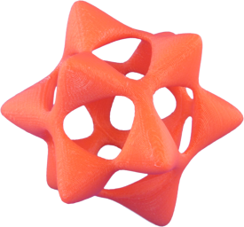
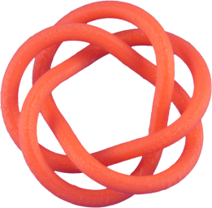
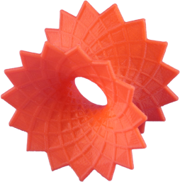
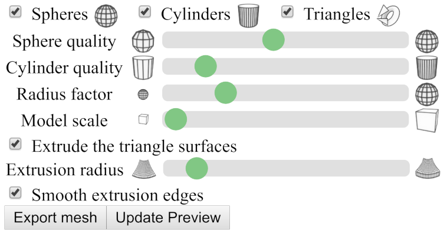
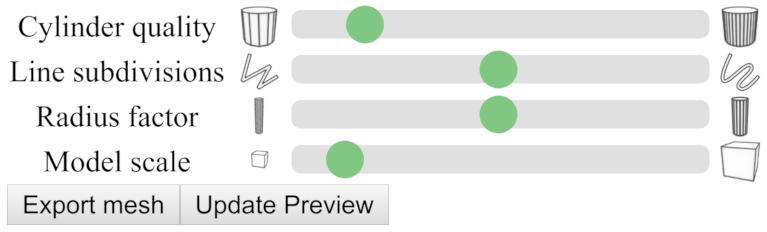
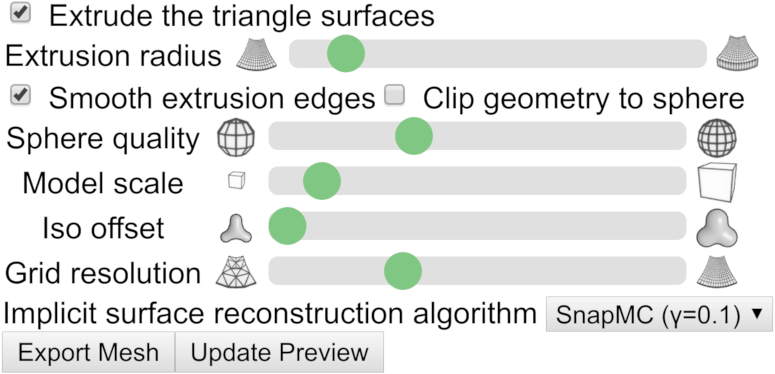

# CindyPrint

CindyPrint is a plug-in that enables the user to print three-dimensional objects from Cindy3D and CindyGL. For this, triangle meshes of the objects can be exported.

For Cindy3D, there are the options to print either the whole scene as the union of all objects (constructive solid geometry, CSG) or print tubes constructed around a path in space. For the former, the JavaScript library csg.js is used (https://github.com/jscad/csg.js/).

For CindyGL, iso surfaces of scalar functions can be created and printed using the Marching Cubes or SnapMC algorithms.

<table style="width:100%">
  <tr>
    <th></th>
    <th></th>
    <th></th>
  </tr>
  <tr>
    <td align="center">Barth sextic</td>
    <td align="center">Torus</td>
    <td align="center">Discrete asymptotic line catenoid</td>
  </tr>
</table>

As a first step, in order to use the plugin, at the beginning of the HTML file, the following code needs to be added (possibly with different file paths).

```html
<script type="text/javascript" src="../../build/js/CindyPrint.js"></script>
```
Examples on how to use CindyPrint can be found in the folder `examples/cindyprint/`.

------

## GUI Options

When exporting objects for printing, it is often desirable that the user is able to have control over different types of settings. In the following section, an overview over the different settings the user can configure is given.

<figure>

<figcaption>Figure 1: Print UI for Cindy3D scenes. Call <i>addcindy3dprintui</i> to add this user interface.</figcaption>
</figure>

In Cindy3D, spheres, cylinders and triangles are the objects a user can add to a scene. For the export, the user can specify the following information.

- What types of objects to export.
- The number of subdivisons of spheres and cylinders (i.e., sphere quality and cylinder quality).
- Whether the radius of spheres and cylinders should be scaled compared to what is specified in Cindy3D. This can be useful e.g. for models where the primary object is a triangular surface. When the surface is extruded, it may also be necessary to boost the radius of spheres and cylinders, as they might otherwise be too small.
- What scaling factor to use for the model. This factor controls how large the printed object will be. Please note that, to get the desired model size, it may be necessary to import the object into the printer's slicer software to see how large the object will be in real-world coordinates. After that, the user needs to either scale the object up in the printer software or go back to CindyPrint and export the object at a different size. Unfortunately, different printer software may interpret the dimensionless coordinates in .stl and .obj files differently, so it is hard to get a good standard scaling value.
- Whether to extrude triangle surfaces (i.e., whether to convert open surfaces without volume to hull volumes).
- The radius of these extrusion surfaces.
- Whether the extrusion surfaces should have smooth, circular edges.

<figure>

<figcaption>Figure 2: Print UI for tubes in Cindy3D. Call <i>addcindy3dprintuitubes</i> to add this user interface.</figcaption>
</figure>

When exporting tube meshes enclosing curves, different settings are necessary.

- The number of subdivisons of the cylindrical tube segements (i.e., the cylinder quality).
- The number of line subdivisions, i.e., how many points of the curve are used for discretization.
- The radius of the tube to export is specified in JavaScript. However, the user may scale the radius in the interface.
- Again, like in the user interface explained above, the model scale.

<figure>

<figcaption>Figure 3: Print UI for implicit surfaces in CindyGL. Call <i>addcindyglprintui</i> to add this user interface.</figcaption>
</figure>

Finally, in CindyGL, the user can export triangle mesh approximations of implicit surfaces of scalar functions. The following settings can be specified.

- Again, like in the user interface for Cindy3D, the model scale, whether to extrude triangle surfaces and whether to use smooth extrusion edges can be specified. Here, triangle iso surfaces are the approximations of the implicit surface to export.
- Whether to clip the geometry to a sphere. In the ray tracer for implicit surfaces, only points are shown that lie within a radius of 2.2. If this box is checked, the object will be clipped to this sphere. Note, however, that for meshes with a really high resolution, csg.js may be too numerically unstable to produce good clipping results and creates meshes with holes.
- The iso offset. Normally, the implicit surface for `f(x,y,z) = c` with `c = 0` is exported. The user may, however, specify a different iso offset `c ∈ ℝ^+_0` . This is useful for implicit surfaces like the Barth Sextic that would result in infinitely thin structures (which can of course not be printed) if `c = 0` is chosen.
- The grid resolution. This is the discretization resolution of the implicit surface. A larger value creates qualitatively better results, but is considerably slower (runtime and space complexity of `O(n³)`).
- What algorithm to use for implicit surface reconstruction. Recommended to leave at the default value. SnapMC removes very thin triangles from the mesh and thus improves the numerical stability, e.g., of csg.js compared to the standard marching cubes algorithm.

------

## API Documentation


#### Saving a triangle mesh of a Cindy3D scene: `savecsgmesh(‹meshfilename›)`

**Description:**
Computes the union of all objects in a certain Cindy3D instance to create an output mesh. The union is computed as a triangle mesh using constructive solid geometry (CSG).
- `meshfilename` is the name the triangle mesh file is given for downloading. At the moment, both binary `.stl` files and `.obj` files are supported as output formats.

**Modifiers:**

| Modifier  | Parameter                | Effect                                                   |
| --------- | ------------------------ | -------------------------------------------------------- |
| `instancename` | `‹string›` | The name of the Cindy3D instance to use. |

**Example #1:**
```javascript
savecsgmesh("mesh.stl");
```

**Example #1:**
```javascript
savecsgmesh("mesh.obj",  instancename->"Cindy3DSecondInstance");
```


------

#### Saving a triangle mesh of a tube: `savetubemesh(‹meshfilename›, ‹tubepoints›, ‹tuberadius›, ‹tubeclosed›)`

**Description:**
Generates the triangle mesh of a tube represented by a list of path line points and a radius and saves it in a file.
- `meshfilename` is the name the triangle mesh file is given for downloading. At the moment, both binary `.stl` files and `.obj` files are supported as output formats.
- `tubepoints` are the tube line points, i.e., a list of points in ℝ³.
- `tuberadius` is the radius of the tube.
- `tubeclosed` is a boolean value specifying whether the tube is closed or not (i.e., whether the curve is periodic in the start and end point). If it is not closed, caps are added at the ends.

**Example** (`f: [0°, 360°] -> ℝ³`):
```javascript
// n is the number of line points used for discretization.
n = 4000;
radius = 1;
f(w) := (sin(4*w), sin(5*w), sin(6*w));
tubePoints = apply(1..n, f((#-1)/n*360°));
savetubemesh("tube.stl", tubePoints, radius, true);
```

------

#### Adding the print UI: `addcindy3dprintui(‹meshfilename›)`

**Description:**
Adds a printing user interface to the bottom of the website. This includes both changing print settings (like the model scale) and a print preview canvas using Cindy3D. It is expected that `savecsgmesh` will be used for generating print models (and not `savetubemesh`).
- `meshfilename` is the filename to use for saving the mesh when the user presses the *Export mesh* button.

**Example:**
```html
<script id='init' type='text/x-cindyscript'>
	use("Cindy3D");
	use("Cindy3DPrint");
	addcindy3dprintui("mesh.stl");
	// ...
</script>
```

------

#### Adding the print UI: `addcindy3dprintuitubes(‹meshfilename›, ‹computetubepointsfunction, ‹numtubepointsstring›, ‹radiusstring›, ‹tubeclosed›)`

**Description:**
Adds a printing user interface to the bottom of the website. This includes both changing print settings (like the model scale) and a print preview canvas using Cindy3D. It is expected that `savetubemesh` will be used for generating print models (and not `savecsgmesh`}).
- `meshfilename` is the filename to use for saving the mesh when the user presses the *Export mesh* button.
- `computetubepointsfunction` is a function that expects the number of tube points to generate as an argument, and returns the tube points.
- `numtubepointsstring` is a string encoding the number of tube points to generate.
- `radiusstring` is a string encoding the radius of the tube.
- `tubeclosed` is a boolean value specifying whether the tube is closed or not (i.e., whether the curve is periodic in the start and end point). If it is not closed, caps are added at the ends.

NOTE: `numtubepointsstring` and `radiusstring` are passed as strings and not as variable values, as this way, arbitrary computations for the number of points and the radius can be used that are variable and dependent on the program state. These arguments will be passed to `savetubemesh`.

**Example:**
```html
<script id='init' type='text/x-cindyscript'>
	use("Cindy3D");
	use("Cindy3DPrint");
	radius = 1;
	n = 4000;
	f(w) := (sin(4*w), sin(5*w), sin(6*w));
	computeTubePoints(numTubePointsPrint) := (
		apply(1..numTubePointsPrint, f((#-1)/numTubePointsPrint*360°))
	);
	addcindy3dprintuitubes("tube.stl", computeTubePoints, "n", "radius", true);
	// ...
</script>
```


------

#### Drawing the print preview: `drawprintpreview()`

**Description:**
Renders the content of the print preview canvas using the last generated triangle mesh.

NOTE: This should be called after the rendering code of the main Cindy3D instance!

**Example (Cindy3D):**
```html
<script id='csmove' type='text/x-cindyscript'>
	begin3d();
	// ...
	end3d();
	drawprintpreview();
</script>
```

**Example (CindyGL):**
```html
<script id='csdraw' type='text/x-cindyscript'>
	colorplot(...);
	drawprintpreview();
</script>
```


------

#### Updating the print preview: `updatepreviewcdy3d()`

**Description:**
The function updates the print preview added by `addcindy3dprintui` by generating a new mesh using the objects stored in the specified Cindy3D instance (for more details see `savecsgmesh`).

NOTE: A button with the caption *Update preview* is automatically added to the UI when calling one of the `addcindy3dprintui*` functions. Thus, this function doesn't need to be called by the programmer of a website.

**Modifiers:**

| Modifier  | Parameter                | Effect                                                   |
| --------- | ------------------------ | -------------------------------------------------------- |
| `instancename` | `‹string›` | The name of the Cindy3D instance to use. |

**Example #1:**
```javascript
updatepreviewcdy3d();
```

**Example #2:**
```javascript
updatepreviewcdy3d("Cindy3DSecondInstance");
```


------

#### Updating the print preview: `updatepreviewtubes()`

**Description:**
The function updates the print preview added by `addcindy3dprintuitubes` by generating a new tube mesh using the data set by `addcindy3dprintuitubes`.

NOTE: A button with the caption *Update preview* is automatically added to the UI when calling one of the `addcindy3dprintui*` functions. Thus, this function doesn't need to be called by the programmer of a website.

**Example:**
```javascript
updatepreviewtubes();
```


------

#### Saving a triangle mesh of an iso surface: `saveisomeshtofile(‹meshfilename›, ‹F›, ‹dF›, ‹isovalue›, ‹origin›, ‹dx›, ‹nx›)`

**Description:**
This function creates an approximation of the iso surface of a scalar field and saves it to a file as a triangle mesh. For this, it evaluates the function we want to compute the implicit surface of at vertices forming a Cartesian grid in 3D.

- `meshfilename` is the filename to use for saving/downloading the triangle mesh.
- `F` is a three-dimensional scalar field function `F: U -> ℝ, U ⊆ ℝ^3`.
- `dF` is the gradient function of the scalar function above, i.e., `dF: U -> ℝ³, dF = ∇F`.
- `isovalue` is the iso value of the iso surface to construct (usually zero for the implicit surface for `F(x,y,z) = 0`, generally `F(x,y,z) = isovalue`).
- `origin` is the origin of the Cartesian grid to use for creating the iso mesh, i.e., a vector in ℝ³ representing the position of the bottom left corner of the grid.
- `dx` is the cell width in x, y, and z direction (Cartesian grid: dx = dy = dz).
- `nx` is the number of vertices in x, y and z direction (nx = ny = nz).

NOTE: The number of vertices in each dimension is larger by one than the number of cells.

**Example:**
```javascript
// Some scalar field function.
fun(x, y, z) := (x^2 + y ^2 + z^2 - 1);

// F takes vec3 instead of 3 variables.
F(p) := (fun(p.x, p.y, p.z));

// Use central difference to approximate dF.
dF(p) := (
	(F(p + [eps, 0, 0]) - F(p - [eps, 0, 0])),
	(F(p + [0, eps, 0]) - F(p - [0, eps, 0])),
	(F(p + [0, 0, eps]) - F(p - [0, 0, eps]))
) / (2 * eps);

saveisomeshtofile("model.stl", F, dF, 0, [-5,-5,-5], 0.01, 1001);
```


------

#### Saving a triangle mesh of an iso surface: `saveisomeshtofile(‹meshfilename›, ‹F›, ‹dF›, ‹isovalue›, ‹radius›)`

**Description:**
A second version of the command assuming a Cartesian grid centered at (0,0,0) and standard values for the other arguments. The function creates an approximation of the iso surface of a scalar field and saves it to a file as a triangle mesh. For this, it evaluates the function we want to compute the implicit surface of at vertices forming a Cartesian grid in 3D.

- `meshfilename` is the filename to use for saving/downloading the triangle mesh.
- `F` is a three-dimensional scalar field function `F: U -> ℝ, U ⊆ ℝ^3`.
- `dF` is the gradient function of the scalar function above, i.e., `dF: U -> ℝ³, dF = ∇F`.
- `isovalue` is the iso value of the iso surface to construct (usually zero for the implicit surface for `F(x,y,z) = 0`, generally `F(x,y,z) = isovalue`).
- `radius` is the extent of the Cartesian grid in x, y and z direction.

**Example:**
```javascript
// Changed when the user is zooming in or out.
zoom = 1;

// Some scalar field function.
fun(x, y, z) := (x^2 + y ^2 + z^2 - 1);

// F takes vec3 instead of 3 variables.
F(p) := (fun(p.x, p.y, p.z));

// Use central difference to approximate dF.
dF(p) := (
	(F(p + [eps, 0, 0]) - F(p - [eps, 0, 0])),
	(F(p + [0, eps, 0]) - F(p - [0, eps, 0])),
	(F(p + [0, 0, eps]) - F(p - [0, 0, eps]))
) / (2 * eps);

saveisomeshtofile("mesh.stl", F, dF, 0, 1/zoom);
```


------

#### Adding the print UI: `addcindyglprintui(‹meshfilename›, ‹updatepreviewcdyglarguments›)`

**Description:**
Adds a printing user interface to the bottom of the website. This includes both changing print settings (like the model scale) and a print preview canvas using Cindy3D. It is expected that `saveisomeshtofile` will be used for generating print models.

- `meshFilename` is the filename to use for saving the mesh when the user presses the *Export mesh* button.
- `updatepreviewcdyglArguments` are the arguments to use for `updatepreviewcdygl` and `saveisomeshtofile` when the user presses the *Export mesh* or *Update preview* buttons encoded as a string. This needs to be a string, as this way, the arguments can also contain a variable expression like `1/zoom` that can't be precomputed.

**Example:**
```html
<script id='init' type='text/x-cindyscript'>
    use("CindyGL");
    use("Cindy3D");
    use("CindyGLPrint");
    addcindyglprintui("isomesh.stl", "F, dF, 0, 1/zoom");
	// ...
</script>
```


------

#### Updating the print preview: `updatepreviewcdygl(‹F›, ‹dF›, ‹isovalue›, ‹origin›, ‹dx›, ‹nx›)`

**Description:**
The function updates the print preview added by `addcindyglprintui`.

- `F` is a three-dimensional scalar field function `F: U -> ℝ, U ⊆ ℝ^3`.
- `dF` is the gradient function of the scalar function above, i.e., `dF: U -> ℝ³, dF = ∇F`.
- `isovalue` is the iso value of the iso surface to construct (usually zero for the implicit surface for `F(x,y,z) = 0`, generally `F(x,y,z) = isovalue`).
- `origin` is the origin of the Cartesian grid to use for creating the iso mesh, i.e., a vector in ℝ³ representing the position of the bottom left corner of the grid.
- `dx` is the cell width in x, y, and z direction (Cartesian grid: dx = dy = dz).
- `nx` is the number of vertices in x, y and z direction (nx = ny = nz).

NOTE: A button with the caption *Update preview* is automatically added to the UI when calling `addcindyglprintui`. Thus, this function doesn't need to be called by the programmer of a website.

**Example:**
```javascript
updatepreviewcdygl(F, dF, 0, [-5,-5,-5], 0.01, 1001);
```


------

#### Updating the print preview: `updatepreviewcdygl(‹F›, ‹dF›, ‹isovalue›, ‹radius›)`

**Description:**
The function updates the print preview added by `addcindyglprintui`.

- `F` is a three-dimensional scalar field function `F: U -> ℝ, U ⊆ ℝ^3`.
- `dF` is the gradient function of the scalar function above, i.e., `dF: U -> ℝ³, dF = ∇F`.
- `isovalue` is the iso value of the iso surface to construct (usually zero for the implicit surface for `F(x,y,z) = 0`, generally `F(x,y,z) = isovalue`).
- `radius` is the extent of the Cartesian grid in x, y and z direction.

NOTE: A button with the caption *Update preview* is automatically added to the UI when calling `addcindyglprintui`. Thus, this function doesn't need to be called by the programmer of a website.

**Example:**
```javascript
updatepreviewcdygl(F, dF, 0, 1/zoom);
```
