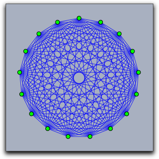

##  Elementary Drawing Functions

The operators described in this section are used to draw points, lines, and segments in a construction window.

#### Drawing: `draw(‹expr›)`

**Description:**
The `draw(‹expr›)` function is a multifunctional operator.
Depending on the meaning of `‹expr›`, the corresponding objects will be drawn if possible.
Currently, there are three possible inputs that will lead to a drawing action.
For the first two we assume that `x`, `y`, and `z` are numbers.

| Code            | Result                                                       |
| --------------- | ------------------------------------------------------------ |
| `draw([x,y])`   | Draws a point with *x*-coordinate `x` and *y*-coordinate `y` |
| `draw([x,y,z])` | Draws a point with homogenous coordinates given by `[x,y,z]` |

A word on homogeneous coordinates: If `[x,y,z]` are the homogeneous coordinates of a point, then the corresponding point that will be drawn has *xy*-coordinates `[x/z,y/z]`.
Points that have homogeneous coordinates with `z=0` correspond to "points at infinity." You won't see them in a usual Cinderella Euclidean view.
However, they will be drawn in spherical view (or when a local projective basis is set (see [Script Coordinate System](Script_Coordinate_System.md)).

**Drawing a segment:**
A segment can be drawn by providing a list of two points.
The points can be given in either Euclidean or homogeneous coordinates, which we assume for `a` and `b` below.

| Code          | Result                          |
| ------------- | ------------------------------- |
| `draw([a,b])` | Draws a segment from `a` to `b` |

**Example:**
The code below produces the following picture.
Observe that both Euclidean and homogeneous coordinates are given.
Furthermore, the segments appear in front of the points, since their drawing operators are invoked after the drawing operators for the points.

    > A=[0,0];
    > B=[0,2,2];
    > C=[1,1,1];
    > D=[1,0];
    > E=[0.5,1.5];
    > linesize(3);
    > pointsize(10);
    > draw(A);draw(B);
    > draw(C);draw(D);draw(E);
    > draw([A,B]);draw([B,C]);
    > draw([C,D]);draw([D,A]);
    > draw([C,E]);draw([B,E]);

|  |
| ------------------------ |
| ****                     |

**Drawing a line:**
Homogeneous coordinates can also be used to represent lines.
One can think of this encoding for lines by three real numbers `[a,b,c]` as encoding a line with implicit equation `a∗x+b∗y+c=0`.
A point with Euclidean coordinates `[x,y]` is on this line if and only if the equation is satisfied.
A point with homogeneous coordinates `[x,y,z]` is on this line if and only if the equation `a∗x+b∗y+c∗z=0` is satisfied.

In order to tell CindyScript whether a list of three real numbers `[a,b,c]` is a point or a line, an internal flag for the list is set by operations that produce lines as output.
So for instance, the operation `join(A,B)` calculates the line through two points `A` and `B` and sets the internal line flag.
Invoking the draw operator on the result of this operation will draw the line.
One can also force the setting of the line flag by applying the operator `line(‹expr›)`.

**Examples:**
Each of the following two draw operations draws a line:

    > draw(line([1,1,0.5]));
    > draw(join([1,2],[2,-1]));

**Modifiers:**
The draw operator can handle the modifiers summarized in the following table:

| Modifier      | Parameter                   | Effect                                                  |
| ------------- | --------------------------- | ------------------------------------------------------- |
| `point size`  | `‹real›`                    | sets the point size                                     |
| `line size`   | `‹real›`                    | sets the line size                                      |
| `size`        | `‹real›`                    | sets the line size and the point size                   |
| `pointcolor`  | `[‹real1›,‹real2›,‹real3›]` | sets the point color to an RGB value                    |
| `linecolor`   | `[‹real1›,‹real2›,‹real3›]` | sets the line color to an RGB value                     |
| `color`       | `[‹real1›,‹real2›,‹real3›]` | sets the point color and the line color to an RGB value |
| `alpha`       | `‹real›`                    | sets the opacity to the value `‹real›`                  |
| `noborder`    | `‹bool›`                    | `noborder→true` turns off the border of points          |
| `border`      | `‹bool›`                    | `border→true` the opposite of the last modifier         |
| `dashtype`    | `‹int›`                     | Specify a certain type of dashing (values 0..4 allowed) |
| `dashing`     | `‹real›`                    | Size of dashing                                         |
| `dashpattern` | `‹list›`                    | Specify an individual dash pattern                      |

Modifiers have only a local effect.
This means that the default appearance settings are not affected when a modifier is used.

**Example:**
The following piece of code illustrates the effect of the dashing modifiers.

    > linesize(3);
    > draw((0,0),(0,6),dashtype->0);
    > draw((1,0),(1,6),dashtype->1);
    > draw((2,0),(2,6),dashtype->2);
    > draw((3,0),(3,6),dashtype->3);
    > draw((4,0),(4,6),dashtype->4);
    > draw((6,0),(6,6),dashing->4);
    > draw((7,0),(7,6),dashing->6);
    > draw((8,0),(8,6),dashing->8);
    > draw((9,0),(9,6),dashing->10);
    > draw((11,0),(11,6),dashpattern->[0,4,2,4]);
    > draw((12,0),(12,6),dashpattern->[0,2,2,2,4,2]);
    > draw((13,0),(13,6),dashpattern->[0,4,2,4]);
    > draw((14,0),(14,6),dashpattern->[4,2,1,2]);

|  |
| ------------------------- |
| ****                      |

**See also:**
[Script Coordinate System](Script_Coordinate_System.md) and [Geometric Operators](Geometric_Operators.md)

------

#### Drawing segments: `draw(‹expr›,‹expr›)`

**Description:**
Invoking the draw operator with two arguments can also be used to draw a segment.
Both arguments must represent points either in Euclidean or in homogeneous coordinates.
Thus `[draw([0,0],[1,1])]` draws a segment from `[0,0]` to `[1,1]`.

**Modifiers:**
This operator can handle the same modifiers as the `draw(‹expr›)` operator.
However, the modifiers that are specific for points have no effect.

------

#### Drawing lists of objects: `drawall(‹list›)`

**Description:**
The operator `drawall(‹list›)` takes a list as argument.
Each element of the list should be such that it could be drawn by the usual `draw(‹expr›)` operator.
The `drawall` operator will then apply the draw operator to each of the entries of the list.
The `drawall` operator is extremely useful for drawing more complicated mathematical pictures that involve structured or highly interrelated mathematical content.

**Example:**
The following code produces the picture below.
The second line defines a function that maps a number to a point on the unit circle.
The line `steps=2*pi*(1..n)/n;` initializes the variable `steps` with a list of 17 angles that correspond to 17 points on the unit circle.
These points are assigned to the variable `pts` by the line `pts=apply(steps,f(#))`.
The variable `segs` contains all pairs of such points.
In the final two lines the `draw` operator is used to draw these lists of objects.

    > n=17;
    > f(x):=[sin(x),cos(x)];
    > steps=2*pi*(1..n)/n;
    > pts=apply(steps,f(#));
    > segs=pairs(pts);
    > drawall(segs,alpha->0.9);
    > drawall(pts,size->4);

|  |
| -------------------------------- |
| ****                             |

**Modifiers:**
This operator can handle the same modifiers as the `draw(‹expr›)` operator.

------

#### Connect the dots: `connect(‹list›)`

**Description:**
This operator takes a list of points as input and connects them by line segments.

**Example:**
The following code together with a collection of points of a construction produces the picture below.
The first line assigns to the variable `pts` all points of a construction.
The second line assigns to `sortpts` a list of these points that was sorted by the *x*-coordinate of the points.
Finally, the `connect` operator connects these points in the given sequential order.

    > pts=allpoints();
    > sortpts=sort(pts,#.x);
    > connect(sortpts);

|  |
| --------------------------------- |
| ****                              |

**Modifiers:**
This operator can handle the same modifiers as the `draw(‹expr›)` operator.

------

#### Draw a polygon: `drawpoly(‹list›)`

**Description:**
This operator takes a list of points as input and draws the border of the polygon described by this list.

**Modifiers:**
This operator can handle the following modifiers:

| Modifier | Parameter                   | Effect                                                  |
| -------- | --------------------------- | ------------------------------------------------------- |
| `color`  | `[‹real1›,‹real2›,‹real3›]` | sets the point color and the line color to an RGB value |
| `alpha`  | `‹real›`                    | sets the opacity to the value `‹real›`                  |

------

#### Fill a polygon: `fillpoly(‹list›)`

**Description:**
This operator takes a list of points as input and creates a polygon from them.

**Example:**
The following code creates the picture below.
In each iteration step of the `repeat` loop the square is drawn, and after this the coordinate system is rotated and scaled.

    > sq=[[-1,-1],[-1,1],[1,1],[1,-1]];
    > repeat(300,i,
    >   fillpoly(sq,color->hue(i/10));
    >   rotate(4°);
    >   scale(0.95);
    > )

|  |
| --------------------------- |
| ****                        |

**Modifiers:**
This operator can handle the following modifiers:

| Modifier | Parameter                   | Effect                                                  |
| -------- | --------------------------- | ------------------------------------------------------- |
| `color`  | `[‹real1›,‹real2›,‹real3›]` | sets the point color and the line color to an RGB value |
| `alpha`  | `‹real›`                    | sets the opacity to the value `‹real›`                  |

------

#### Drawing circles: `drawcircle(‹point›,‹radius›)`

**Description:**
Draws a circle at `‹point›` with radius given by a number `‹radius›`.
The point may be given either in euclidean or in homogeneous coordinates.

**Modifiers:**
This operator can handle the same modifiers as the `draw(‹expr›)` operator.

------

#### Filling circles: `fillcircle(‹point›,‹radius›)`

**Description:**
Draws the interior of a circle at `‹point›` with radius given by a number `‹radius›`.
The point may be given either in euclidean or in homogeneous coordinates.

**Modifiers:**
This operator can handle the following modifiers:

| Modifier | Parameter                   | Effect                                 |
| -------- | --------------------------- | -------------------------------------- |
| `color`  | `[‹real1›,‹real2›,‹real3›]` | sets the fill color to an RGB value    |
| `alpha`  | `‹real›`                    | sets the opacity to the value `‹real›` |

**Example:**
The following piece of code shows a combined usage of the `drawcircle` and the `fillcircle` operator.

    > repeat(100,i,
    >  fillcircle((0,0),1,color->hue(i/70));
    >  drawcircle((0,0),1,color->(0,0,0));
    >  translate((1.5,0));rotate(26°);scale(.95);
    > );

|  |
| ----------------------------- |
| ****                          |

------

#### Drawing circular arc: `drawarc(‹point1›,‹point2›,‹point3›)`

**Description:**
Draws a circular arc from `‹point1›` to `‹point3›` via `‹point2›`.

The points may be given either in euclidean or in homogeneous coordinates.

**Modifiers:**
This operator can handle the same modifiers as the `draw(‹expr›)` operator.

------

#### Filling circular arcs: `fillarc(‹point1›,‹point2›,‹point3›)`

**Description:**
Draws the interior of a circular arc `‹point1›` to `‹point3›` via `‹point2›`.
The points may be given either in euclidean or in homogeneous coordinates.

**Modifiers:**
This operator can handle the following modifiers:

| Modifier | Parameter                   | Effect                                 |
| -------- | --------------------------- | -------------------------------------- |
| `color`  | `[‹real1›,‹real2›,‹real3›]` | sets the fill color to an RGB value    |
| `alpha`  | `‹real›`                    | sets the opacity to the value `‹real›` |

------
