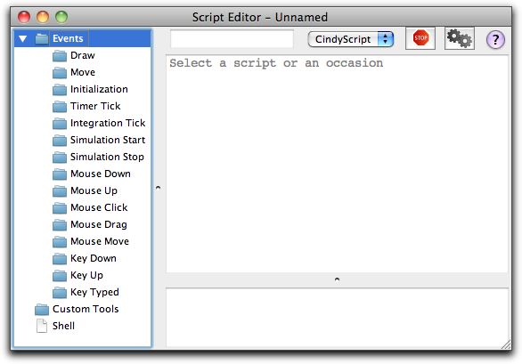

## Entering Program Code

The editor for CindyScript code can be opened by selecting the menu item *Scripting/Edit Scripts*.
When this item is selected, a window for the program code editor is opened.
Each construction has an individual program editor window.
When first opened, the editor window looks as follows:

This window contains several components that require explanation.
The main part of the window is occupied by a large white space (the middle part of the right side).
This is the text field in which you will enter your script later on.
The left side of the window is occupied by a “tree view”, in which you can select an occasion upon which a script should be executed.
The first step in entering a script consists in choosing a suitable occasion.

The lower part of the right side is reserved for console output, while the top part of the window contains some controls and a field in which you can enter a name for your script.

### Entering a Small Script

The first step in entering a script consists in choosing the occasion on which the script is to be executed.
For this, one has to click on one of the “Events” shown on the left.
Let us choose the “Draw” event.
A script entered in the Draw event will always be executed when drawing is performed on the screen.
After this entry has been selected, the main part of the window is ready for input.
Clicking in the main window allows one to enter script code.
In the example shown below a small script was entered and given the title “My first script”

Pressing the button with the two gears executes the script.
In the above example a green dotted line will be drawn consisting of ten simple dots.
Alternatively the execution can be started by pressing <kbd>⇧</kbd>+<kbd>↵</kbd>.

### Execution Slots

Every script in Cinderella is associated with an occasion on which it will be executed.
Since scripts in Cinderella are assumed to run during the runtime of the program, it may well happen that the same script is executed many times during a move.
The precise interpretation of the different occasions is described below:

*  **Draw:**
A script in this slot is executed right before a new screen picture is generated.
Scripts entered here will be executed very often.
This is the typical place to enter a script that should be automatically updated when the user drags geometric elements.

* **Move:**
Scripts in this slot will be executed even more often than those in the “Draw” slot.
They are always invoked if the position of free elements has changed.
In general, this happens more often than just at screen refresh.
Sometimes putting a script in the “Draw” slot produces strange and unexpected results.
It might then be a good idea to place it in the “Move” slot.

* **Initialization:**
A script in this slot is executed whenever the parse button of the script editor is pressed.
This slot is very useful for resetting variables or points to an initial state or position.

* **Timer Tick:**
A script in this slot causes an animation controller to be shown in geometric view (if not already present).
When the play button of the animation controller is pressed, a script in this slot will be regularly executed every few milliseconds.

* **Integration Tick:**
This event is only relevant in context with physics simulations.
If a script is contained in this slot it will be executed whenever the internal physics simulation engine requires information on the position and forces of masses.
This slot is needed when one wants to implement user specific force potentials.

* **Simulation Start:**
This script is executed when the animation controller changes from “Stop” to “Play”. It is a very good place to enter initial setups for animations.

* **Simulation Stop:**
This script is executed when the animation controller changes from “Play” to “Stop”. It is a very good place to evaluate the result of an animation.

* **Mouse Down:**
This slot and the following three slots are very useful for programming user interfaces in CindyScript.
A script in this slot is executed whenever the mouse button is pressed.
With the function `mouse()` the current mouse coordinates can be read within a script.

* **Mouse Up:**
Scripts in this slot are executed when the mouse is released.

* **Mouse Click:**
Scripts in this slot are executed when the mouse is moved.

* **Mouse Drag:**
Scripts in this slot are executed when the mouse is dragged.

* **Key Typed:**
Scripts in this slot are executed when the key on the keyboard is typed.
This slot is very useful for handling user input via the keyboard.
A string that corresponds to the currently pressed key can be accessed via the `key()` and via the `keydownlist()` functions.

* **Key Down:**
Scripts in this slot are executed when the key on the keyboard is pressed, exactly at the moment when the key moves down.

* **Key Up:**
Scripts in this slot will be executed when the key on the keyboard is released, exactly at the moment when the key moves up.

###  Control Buttons

In the upper part of the script editor window are two buttons to start and stop the program, as well as a text field to provide names to parts of the program and a language chooser for switching between different languages (at present, only CindyScript is documented).

Perhaps the most important part of these controls is the “Play” button (the one with the two gears).
Whenever this button is pressed all scripts are parsed and the execution of the program is started.
Every change in a program requires the play button to be pressed to become active.
Alternatively, the key combination <kbd>⇧</kbd>+<kbd>↵</kbd> can be used as an equivalent for pressing the play button.

It may happen that a script gets stuck in an infinite loop or performs a calculation that simply takes too long.
As a kind of emergency exit, the “Stop” button can be pressed.

The little text field on the left can be used to give a script an individual name.
Scripts with different names can be accessed and edited separately.

Finally, there is a drop-down menu for choosing the language for the script.
In this documentation you will find all necessary information for programming in CindyScript.
However, it is also possible to program in “Python”, “JRuby” or in the core Cinderella geometry language.
These options will be documented later and elsewhere.

You find more information about the ways to enter code in [the corresponding section of the reference manual](The_CindyScript_Editor.md).
