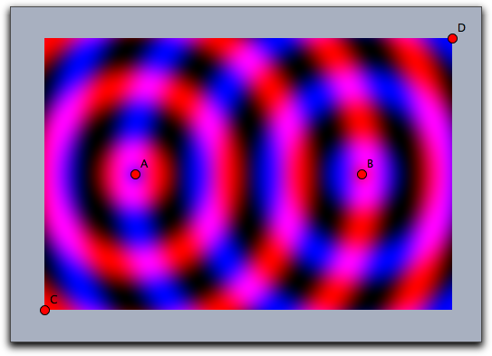
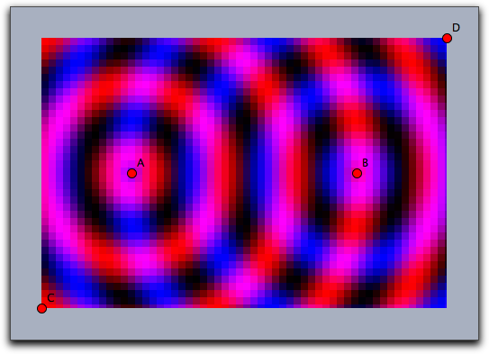
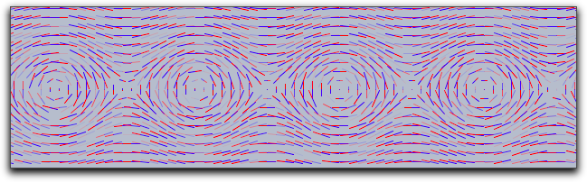

##  Function Plotting

Cinderella provides several operators that allow one to plot information about mathematical functions.
Besides simple function plotting, information on extrema, zeros, and inflection points can be shown.

###  Functions

The following functions allow to plot the graph of a function that maps a real number to a real number.

#### Plotting a Function: `plot(‹expr›)`

**Description:**
The `plot` operator can be used to plot a function.
The function must be given as an expression `‹expr›`.
This expression must contain the running variable `#` and calculate either a real value for a real input of `#` or a two-dimensional vector.
In the first case, the `plot` operator will simply draw the function.
In the latter case, it will draw a parametric plot of a function.
The coordinate system is tied to the coordinate system of the geometric views.
Instead of `#` also other running variables are detected automatically.
If there is only one free variable then this variable is taken as running variable.
If there are several free variables the `plot(…)` function searches for typical names in the order `x`, `y`, `t`, `z`.

**Examples:**
In its simplest form the `plot` operator can be used directly to plot a function.
The line `plot(sin(#))` immediately plots the function sin(*x*).
The same plot is generated by `plot(sin(x))`.

Similarly, one can first define a function whose graph is then displayed by the `plot` operator.
The following lines of code produce the picture below:

    > f(x):=1/(x^2+1)*sin(4*x);
    > plot(f(x));

If invoked with an expression `‹expr›` that produces a two-dimensional vector as output, the `plot` operator will automatically generate a parametric plot of a curve.
Here the value range for the input variable is taken by default to be from 0 to 100.
However, these defaults can easily be changed by modifiers.
The line `plot([sin(t),cos(t)]*t)` produces the following output:

**Modifiers:**
The `plot` operator supports many different modifiers.
Some of them have to be explained in detail.
They can be used to modify the appearance of the curve, to modify the plot range, to modify the position on the screen, and even to display maxima, minima, zeros, and inflection points of the function.
An overview of available modifiers is given in the table below.
Observe that some of the modifiers may even be invoked with different types of arguments, resulting in a slightly different effect.

| Modifier           | Parameter                   | Effect                                                       |
| ------------------ | --------------------------- | ------------------------------------------------------------ |
| Appearance         |
| `color`            | `[‹real1›,‹real2›,‹real3›]` | set color to specific value                                  |
| `size`             | `‹real›`                    | set line size to specific value                              |
| `alpha`            | `‹real›`                    | set opacity                                                  |
| `connect`          | `‹true›`                    | connect jumps in functions                                   |
| Iteration control  |
| `start`            | `‹real›`                    | set start value for function drawing                         |
| `stop`             | `‹real›`                    | set end value for function drawing                           |
| `steps`            | `‹real›`                    | number of set plot points (for parametric functions only)    |
| `pxlres`           | `‹real›`                    | pixel resolution of curve plotting (for real functions only) |
| Significant points |
| `extrema`          | `‹bool›`                    | mark all extrema                                             |
| `extrema`          | `[‹real1›,‹real2›,‹real3›]` | mark all extrema in specified color                          |
| `minima`           | `‹bool›`                    | mark all minima                                              |
| `minima`           | `[‹real1›,‹real2›,‹real3›]` | mark all minima in specified color                           |
| `maxima`           | `‹bool›`                    | mark all maxima                                              |
| `maxima`           | `[‹real1›,‹real2›,‹real3›]` | mark all maxima in specified color                           |
| `zeros`            | `‹bool›`                    | mark all zeros                                               |
| `zeros`            | `[‹real1›,‹real2›,‹real3›]` | mark all zeros in specified color                            |
| `inflections`      | `‹bool›`                    | mark all inflection points                                   |
| `inflections`      | `[‹real1›,‹real2›,‹real3›]` | mark all inflection points in specified color                |
| Line style         |
| `dashing`          | `‹real›`                    | width of dash patterns (default 5)                           |
| `dashtype`         | `‹int›`                     | a specific dash type (values 0…4 are allowed)                |
| `dashpattern`      | `‹list›`                    | specify an individual dash pattern                           |

**Examples:**
Here are a few examples that demonstrate the use of the modifiers:

One can easily vary the plot range by setting the start and stop values.
For instance, `plot(f(#),start->A.x,stop->B.x)` helps to control the plot using by the *x*-coordinates of two free construction points.

#####  Plot Appearance

The resolution of the plot is controlled automatically and adaptively.
The `plot(…)` function automatically increases its resolution close to singularities.
The following plot shows the output of the call `plot(sin(1/#)*#)`.
Observe the quality of the plot close to the origin.

Usually jumps in functions are detected and by default they arenot connected.
One can connect them on purpose by setting `connect->true`.

|                            |
| -------------------------- | -------------------------------- |
|  |        |
| `plot(x-floor(x))`         | `plot(x-floor(x),connect->true)` |

#####  Special Points

By using the modifiers for a curve's significant points one can display zeros, minima, maxima, and inflection points.
The following three pictures demonstrate the use of these operators.

|                          |
| ------------------------ |
|  |
| `zeros->true`            |
|  |
| `extrema->true`          |
|  |
| `inflections->true`      |

#####  Dashing

The Dashing options for a plot statement are identical to those for lines and circles.
They can be controlled by the modifiers `dashing`, `dashtype` and `dashpattern`.

* `dashtype` Can be an integer between 0 and 4 and selects one of four predefined dashing patterns.
The value 0 creates a solid line.

* `dashing` is a real number specifying the unitsize of the dashes.
Simply setting `dashing->5` already creates a standard dashing.

* `dashpattern` Can be set to a list that specifies the length of the successive dashes and empty spaces.

The following picture has been created with `plot(sin(x),dashpattern->[0,3,7,3],size->2,dashing->5)`

###  Dynamic Color and Alpha

The `color` and the `alpha` can again be functions that depend on the running variable.
By the the opacity and the color of the function plot can be varied along with the function.
The following plot was generated with the statement

    > plot(sin(x),color->hue(x/(2*pi)),size->3)

Here the `hue` function was used that cyclically generates rainbow colors.

------

#### Plotting a Function: `plot(‹expr›,‹var›)`

**Description:**
Identical to `plot(‹expr›)` but with a specified running variable.

------

#### Plotting integral-like effects: `fillplot(‹expr›)`

**Not available in CindyJS yet!**

**Description:**
Often it is desirable to highlight the area between a function graph and the x-axis of the coordinate system (for instance if one generates an applet for explaining integrals).
This can be done using the function `fillplot`.
Similarly to `plot`, this operator takes a function as argument (the running variable is determined by the same process as in `plot(…)`).
In its simplest form this operator just highlights the area traversed by the function.
The function itself is not drawn.
This could be done by explicitly calling also the `plot(…)` operator.
The following code

    > f(x):=1/(x^2+1)*sin(4*x);
    > fillplot(f(x));
    > plot(f(x));

produces the following picture:

**Warning:**
The singularity treatment of the `fillplot(…)` statement is by far less subtle than that of the `plot(…)` statement.
So although the modifiers allow to draw functions also with `fillplot` one should use `plot` for function plotting.

**Modifiers:**

| Modifier          | Parameter                   | Effect                                          |
| ----------------- | --------------------------- | ----------------------------------------------- |
| Appearance        |
| `color`           | `[‹real1›,‹real2›,‹real3›]` | set color to specific value                     |
| `pluscolor`       | `[‹real1›,‹real2›,‹real3›]` | set color for positive function values          |
| `minuscolor`      | `[‹real1›,‹real2›,‹real3›]` | set color for negative function values          |
| `alpha`           | `‹real›`                    | set opacity                                     |
| Iteration control |
| `start`           | `‹real›`                    | set start value for function drawing            |
| `stop`            | `‹real›`                    | set end value for function drawing              |
| Function graph    |
| `graph`           | `‹bool›`                    | plot also the function graph                    |
| `graph`           | `[‹real1›,‹real2›,‹real3›]` | plot also the function graph in specified color |
| `size`            | `‹real›`                    | set line size for the function graph            |

The `color` and the `alpha` modifier again support the use of functions that control color and opacity (similar to `plot`).
The following sampler illustrates different usages of the `fillplot` statement:

|                                                |
| ------------------------------------------------------------------------- |
| `fillplot(sin(x))`                                                        |
|                                                |
| `fillplot(sin(x),graph->true)`                                            |
|                                                |
| `fillplot(sin(x),graph->true,pluscolor->(.5,1,.5),minuscolor->(1,.5,.5))` |
|                                                |
| `fillplot(sin(x),graph->true,color->(sin(x),-sin(x),0))`                  |

------

#### Plotting integral like effects: `fillplot(‹expr1›,‹expr2›)`

**Not available in CindyJS yet!**

**Description:**
This function is very similar to the `fillplot(…)` statement.
However, instead of highlighting the are between a function and the x-axis it highlights the area between two functions.
The following picture

was created using the statement

    > fillplot(sin(x),cos(x),graph->true,pluscolor->(.5,1,.5),minuscolor->(1,.5,.5))

**Modifiers:**
This statement supports exactly the same modifiers as `fillplot(…)`.

------

###  Colorplots

Colorplots are useful to create visual information about functions defined in the entire plane.
They can associate a color value to every point in a rectangle.

#### Creating a colorplot: `colorplot(‹expr›,‹vec›,‹vec›)`

**Not available in CindyJS yet!**

**Description:**
The `colorplot` operator makes it possible to give a visualization of a planar function.
To each point of a rectangle a color value can be assigned by a function.
In the function `‹expr›` the running variable may be chosen as `#` (for more on running variables, see below).
However, it is important to notice that this variable describes now a point in the plane (this is a variable two dimensional coordinates).
The return value of `‹expr›` should be either a real number (in which case a gray value is assigned) or a vector of three real numbers (in which case an RGB color value is assigned).
In any case, the values of the real numbers should lie between 0 and 1.
The second and third argument determine the lower left and the upper right corners of the drawing area.

**Example:**
The following code and two points A and B produce the picture below.
In the first line, a real-valued function is defined that assigns to two points the sine of the distance between them (shifted and scaled to fit into the interval [0, 1]).
The first argument of the `colorplot` operator is now a vector of three numbers depending on the run variable `#` (the red part is a circular wave around A, the green part is zero, and the blue part is a circular wave around B).
Finally, C and D mark the corners of the rectangle.

    > f(A,B):=((1+sin(2*dist(A,B)))/2);
    > colorplot(
    >    (f(A,#),0,f(B,#)),
    >    C,D
    > )

**Running Variables:**
Usually `#` is a good choice for the running variable in the `colorplot` function.
However also other choices are possible.
The possibilites for running variables are checked in the following order:

*  If there is only one free variable in `‹expr›` then this variable is taken as running variable and interpreted as a two dimensional vector.

*  If `‹expr›` contains `#` the `#` is taken as running variable (again as a two dimensional vector)

*  If `‹expr›` contains both `x` and `y` as free varaibles the these two variables can be used as running variables the together represent the vector `(x,y)`.

*  If exactly one free variable is not assigned yet, then this variable is taken (as vector)

*  if none of the above happens also `p` (for point) and `z` (for complex number) are checked as running variables.

For instance the following line

    > colorplot((sin(2*x),sin(2*y),0),A,B)

produces the following picture:

**Modifiers:**
The `colorplot` operator supports three modifiers.
The modifier `pxlres` can be set to an integer that determines the size in pixels of the elementary quadrangles of the color plot.
The picture above was taken with `pxlres->2` which is the default value.
Setting the `pxlres` modifier either to 1 or to 2 produces stunning pictures.
However, one should be aware that for each elementary quadrangle of the `colorplot` output the function has to be evaluated once.
The computational effort grows quadratically as `pxlres` is linearly reduced.
So sometimes it is also good practice to reduce the pxlres modifier in order to gain more preformace.
The picture below has been rendered by setting `pxlres->8`.

One can also dynamically change the resolution.
For this there is another modifier `startres` that can be used to have gradually improving plots, thus combining the best of two worlds.
For example, using both `startres->16` and `pxlres->1` you will get a coarse plot during interactive movements, which will be re-calculated automatically with a finer resolution whenever there is enough time.

Furthermore, the `colorplot` operator supports a modifier `alpha` that is used to control the opacity.
This modifier can even be set to values that depend parametrically on the running variable.

The picture below was generated by the following code, which is only a slight modification of the code of one of the previous examples:

    > f(A,B):=((1+sin(2*dist(A,B)))/2);
    > colorplot(
    >    (f(A,#),0,f(B,#)),
    >    C,D,
    >    pxlres->2,
    >    alpha->-abs(#)+5
    > )

------

------

###  Vector Fields

Vector fields can be used to visualize flows and forces.
They have many applications in the visualization of systems of differential equations.

#### Drawing a vector field: `drawfield(‹expr›)`

**Not available in CindyJS yet!**

**Description:**
The `drawfield` operator can be used to draw a vector field.
The function must be given as an expression `‹expr›`.
This expression must contain a running variable (usually `#`), which should this time represent a two-dimensional vector (as in color plot).
The result should also be a two-dimensional vector.
Applying the operator `drawfield` to this expression will result in plotting the corresponding vector field.
The field will be animated.
This means that it will change slightly with every picture.
Therefore, it is often useful to put the `drawfield` operator into the “timer tick” evaluation slot.
This creates an animation control in the geometric view.
Running the animation will automatically animate the vector field.
The running variable policy is identical to the one in the `colorplot(…)` statement.
In particular it is possible to use free variables `x` and `y` to represent the two dimensional location `(x,y)`

**Examples:**
We consider a vector field defined by the function `f(x,y)=(y,sin(x))`.
The corresponding code with the function definition and the call of the `drawfield` operator is as follows:

    > f(v):=[v.y,sin(v.x)];
    > drawfield(f(#));

Alternatively the same picture could be generated by

    > drawfield((y,sin(x)));

To generate the picture, a collection of needlelike objects is thrown onto the drawing surface.
These needles will be oriented according to the vector field.
During the animation, the needles move according to the vector field.
It is also possible to replace the needles by small snakelike objects that give a more accurate impression of the vector field but take a longer time for calculation.
This can be done with a suitable modifier.

    > f(v):=[v.y,sin(v.x)];
    > drawfield(f(#),stream->true,color->(0,0,0));

**Modifiers:**
The `drawfield` operator supports many modifiers that control the generation process of the vector field.
To help in understanding them we first describe in a bit more detail how the pictures are generated.

The pictures are generated by showing the movement of some test objects under the influence of the field.
By default, the test objects are needlelike.
They are initially positioned on a regular grid.
Since this usually creates many visual artifacts, they are randomly distorted within a certain radius around the grid points.
During an animation the needles are moved in the direction of the force field.
The needles' lengths represent the strength of the field.

| Modifier     | Parameter                   | Effect                                    |
| ------------ | --------------------------- | ----------------------------------------- |
| Test objects |
| `resolution` | `integer`                   | original grid cell size in pixels         |
| `jitter`     | `integer`                   | distortion of the test objects            |
| `needlesize` | `‹real›`                    | maximum size of the needles               |
| `factor`     | `‹real›`                    | scaling factor of the field strength      |
| `stream`     | `‹bool›`                    | use needles or streamlets                 |
| `move`       | `‹real›`                    | speed of moving objects                   |
| Appearance   |
| `color`      | `[‹real1›,‹real2›,‹real3›]` | set streamlet color or first needle color |
| `color2`     | `[‹real1›,‹real2›,‹real3›]` | set second needle color                   |

The following picture demonstrates the original grid.
It has been rendered with `move->0` and `jitter->0`.
It shows clear artifacts resulting from unnatural alignment in the horizontal or vertical direction.

The following picture has been rendered with `resolution->5` and `stream->true`.

------

#### Drawing a complex vector field: `drawfieldcomplex(‹expr›)`

**Not available in CindyJS yet!**

**Description:**
This operator is very similar to the `drawfield` operator.
However, it takes as input a one-dimensional complex function.
The real and imaginary parts are treated as *x* and *y* components for the vector field.
Otherwise, the operator is completely analogous to the previous one.

**Example:**
The following example demonstrates the use of the operator with a complex polynomial whose zeros are determined by four points in the drawing:

    > f(x):=(x-complex(A))*(x-complex(B))*(x-complex(C))*(x-complex(D));
    > drawfieldcomplex(f(#),stream->true,resolution->5,color->(0,0,0))

The modifiers are analogous to those for the `drawfield` operators.

------

#### Drawing a force field: `drawforces()`

**Not available in CindyJS yet!**

**Description:**
This operator is again very similar to the `drawfield` operator.
However, this time it is related to a physics simulation in CindyLab.
No arguments are required, and it shows the forces on a potential test charge that is placed at various locations on the screen.
The test charge has mass = 1, charge = 1, and radius = 1.
However, no other particle will interact with it.
Sometimes it will be necessary to use the `factor` modifier to amplify the force field.
The following example shows the interaction among four charged particles.

------

#### Drawing the force field of a point: `drawforces(‹mass›)`

**Not available in CindyJS yet!**

**Description:**
There is another operator that draws the force field with respect to a fixed mass particle.
The particle itself takes no part in the calculation of the forces.
In this way, one can visualize the forces that act on a certain particle.

------

------

###  Grids

Grids can be used to visualize transformations that map the plane onto itself.
With grids, the deformation induced by such a map can be visualized.

#### Mapping a rectangular grid: `mapgrid(‹expr›)`

**Not available in CindyJS yet!**

**Description:**
This operator takes a rectangular grid and deforms it by a function given in `‹expr›`.
By default the range of the original grid is taken to be the unit rectangle in the plane.
The bound of this rectangle may be altered using modifiers.
It is also possible to visualize complex maps by using the `complex->true` modifier.

**Modifiers:**
There are several modifiers controlling the behavior of this function.

| Modifier          | Parameter                   | Effect                                  |
| ----------------- | --------------------------- | --------------------------------------- |
| Appearance        |
| `color`           | `[‹real1›,‹real2›,‹real3›]` | set color to specific value             |
| `alpha`           | `‹real›`                    | set opacity                             |
| `size`            | `‹real›`                    | set the size of the grid lines          |
| Iteration control |
| `xrange`          | `[‹real›,‹real›]`           | *x*-range of the source rectangle       |
| `yrange`          | `[‹real›,‹real›]`           | *y*-range of the source rectangle       |
| `resolution`      | `‹int›`                     | number of grid lines in both directions |
| `resolutionx`     | `‹int›`                     | number of grid lines in *x*-direction   |
| `resolutiony`     | `‹int›`                     | number of grid lines in *y*-direction   |
| `step`            | `‹int›`                     | refinement in both directions           |
| `stepx`           | `‹int›`                     | refinement in *x*-direction             |
| `stepy`           | `‹int›`                     | refinement in *y*-direction             |
| Type              |
| `complex`         | `‹boolean›`                 | use complex functions                   |

**Examples:**
The following piece of code exemplifies the usage of the `mapgrid` operator.
Is also illustrates the effect of the `xrange` and `yrange` modifiers.
It displays the effect of a two-dimensional function that squares the *x* and the *y* coordinate separately.

    > f(v):=(v_1^2,v_2^2);
    > linesize(1.5);
    > mapgrid(f(v),color->(0,0,0));
    > mapgrid(f(v),xrange->[1,2],color->(.6,0,0));
    > mapgrid(f(v),yrange->[1,2],color->(.6,0,0));
    > mapgrid(f(v),xrange->[1,2],yrange->[1,2],color->(0,.6,0));

In the following example we see that generally the grid lines do not have to stay straight or parallel.

    > f(v):=(v_1*sin(v_2),v_2*sin(v_1));
    > linesize(1.5);
    > mapgrid(f(v),xrange->[1,2],yrange->[1,2]);

The following simple example illustrates the usage of `mapgrid` for complex functions.

    > mapgrid(z^2,complex->true);

Using the `resolution` modifier, one can specify the number of mesh lines that are generated.

    > mapgrid(z^2,complex->true,resolution->4);

By default, the `mapgrid` command directly connects the mesh points.
This may lead to pictures that do not really map the mathematical truth.
Using the `step` modifier, one can introduce additional steps between the mesh points.

    > mapgrid(z^2,complex->true,resolution->4,step->5);

The results of the last three pieces of code are shown below.

Grids carry very characteristic information about complex functions.
The following three pictures show grids for the functions `z*z`, `sin(z)`, `1/z` and `tan(z)` respectively.

|  |  |
| ------------------------ | ------------------------ |
|  |  |

------

------

###  Oscillographs

Oscillographs allow to visualize dynamic changes of values in physic simulations and animations.

#### Curve drawing of physics magnitudes: `drawcurves(‹vec›,‹list›)`

**Not available in CindyJS yet!**

**Description:**
In real and simulated physical situations one is often interested in plotting curves that show how magnitudes evolve over time.
For this, the `drawcurves` operator was created.
Here `‹vec›` is a two-dimensional vector that refers to the lower left corner of the drawing area, and `‹list›` is a list of values that are to be observed.
When the animation runs, the values are updated and the corresponding curves are drawn.

**Example: ** The next picture shows a very simple application of the `drawcurves` operator.
In CindyLab, a physical pendulum was constructed.
The following code produces a curve plot of the *x* coordinate of the moving point and of its *x* velocity:

    > drawcurves([0,0],[D.x,D.vx])

**Modifiers:**
The `drawcurves` operator supports many modifiers.
Than can be used to change the appearance of the curves and to show additional information.

| Modifier    | Parameter                    | Effect                                                                                                 |
| ----------- | ---------------------------- | ------------------------------------------------------------------------------------------------------ |
| Dimension   |
| `width`     | `‹real›`                     | pixel width of the plot range                                                                          |
| `height`    | `‹real›`                     | pixel height for each curve                                                                            |
| Appearance  |
| `border`    | `‹bool›`                     | show the borders of the table                                                                          |
| `back`      | `‹bool›`                     | show a background                                                                                      |
| `back`      | `[‹real1›,‹real2›,‹real3›]`  | show background in specified color                                                                     |
| `backalpha` | `‹real›`                     | opacity of background                                                                                  |
| `colors`    | `[‹col1›,‹col2›,‹col3›,…]`   | provide a color for each curve                                                                         |
| Information |
| `texts`     | `[‹text1›,‹text2›,…]`        | provide a caption for each curve                                                                       |
| `showrange` | `‹bool›`                     | show the max and min values for each curve                                                             |
| Rendering   |
| `range`     | `‹string›`                   | `"peek"` scales to the absolute measured maximum, `"auto"` scales to the currently shown part of the curve |
| `range`     | `[‹string1›,‹string2›,…]`    | individual `"peek"`/`"auto"` for each curve                                                            |

The following piece of code demonstrates the usage of the modifiers.
It shows a weakly coupled pendulum and its energy behavior.

    > linecolor((1,1,1));
    > textcolor((0,0.8,0));
    > drawcurves((-7,-3),
    >   [A.x,B.x,A.ke,B.ke,a.pe+b.pe+c.pe],
    >   height->50,
    >   color->(1,1,1),
    >   back->(0,0,0),
    >   backalpha->1,
    >   range->"peek",width->400,
    >   colors->[
    >     [1,0.5,0.5],
    >     [0.5,1,0.5],
    >     [1,0.5,0.5],
    >     [0.5,1,0.5],
    >     [0.5,0.5,1]],
    >   texts->[
    >     "PosA = "+ A.x,
    >     "PosB = "+B.x,
    >     "EnergyA = "+A.ke,
    >     "EnergyB = "+B.ke,
    >     "PotentialEnergy = "+(a.pe+b.pe+c.pe)
    > ]
    > );

The corresponding drawing looks as follows:

