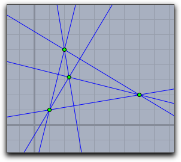
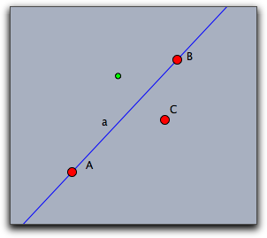

#  Geometric Operators

The geometric operators provide high-level access to several elementary geometric operations.
They can be applied either directly to objects of the geometric construction or to vectors (lists of numbers) that represent the coordinates for the geometric objects.
If the operator returns a geometric object, it can also be directly drawn with the draw operator.

##  Lists and Coordinates

Coordinates for lines are always homogeneous coordinates (i.e., list of three numbers that are the parameters `[a,b,c]` of the line with equation `a∗x+b∗y+c=0`).
Coordinates of points can be either Euclidean (list of two numbers `[x,y]`) or homogeneous (list of three numbers `[x,y,z]` that represent the point `[x/z,y/z]`).
Return values will always be in homogeneous coordinates.
In the text below we will indicate pointlike arguments as `‹point›`, and linelike arguments as `‹line›`, without further mentioning that the coordinates have to of the kind described above.

Since both object types `‹point›` and `‹line›` can be represented as lists of three numbers, one needs a way to distinguish these two cases.
Internally, a list carries flags that indicate whether it has an intrinsic geometric meaning.
One can interrogate the operator `geotype(‹list›)` to obtain this information.
This operator will return either `"Point"`, `"Line"`, or `"None"`.
If such a vector has an intrinsic geometric meaning, then the `draw` operator will automatically render it as such an object.

##  Elementary geometric operators

#### Intersection of two lines: `meet(‹line1›,‹line2›)`

**Description:**
This operator calculates the intersection of two lines.
It returns a point in homogeneous coordinates.

------

#### Joining two points: `join(‹point1›,‹point2›)`

**Description:**
This operator calculates the line joining two points.
The result is a line in homogeneous coordinates.

------

#### Calculating a parallel: `parallel(‹point›,‹line›)`

#### Calculating a parallel: `parallel(‹line›,‹point›)`

**Description:**
This operator takes a point and a line as input (no matter in which order) and calculates the line parallel to the input line and through the input point.
The line that is returned by the operator is again represented in homogeneous coordinates.
This operator refers to Euclidean geometry.
Hyperbolic and spherical computations are not supported.
This operator can also be abbreviated by `para(...)`.

------

#### Calculating an orthogonal line: `perpendicular(‹point›,‹line›)`

#### Calculating an orthogonal line: `perpendicular(‹line›,‹point›)`

**Description:**
This operator takes a point and a line as input (no matter in which order) and calculates the line orthogonal to the input line and through the input point.
The line that is returned by the operator is again represented in homogeneous coordinates.
This operator refers to Euclidean geometry.
Hyperbolic and spherical computations are not supported.
This operator can also be abbreviated by `perp(...)`.

**Combined example:**
The following code creates the picture below.
Observe that the operator generates an implicit typing of the return values, so that the objects are rendered correctly automatically.

    > A=[1,1];
    > B=[2,5];
    > C=[7,2];
    > a=join(B,C);
    > b=join(C,A);
    > c=join(A,B);
    > ha=perpendicular(A,a);
    > hb=perpendicular(B,b);
    > hc=perpendicular(C,c);
    > X=meet(ha,hb);
    > X.xy
    < [2.3043, 3.1739]

    - skip test: can't do drawing in the test suite.
    > drawall([a,b,c,d,ha,hb,hc,X,A,B,C]);

------

#### Calculating an orthogonal vector: `perpendicular(‹list›)`

**Description:**
If the `perp` operator is invoked with one argument, it assumes that the input list consists of two numbers.
Such a list `[a,b]` is converted by this operator to the list `[-b,a]`, which is the input vector rotated 90° about the origin.

------

#### The area of a triangle: `area(‹point1›,‹point2›,‹point3›)`

**Description:**
This operator calculates the (oriented) area of the triangle formed by the three vertices `‹point1›`, `‹point2›`, and `‹point3›`.
If the orientation of the points is counterclockwise, then the area is positive, while if it is clockwise, the area is negative.
If the three points are collinear, then the area is zero.

------

------

##  Useful Linear Algebra Operators

The following operators from linear algebra are very useful in geometric contexts.
They apply especially to numeric vectors of length 3.
For other useful operators in that context (such as `dist`, matrix operations, and scalar product) please refer to [Vectors and Matrices](Vectors_and_Matrices).

#### The determinant of three points: `det(‹vec1›,‹vec2›,‹vec3›)`

**Description:**
This operator calculates the determinant of a 3 × 3 matrix formed by the three three-dimensional vectors `‹vec1›`, `‹vec2›`, `‹vec3›`.
Unlike the general determinant method described in the section [Vectors and Matrices](Vectors_and_Matrices), this method is optimized for performance.

------

#### The cross product of two points: `cross(‹vec1›,‹vec2›)`

**Description:**
This operator takes two three-dimensional vectors and calculates their cross product.
The cross product is a three-dimensional vector that is orthogonal to the other two vectors.

------

------

##  Conversion and Typing

#### The type of an object: `geotype(‹list›)`

**Description:**
This operator determines whether an object has an explicit geometric meaning.
It returns a string that is either `"POINT"`, `"LINE"`, or `"NONE"`.

Applying this operator to a list of two numbers will always return `"Point"`.
Applying this operator to a list of three numbers will return `"Point"`, `"Line"`, or `"None"`, depending on whether the internal meaning of this list is set to `"Point"` or `"Line"`.
Values that come from geometric objects of a Cinderella construction will always be assigned the corresponding geometric type.
The output of the `meet` operator is always a "Point".
The output of the operators `join`, `parallel`, and `perpendicular` is always a "Line".
Furthermore, the geometric meaning can be explicitly set using the operators `line` and `point`.

------

#### Declaring points: `point(‹vec›)`

**Description:**
This operator explicitly sets the geometric type of a vector of three numbers to `"Point"`.
If the argument is not a list of three numbers, the operator has no effect.

------

#### Declaring lines: `line(‹vec›)`

**Description:**
This operator explicitly sets the geometric type of a vector of three numbers to `"Line"`.
If the argument is not a list of three numbers, the operator has no effect.

------

#### Points to complex numbers: `complex(‹point›)`

**Description:**
This operator takes a point and converts it into a complex number.
Here the usual coordinate system of the Euclidean plane is identified with the Gaussian complex plane.
The point `[x,b]` is converted to the complex number `a+i∗b`.

------

#### Complex numbers to points: `gauss(‹point›)`

**Description:**
This operator is the opposite of the previous one.
It converts a complex number `a+i∗b` to a list of two numbers `[a,b]`.

------

#### Cross ratio of four points or lines: `crossratio(‹vec›,‹vec›,‹vec›,‹vec›)`

**Description:**
Calculates the geometric cross ratio of four points.
If the four points are collinear, the usual cross ratio in the real projective plane is calculated.
If the points are not collinear, then the cross ratio of the corresponding points in the complex projective line is calculated.
For collinear finite points these two results coincide.

    > crossratio([2,-2], [1,-1,1], [0,1], [0,0,1])
    < 0.8 + i*0.1

------

#### Cross ratio of four numbers: `crossratio(‹numb›,‹numb›,‹numb›,‹numb›)`

**Description:**
Calculates the cross ratio (A/B)/(C/D) of four real or complex numbers.
An extremely useful geometric invariant.

    > crossratio(2-2*i, 1-i, i, 0)
    < 0.8 + i*0.1

------

##  Geometric Transformations and Bases

One can deal with geometric transformations on an explicit algebraic level.
Transformations are best represented by 3 × 3 matrices.
A real transformation corresponds to a matrix multiplication of the homogeneous coordinates of a point by the corresponding transformation matrix.
There are several operators for the calculation of these transformation matrices.

#### Reflection in a line: `linereflect(‹line›)`

**Description:**
Returns a matrix that represents a reflection in the line `‹line›`.

**Example:**
The following code takes the line *a*, creates the reflecting transformation, and maps point *C* by multiplying its homogeneous coordinates by the matrix.
The result is the green point in the figure.

    - skip test: can't do drawing in the test suite.
    > m=linereflect(a);
    > draw(m*C.homog);

------

#### Reflection in a point: `pointreflect(‹point›)`

**Description:**
Returns a matrix that represents a reflection in the point `‹point›`.

------

#### Translation: `map(‹point1›,‹point2›)`

**Description:**
Returns a matrix that represents a translation that maps `‹point1›` to `‹point2›`.

------

#### Similarity: `map(‹point1›,‹point2›,‹point3›,‹point4›)`

**Description:**
Returns a matrix that represents a similarity that maps `‹point1›` to `‹point2›` and `‹point3›` to `‹point4›`.

------

#### Affine transformation: `map(‹point1›,‹point2›,‹point3›,‹point4›, ‹point5›,‹point6›)`

**Description:**
Returns a matrix that represents an affine transformation that maps `‹point1›` to `‹point2›`, `‹point3›` to `‹point4›`, and `‹point5›` to `‹point6›`.

------

#### Projective transformation: `map(‹point1›,‹point2›,‹point3›,‹point4›, ‹point5›,‹point6›,‹point7›,‹point8›)`

**Description:**
Returns a matrix that represents a projective transformation that maps `‹point1›` to `‹point2›`, `‹point3›` to `‹point4›`, `‹point5›` to `‹point6›`, and `‹point7›` to `‹point8›`.

------
