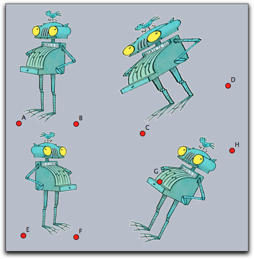

##  Image Manipulation and Rendering

Cinderella.2 introduces various ways to deal with images in a geometric construction.
On the one hand it is possible to load images in a media database and use them freely within CindyScript.
Images can be arbitrarily moved, rotated, scaled, perspectively transformed, of even transformed by a function.
On the other hand it is possible to use the drawing functions of CindyScript to create custom images which are in turn used as blueprint for other purposes.

###  The Media Browser

Prior to all image rendering there is the need to load a specific image into a Cinderella construction.
This is done via the Media Browser from which you can access all images you need for a construction.
The Media Browser is opened by choosing the menu item *File/Media Browser*.
You can load images by pressing the *+* button and remove them again by pressing the *-* button.
Once an image is loaded you see its internal name and a preview of the image.
By default, the image name is the original file name, but you can change the internal name by double clicking and editing it.
Under this name the image can be accessed from within CindyScript.

The images in the media browser can also be used as images for points and lines as well as background of the view port.
This functionality is available via the [inspector](Inspector.md).

------

###  Drawing and Transforming Images

#### Drawing an image: `drawimage(‹pos›,‹imagename›)`

**Description:**
This operator takes an image (from the Media Browser) and draws it at a position given by the first argument.
The reference point is by default the center of the image.
However, this can be altered by modifiers.
Also the scaling and positioning of the image can be altered.

**Examples:**
The following code draws the image called `myimage` at the position given by the point *A*.

    > drawimage(A,"myimage"))

The following code shows various usages of the `drawimage` command.
It creates the graphics given below.

    > drawimage(A,"myimage");
    > drawimage(B,"myimage",scale->1.5,angle->30°);
    > drawimage(C,"myimage",ref->"lb");

**Reference points:**
Reference points can be specified using the modifiers `ref`, `refx`, `refy`.
While the `ref` modifier expects a two-dimensional information, the last two refer to the two coordinate directions separately.
The reference information may be given in three different ways:

*  Absolute to the pixel coordinates of the original image: If the image for example was originally 400 by 800 pixels then the modifier `ref->[100,200]` will specify the position in the middle of the left lower quarter of the image.

*  As relative quotient with respect to the image's dimensions: In this case the position has to be specified by a percentage value (given as a string).
So for instance, `ref->["25%", "25%"]` would again place the reference point in the middle of the left lower quarter of the image - but now independent of the original image's dimensions.

*  Symbolically as a pair of letters: Here in the *x*-direction the letters `l`, `c`, `r` represent *left', *center* and *right*.
In the *y* direction the letters `b`, `c`, `t` represent *bottom', *center* and *top*.
So the lower left corner may be specified either by `ref->"lb"` or by `ref->["l","b"]`.

All the position information can be used separately for the horizontal and vertical direction, for example with `refx->"l"`, `refx->100` or `refx->"10%"`.
The following picture exemplifies the positions of a few reference points.

**Modifiers:**
The modifiers of this function are listed below.

| Modifier    | Parameter          | Effect                                    |
| ----------- | ------------------ | ----------------------------------------- |
| `alpha`     | `0.0 ... 1.0`      | opacity of the image                      |
| `angle`     | `real`             | rotation angle around the reference point |
| `rotation`  | `real`             | same as `angle`                           |
| `scale`     | `real`             | scaling                                   |
| `scale`     | `vec`              | separate scaling in both directions       |
| `scalex`    | `real`             | scaling in *x*-direction                  |
| `scaley`    | `real`             | scaling in *y*-direction                  |
| `flipx`     | `boolean`          | vertical reflection                       |
| `flipy`     | `boolean`          | horicontal reflection                     |
| `ref`       | `see above`        | *xy*-position of reference point          |
| `refx`      | `see above`        | *x*-position of reference point           |
| `refy`      | `see above`        | *y*-position of reference point           |
| `rendering` | `"fast" or "nice"` | specify the rendering quality             |

------

#### Drawing an image: `drawimage(‹pos›,‹pos›,‹imagename›)`

**Description:**
Draws a copy of an image whose position and size is specified by two reference points.
By default, these reference points are the two corners of the bottom edge.
It is also possible to specify the position of the reference points within the image.
The syntax for specifying a reference point is the same as in the previous command.

**Examples:**
The simplest usage of the operator is given in the following example.

    > drawimage(A,B,"myimage"))

More advanced usages can be found in the following example.
They generate the picture given below.
Observe how in the third row the two reference points are specified individually.

    > drawimage(A,B,"MyImage");
    > drawimage(C,D,"MyImage",aspect->1);
    > drawimage(E,F,"MyImage",flipx->true);
    > drawimage(G,H,"MyImage",refx1->"20%",refy1->"50%",ref2->"rt");

**Modifiers:**

| Modifier    | Parameter          | Effect                               |
| ----------- | ------------------ | ------------------------------------ |
| `alpha`     | `0.0 ... 1.0`      | opacity of the image                 |
| `flipx`     | `boolean`          | vertical reflection                  |
| `flipy`     | `boolean`          | horicontal reflection                |
| `aspect`    | `real`             | specify the aspect ratio             |
| `ref1`      | `see above`        | *xy*-position of reference point one |
| `refx1`     | `see above`        | *x*-position of reference point one  |
| `refy1`     | `see above`        | *y*-position of reference point one  |
| `ref2`      | `see above`        | *xy*-position of reference point two |
| `refx2`     | `see above`        | *x*-position of reference point two  |
| `refy2`     | `see above`        | *y*-position of reference point two  |
| `rendering` | `"fast" or "nice"` | specify the rendering quality        |

**Example:**
A more advanced example is given below.
It iteratively maps two points (stored the variables `a` and `b`) by a transformation matrix.
In each step a corresponding image is drawn.
This code creates a logarithmic spiral of images.
One important issue may arise if many images are drawn in a construction.
One may have to select between *nice* or *fast* drawing of the images.
For this there is a modifier `rendering` that may be set either to `"nice"` or to `fast`.
By default it is set to prefer the *nice* rendering.

    > a=(1,0);
    > b=(2,-1);
    > w=30°;
    > m=((cos(w),-sin(w)),
    >    (sin(w),cos(w)))*0.9;
    > 
    > repeat(100,
    >  drawimage(a,b,"MyImage");
    >  a=m*a;
    >  b=m*b;
    > );

------

#### Drawing an image: `drawimage(‹pos›,‹pos›,‹pos›,‹imagename›)`

**Description:**
This operator is similar to the last one.
Now three reference points are specified to define an affine transformation of the image.
By default, the reference points are set to the bottom/left, the bottom/right and the top/left corner of the picture.
Again the position op the reference points can be altered by modifiers.

**Example:**
The simplest usage of this command is given by the following piece of code.

    > drawimage(A,B,C,"MyImage"))

This operator is very well suited to draw images under geometric transformation like reflections or rotations.
For this the picture has to be drawn with respect to the mapped reference points.
An example of this technique is given in the code below

    > drawimage(A,B,C,"MyImage"))
    > drawimage(A',B',C',"MyImage"))

**Modifiers:**
The command supports the same modifiers as the previous one and the following additional ones.

| Modifier | Parameter   | Effect                                 |
| -------- | ----------- | -------------------------------------- |
| `ref3`   | `see above` | *xy*-position of reference point three |
| `refx3`  | `see above` | *x*-position of reference point three  |
| `refy3`  | `see above` | *y*-position of reference point three  |

------

#### Drawing an image: `drawimage(‹pos›,‹pos›,‹pos›,‹pos›,‹imagename›)`

**Description:**
Again this command is more general than the previous one.
This time the four corners (or more generally reference points) are used to specify a projective transformation of the image.
By default the position of the reference points are the corners of the image taken in counterclockwise order starting at *left/bottom*.

**Example:**
The simplest usage is given by the following piece of code.

    > drawimage(A,B,D,C,"myimage")

The following picture shows the result of this statement.
For clarity a projective grid has been added to the picture.

**Modifiers:**
The command supports the same modifiers as the previous one and the following additional ones.

| Modifier | Parameter   | Effect                                |
| -------- | ----------- | ------------------------------------- |
| `ref4`   | `see above` | *xy*-position of reference point four |
| `refx4`  | `see above` | *x*-position of reference point four  |
| `refy4`  | `see above` | *y*-position of reference point four  |

------

#### Deforming an image: `mapimage(‹imagename›,‹function›)`

**Description:**
This command is extremely powerful for deforming images by functions.
Usually the function is assumed to be a function that maps a two dimensional vector to a two dimensional vector.
By using the `complex->true` modifier it is also possible to use functions that map the complex plane to the complex plane.
The range of the function must be specified by the modifiers `xrange` and `yrange`.
If they are not specified the ranges are assumed to be between 0.0 and 1.0.
The rectangles defined by these ranges are identified with the rectangular region of the image.
From there every image point is mapped to create the resulting image.
The functionality is essentially similar to the `mapgrid` command.

**Example:**
Here the *x*-axis of the image is deformed using a function that modifies its width by adding a *sin*-function.
In the code the function is specified first.
Then it is used in the `mapimage` command.
For better reference a grid has been added to drawing that illustrates the deformation.

    > f(z):=(z_1*(sin(z_2)+1.3),z_2);
    > mapimage("MyImage",f(#),
    > xrange->(-1,1),
    > yrange->(0,pi),resolution->30
    > );
    > mapgrid(f(#),color->(0,0,0),alpha->0.3,
    > xrange->(-1,1),
    > yrange->(0,pi),resolution->30
    > );

This example is similar to the previous one but now a complex function is used to
specify the mapping.

    > r=complex(A);
    > f(x):=exp(r*x);
    > mapimage("myimage",f(#),
    >   complex->true,
    >   xrange->(0,1),
    >   yrange->(0,pi),resolution->30
    > );
    > 
    > mapgrid(f(#),complex->true,
    > xrange->(0,1),yrange->(0,pi),color->(0,0,0),alpha->0.5
    > ,resolutiony->30,resolutionx->10,step->10,size->1);

**Modifiers:**
The function supports the following modifiers.

| Modifier     | Parameter     | Effect                           |
| ------------ | ------------- | -------------------------------- |
| `alpha`      | `0.0 ... 1.0` | opacity of the image             |
| `xrange`     | `vec`         | start and end in *x*-direction   |
| `yrange`     | `vec`         | start and end in *y*-direction   |
| `complex`    | `boolean`     | use a complex function           |
| `resolution` | `int`         | quality of the resulting picture |

------

#### Getting dimensions of an image: `imagesize(‹imagename›)`

**Description:**
Returns the original size of an image.
This is a pair of integer values that refers to the pixel width and height of the original image.

------

#### Getting pixel data: `imagergb(‹imagename›,‹int›,‹int›)`

**Description:**
The function `imagergb(‹imagename›,x,y)` delivers the raw data of the color information of the pixel at original position *(x,y)*.
The operator returns a four-dimensional vector with the raw data of the color.
The first three entries represent the *rgb*-value with each entry ranging from 0 to 255.
The last entry represents the alpha value.

**Example:**
The following piece of (slightly elaborate) code first asks for the dimensions of an image and then samples the image in both directions.
It plots a point with the corresponding color and opacity and by this creates a very rough copy of the image.

    > drawimage(A,"MyImage",scale->2);
    > dim=imagesize("MyImage");
    > forall((0..dim_1/10)*10,i,err(i);
    >   forall((0..dim_2/10)*10,j,
    >     col=imagergb("MyImage",i,j);
    >     draw((i,-j)*.03,color->(col_1,col_2,col_3)/255,
    >                     alpha->col_4,
    >                     border->false)
    >   )
    > )

------

------

###  Creating Custom Images

So far all image operation referred to images that were preloaded via the Media Browser.
There is also the possibility to create images within Cinderella.
Once these images are created one can pipe all drawing operations coming from CindyScript to such an image using the `canvas` commands.
The result of the drawing operations are no longer directly visible.
However, once the custom image is filled with content one can use it and draw it to draw it on screen with one of the `drawimage` operations.
The `canvas` operations are built in analogy to the `drawimage` operations.
You use them to place the canvas (the custom image) at an arbitrary place in the plane, even using transformations.
This concept is extremely powerful and in the context of this manual we will only sketch its basic usage.

------

#### Creating a custom image: `createimage(‹imagename›,‹int›,‹int›)`

**Description:**
The operator `createimage(‹imagename›,width,height)` creates an image buffer of the specified dimensions.
Initially such an image is fully transparent and contains no drawings.
The image buffer is accessible under the specified name in the Media Browser and can furtheron be used by `drawimage(...)` operations.

------

#### Erasing an image: `clearimage(‹imagename›)`

**Description:**
This operator removes all content from an image.
After using this operator the image still exists, but it does no longer contain any drawings.
It is completely transparent.

------

#### Removing an image: `removeimage(‹imagename›)`

**Description:**
This operator removes the image from the Media Browser.
After this the image can no longer be accessed.

------

### Painting on a canvas

Images that are creating by a script may be used as a canvas to which drawing commands from CindyScript may be piped.
This is a very powerful concept, but it needs a little explanation.

Imagine you have a piece of code that creates some drawing, say:

    >  linesize(3);
    >  repeat(10,i,
    >    drawcircle(K,i*.5);
    >  );
    >  drawtext(K+(-2,2),"These are",size->20,color->(1,1,0));
    >  drawtext(K+(-2,-2),"some circles",size->20,color->(1,1,0));

This drawing will look like the picture below on the left.
Now we want to use this drawing code to generate a custom bitmap.
For this we first must create such a bitmap.

We can do this by creating an image in the *initialization* part of the script with the following code:

    > createimage("image",400,400)

Now we specify a region in which this bitmap should be used as a canvas.
In our example we do so by drawing a rectangle with certain corner points.

The code for drawing on the canvas is included as an argument to a `canvas` function in the following way:

    > canvas(F,G,E,"image",
    >     //....here comes the drawing code....
    > )

The position of the canvas is specified as a parallelogram generated by the corner points *F*, *G* and *E*.
The picture above on the right illustrates which part of the original drawing will be captured by the canvas.
Actually, all the drawing operations that are inside the `canvas` will not have any directly visible effect, so the above picture on the right is just for illustration purposes.

Next, the image can be painted at any location using a `drawimage(...)` command.
The complete resulting code may look like

    > clearimage("image");
    > canvas(F,G,E,"image",
    >  linesize(3);
    >  repeat(10,i,
    >    drawcircle(K,i*.5);
    >  );
    >  drawtext(K+(-2,2),"These are",size->20,color->(1,1,0));
    >  drawtext(K+(-2,-2),"some circles",size->20,color->(1,1,0));
    > );
    > drawimage(A,B,C,D,"image");

The `drawimage(...)` command used here produces a projective transformation of the generated canvas.
It results in the picture shown below on the left

Notice that the image in the canvas is only a bitmap.
Therefore it must be specified with suitable resolution.
If in the initialization one would have used only an 80x80 bitmap, the picture on the right would result.

Once a canvas is created, it may be used without any further effort in different places and orientations many times.
This is illustrated by the following piece of code and the corresponding image.

    > drawimage(A,P,M,O,"image");
    > drawimage(B,P,M,Q,"image");
    > drawimage(D,R,M,O,"image");
    > drawimage(C,R,M,Q,"image");

------

#### Painting on a canvas with one reference point: `canvas(‹pos›,‹imagename›,‹drawing code›)`

**Description:**
This operator uses `‹imagename›` as a canvas and positions it with respect to one reference point identically to the rules of the `drawimage(‹pos›,‹imagename›)` operator.
All drawing statements in `‹drawing code›` are piped to the canvas.
The positioning modifiers are identical to those of `drawimage(‹pos›,‹imagename›)`.

**Modifiers:**
The command has several modifiers.

| Modifier   | Parameter   | Effect                                    |
| ---------- | ----------- | ----------------------------------------- |
| `angle`    | `real`      | rotation angle around the reference point |
| `rotation` | `real`      | same as `angle`                           |
| `scale`    | `real`      | scaling                                   |
| `scale`    | `vec`       | separate scaling in both directions       |
| `scalex`   | `real`      | scaling in *x*-direction                  |
| `scaley`   | `real`      | scaling in *y*-direction                  |
| `flipx`    | `boolean`   | vertical reflection                       |
| `flipy`    | `boolean`   | horicontal reflection                     |
| `ref`      | `see above` | *xy*-position of reference point          |
| `refx`     | `see above` | *x*-position of reference point           |
| `refy`     | `see above` | *y*-position of reference point           |

------

#### Painting on a canvas with two reference points: `canvas(‹pos›,‹pos›,‹imagename›,‹drawing code›)`

**Description:**
This operator uses `‹imagename›` as a canvas and positions it with respect to two reference point identical to the rules of the `drawimage(‹pos›,‹pos›,‹imagename›)` operator.
All drawing statements in `‹drawing code›` are piped to the canvas.
The positioning modifiers are identical to those of `drawimage(‹pos›,‹pos›,‹imagename›)`.

**Modifiers:**
The command has several modifiers.

| Modifier | Parameter   | Effect                                  |
| -------- | ----------- | --------------------------------------- |
| `flipx`  | `boolean`   | vertical reflection                     |
| `flipy`  | `boolean`   | horicontal reflection                   |
| `aspect` | `real`      | specify the aspect ratio                |
| `ref1`   | `see above` | *xy*-position of first reference point  |
| `refx1`  | `see above` | *x*-position of first reference point   |
| `refy1`  | `see above` | *y*-position of first reference point   |
| `ref2`   | `see above` | *xy*-position of second reference point |
| `refx2`  | `see above` | *x*-position of second reference point  |
| `refy2`  | `see above` | *y*-position of second reference point  |

------

#### Painting on a canvas with three reference points: `canvas(‹pos›,‹pos›,‹pos›,‹imagename›,‹drawing code›)`

**Description:**
Similar to the above statement.
Now three reference points are used.
The positioning modifiers are identical to those of `drawimage(‹pos›,‹pos›,‹pos›,‹imagename›)`.

**Modifiers:**
The command supports the same modifiers as the previous command and in addition.

| Modifier | Parameter   | Effect                                 |
| -------- | ----------- | -------------------------------------- |
| `ref3`   | `see above` | *xy*-position of reference point three |
| `refx3`  | `see above` | *x*-position of reference point three  |
| `refy3`  | `see above` | *y*-position of reference point three  |
