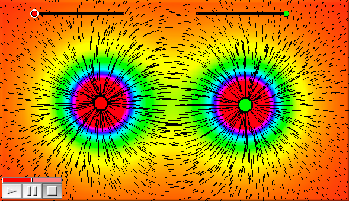

##  Interaction with CindyLab

#### The simulation environment: `simulation()`

**Not available in CindyJS yet!**

**Description:**
This operator provides a handle to the simulation environment.
The simulation environment offers several fields than can be used to access its global properties.

| Name        | Writeable | Type | Purpose                                  |
| ----------- | --------- | ---- | ---------------------------------------- |
| `friction`  | yes       | real | total friction of the simulation         |
| `gravity`   | yes       | real | total gravity of the simulation          |
| `kinetic`   | no        | real | total kinetic energy of the simulation   |
| `ke`        | no        | real | total kinetic energy of the simulation   |
| `potential` | no        | real | total potential energy of the simulation |
| `pe`        | no        | real | total potential energy of the simulation |

------

#### Applying a force: `addforce(‹mass›,‹vec›)`

**Not available in CindyJS yet!**

**Description:**
Applying a force `‹vec›` to an existing mass `‹mass›`.
This operator is useful to implement user defined force fields.
It should be called in the `Integration Tick` slot.

------

#### Applying a force: `setforce(‹mass›,‹vec›)`

**Not available in CindyJS yet!**

**Description:**
Setting the force `‹vec›` for an existing mass `‹mass›`.
This operator is very useful to implement user defined force fields.
It should be called in the `Integration Tick` slot.

------

#### Probing particle forces: `force(‹vector›)`

**Not available in CindyJS yet!**

**Description:**
The operator `force` is closely related to physics simulations in CindyLab.
It can be used for testing the force that would affect a mass particle at a specific position.
The vector `‹vector›` represents the position.
The operator returns a two-dimensional vector that is the force at this position.
If no modifiers are used, the operator assumes that the probe particle has `mass=1`, `charge=1` and `radius=1`.

**Example:**
The following picture was generated using the `drawforces` operator and a color plot of the `force` operator.
It shows the force field and force strength of the electrostatic field of two charges.

    > A.charge=(|C,G|-3)*3;
    > B.charge=(|E,H|-3)*3;
    > f(x):=max((0,min([x,1])));
    > colorplot([0.1,0.1,0.1]+hue(f(abs(force(#)/3))),(-10,-10),(20,10));
    > drawforces(stream->true,move->0.2,color->[0,0,0],resolution->10);

**Modifiers:**
It is also possible to set the values of mass, charge and radius explicitly.
Each of these values can be set by a modifier of the same name.
If at least one of these values is set explicitly, then all unset values are set to zero.
Thus `force([0,0],charge->2)` tests the force that would be present for a particle of `charge=2`, `mass=0`, and `radius=0` at point `[0,0]`.
