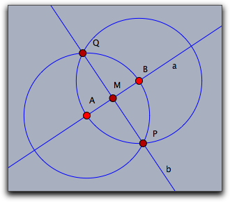
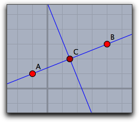

## Interaction with Geometry

CindyScript can interact in different ways with a geometric drawing that was created with Cinderella.
We already saw that it can read the numerical data and appearance of geometric elements.
However it can also change the position of the free elements of a construction.
CindyScript may even inquire and change the construction sequence by creating and deleting new geometric elements.

### Moving Elements

The calculations within CindyScript can be used to control the positions of free elements in a Cinderella construction.
One way of doing this is to explicitly set the position information of a free element.
For instance, if `A` is a free point, the line `A.xy=[1,1]` sets this point to the coordinates `[1,1]`.
Another way of moving an element is with the `moveto` operator.

#### Moving a Free Element: `moveto(‹geo›,‹pos›)`

**Description:**
In this operator, `‹geo›` is a free geometric object and `‹pos›` (usually a vector) describes a position to which this object should be moved.
Calling this operator simulates a move for this geometric object.

If `‹geo›` is a free point, then `‹vec›` can be a list `[x,y]` of two numbers or a list `[x,y,z]` of three numbers.
The first case is interpreted as Euclidean coordinates, while the second case is interpreted as homogeneous coordinates and sets the point to `[x/z,y/z]`.

If `‹geo›` is a free line, then `‹vec›` has to be a list of three numbers `[a,b,c]`, and the line is set to the line described by the equation `a∗x + b∗y + c = 0`.

**Examples:**
The following code lines summarize possible ways to move geometric elements (we also include the possibilities of moving elements by accessing their data fields):

    > //A is a free point
    > moveto(A,[1,4]);        //moves A to Euclidean coordinates [1,4]
    > A.xy=[1,4];             //moves A to Euclidean coordinates [1,4]
    > A.x=5;                  //sets the x coordinate of A to 5, lets the y coordinate unchanged
    > A.y=3;                  //sets the y coordinate of A to 3, lets the x coordinate unchanged
    > moveto(A,[2,3,2]);      //moves A to homogeneous coordinates [2,3,2]
    > A.homog=[2,3,2];        //moves A to homogeneous coordinates [2,3,2]
    > 
    > //a is a free line
    > moveto(a,[2,3,4]);      //moves a to homogeneous coordinates [2,3,4]
    > a.moveto=[2,3,4];       //moves a to homogeneous coordinates [2,3,4]
    > 
    > //b is a line through a point
    > a.slope=1;              //sets the slope of the line to 1
    > 
    > //C is a circle with free radius
    > C.radius=1;             //sets the radius of the circle to 1

------

------

### Handles to Objects

#### Who has moved: `mover()`

**Description:**
This operator gives a handle to the element that is currently moved by the mouse.

------

#### Elements close to the mouse: `elementsatmouse()`

**Description:**
This operator gives a list with handles to all the elements that are close to the current mouse position.

**Example:**
The following script is a little mean.
Putting it into the mouse move slot will make exactly those elements disappear that are close to the mouse.
They reappear if the mouse moves away again.

    > apply(allelements(),#.alpha=1);
    > apply(elementsatmouse(),#.alpha=0);
    > repaint();

------

#### Incidences of an object: `incidences(‹geo›)`

**Description:**
This operator returns a list all the elements that are generically incident to a geometric element `‹geo›`.

------

#### Getting an element by name: `element(‹string›)`

**Description:**
This operator returns the geometric object identified by the name given in `‹string›`.

**Example:**
The `element` operator is necessary for situations where the element name is not a valid variable identifier or already used by a user-defined or built-in name.
For example, if you try to access the color of a line having the name `i`, you cannot write `i.color=[1,1,1](1,1,1)

` as `i` is reserved for the complex unit.
Instead, you use:

    > element("i").color=[1,1,1]

------

### Creating and Removing Elements

#### Creating a free point: `createpoint(‹string›,‹pos›)`

**Description:**
This operator creates a new point with label `‹string›`.
The point will beset to position `‹pos›`.
If an element with this name is already exists then no new element is created.
However, if there already exists a free point with this name, then this point is moved to the specified position.

------

#### Creating a geometric element: `create(‹list1›,‹string›,‹list2›)`

**Description:**
With this operator it is possible to generate arbitrary geometric elements that are functional in a geometric construction.
Due to the fact that algorithms may create multiple outputs several subtleties arise.
This function is meant for expert use only.

The first list contains a list `‹list1›` of element names for the generated output objects of the algorithm.
`‹string›` is the internal name of the geometric algorithm.
The second list `‹list2›` is a list of the parameters that are needed for the definition.
The following table shows a few possible creation statements.

    > create(["A"],"FreePoint",[[1,1,1]]);
    > create(["B"],"FreePoint",[[4,3,1]]);
    > create(["a"],"Join",[A,B]);
    > create(["X"],"CircleMP",[A,B]);
    > create(["Y"],"CircleMP",[B,A]);
    > create(["P","Q"],"IntersectionCircleCircle",[X,Y]);
    > create(["b"],"Join",[P,Q]);
    > create(["M"],"Meet",[a,b]);

This sequence of statements creates the fully functional construction shown below.
Observe that in the sixth statement when two circles are intersected there must be a list of two output elements specified.

|  |
| ------------------------- |
| ****                      |

You can find the valid parameters for elements by constructing them manually and using the `algorithm` and `inputs` functions described below.

------

#### Removing a geometric element: `removeelement(‹geo›)`

**Description:**
Removes a geometric element together with all its dependent elements from a construction.

------

#### Input elements of an element: `inputs(‹geo›)`

**Description:**
This operator returns a list all the elements that are needed to define the object `‹geo›`.
These may be other geometric, elements, numbers or vectors.

------

#### Algorithm of an element: `algorithm(‹geo›)`

**Description:**
This operator returns a string that resembles the algorithm of the definition the object `‹geo›`.

**Example:**
The following piece of code generates all information contained in a construction sequence.

    > els=allelements();
    > data=apply(els,([[#.name],algorithm(#),inputs(#)]));

Applied to the construction of a perpendicular bisector in the picture below it generates the following output:

    >  [[["A"],"FreePoint",[[4,4,-4]]],
    >   [["B"],"FreePoint",[[4,-3,1]]],
    >   [["a"],"Join",[A,B]],
    >   [["C"],"Mid",[A,B]],
    >   [["b"],"Orthogonal",[a,C]]
    > ]

|  |
| ---------------------------- |
| ****                         |

------

### Accessing Element Properties

Element properties like color, size, etc.
are conveniently accessible via operators like `.color`, `.size` etc.
However, elements have by far more properties.
All of them can be generically accessed by the following operators.

#### List all inspectable properties: `inspect(‹geo›)`

**Description:**
Returns a list of names of all private properties of a geometric element.

**Example:**
The operator `inspect(A)` applied to a the free point *A* returns the following list of property names.

    > [name,definition,color,color.red,color.blue,color.green,alpha,visibility,
    > drawtrace,tracelength,traceskip,tracedim,render,isvisible,
    > text.fontfamily,plane,pinning,incidences,labeled,textsize,textbold,textitalics,
    > ptsize,pointborder,printname,point.image,
    > point.image.media,point.image.rotation,freept.pos]

------

#### Accessing an inspectable property: `inspect(‹geo›,‹string›)`

**Description:**
Accesses an arbitrary inspectable property.

**Example:**
One can access the color of a point *A* by `inspect(A,"color")`

------

#### Setting an inspectable property: `inspect(‹geo›,‹string›,‹data›)`

**Description:**
Setting the value of inspectable property.

**Example:**
One can set the color of a point *A* to white by `inspect(A,"color",(1,1,1))`

------

------

#### Forcing a repaint operation: `repaint()`

**Description:**
This operator causes an immediate repaint of the drawing surface.
This operator is meant to be used whenever a script has updated a construction and wants to display the changes.
It is not allowd to use this operator in the `draw` or in the `move` slot.

------

#### Forcing a delayed repaint operation: `repaint(‹real›)`

**Description:**
As `repaint` but with a time delay of as many milliseconds as given by he parameter

------

#### Points on a locus: `locusdata(‹locus›)`

**Description:**
This operator returns a list of points in *xy*-coordinates that are all on a locus given by the name `‹locus›` of a geometric element.
