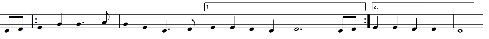
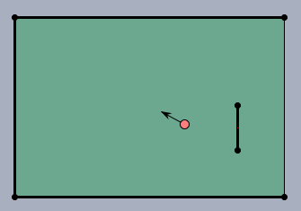
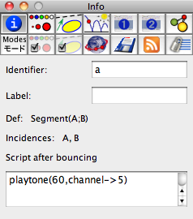

##  MIDI Functions

###  How Cinderella-MIDI Works

MIDI stands for **M**usical **I**nstrumental **D**igital **I**nterface.
It is a standard protocol that is used for the communication between electronic instruments and computers.
MIDI provides control over individual tones, sequences of tones, the sound of instruments, polyphony, volume and many other things which are essential for the perception of music.
The CindyScript MIDI interface offers a streamlined set of statements for creating music and sound effects easily and flexibly.
Before we dive into the details of these statements we will give a brief overview of the architecture and the capability of MIDI.
This will make it easier to understand its interaction with Cinderella.
Whenever easily possible we also mention how the MIDI statements are accessible in CindyScript.

### Notes, Channels and Instruments

Roughly speaking the most fundamental functionality of MIDI is to send information to a music synthesizer and tell it to play a note.
In its most simple form this piece of information just consists of a number between 0 and 127 that tells the synthesizer what note has to be played.
In standard midi coding the number 60 represents the note C in the middle octave.
Increasing or decreasing this number by one corresponds to a half-step.
Thus 61 corresponds to C#, 60 to D and so forth.
The following table associates notes and numbers for the range of two octaves:

| C  | C# | D  | D# | E  | F  | F# | G  | G# | A  | B  | H  | c  | c# | d  | e# | e  | f  | f# | g  | g# | a  | b  | h  | c' |
| -- | -- | -- | -- | -- | -- | -- | -- | -- | -- | -- | -- | -- | -- | -- | -- | -- | -- | -- | -- | -- | -- | -- | -- | -- |
| 60 | 61 | 62 | 63 | 64 | 65 | 66 | 67 | 68 | 69 | 70 | 71 | 72 | 73 | 74 | 75 | 76 | 77 | 78 | 79 | 80 | 81 | 82 | 83 | 84 |

The corresponding CindyScript statement for playing a tone of a certain pitch is `playtone`.
Try for example `playtone(60)`.

However, a note comprises far more than a certain pitch.
It has an associated instrument by which it is played, a volume, a certain location in space and many other characteristics.
Some of them are more of a static nature (like the instrument) and do not change from tone to tone.
Others like the volume are more dynamic in nature and change frequently within the a piece of music.
MIDI lets you control all these parameters in a way that is close to the characteristics of music.
Imagine the playing of a piano.
The main characteristics that changes the volume of a sound that is generated by hitting a key is the *velocity* with which the key is hit.
With this velocity not only the volume changes but also the complete sound characteristics of the tone.
MIDI does not only model the volume but also (and completely automatically) this change of sound characteristics.
For this reason the parameter that controls the volume is called *velocity* rather than volume.
In Cinderella this parameter is controlled by a modifier that ranges from 0.0 to 1.0 So with `playtone(60,velocity->0.5)` you get a C with a medium volume.

In the default setting of Cinderella such a note is played by a piano like instrument.
There are two more concepts of MIDI that are essential for understanding the generation of sound: *instruments* and *channels*.
A single MIDI device is capable of playing the instruments of an entire band with 16 players all at once.
For this MIDI offers 16 channels numbered from 0 to 15.
Each of them can be associated to a specific instrument the instruments are numbered from 1 to 128 and cover a broad range of musical experiences (brass, mallets, strings, pianos, accordeons, guitars, percussion and many more).
In CindyScript an instrument (say 25 which is an acoustic guitar) can be associated to a channel (say 3) either by `midichannel(3, intrument->25)` or by `instruments(25, channel->3)`.
The standard channel in which a tone is played by `playtone(...)` is 0 but it can be changed by a modifier.
So the code

    > midichannel(3,instrument->25); //guitar
    > midichannel(2,instrument->12); //vibraphone
    > playtone(60);
    > playtone(64);
    > playtone(67,channel->3);
    > playtone(72,channel->2);

plays a C-major chord whose two lowest tones are played by the piano and whose upper notes are played by a vibraphone and a guitar.
Each channel can be used completely polyphonically.
So it is no problem that the piano play two notes at the same time.

In CindyScript's MIDI implementation the 16 channels have preassigned instruments, to allow for convenient access to important sounds.
The instruments associated to the channels are specified in the following table (the numbers behind the instruments indicate the instrument numbers):

| 0: Acoustic Grand Piano (1) | 8: Synt. square wave (81) |
| --------------------------- | ------------------------- |
| 1: Glockenspiel (10)        | 9: DRUMSET                |
| 2: Vibraphone (12)          | 10: FX 3, crystal (99)    |
| 3: Marimba (13)             | 11: Tinkle Bell (113)     |
| 4: Xylophone (14)           | 12: Flute (74)            |
| 5: Woodblock (116)          | 13: Acoustic Bass (33     |
| 6: Pizzicato Strings (46)   | 14: Percussive Organ (18) |
| 7: Tremolo Strings (45)     | 15: Alto Saxophone (66)   |

There are various other characteristics (reverb, balance, pressure, etc.
) of tones that can be accessed by modifiers.
For a complete description we refer to the explanations for the various statements.
We here only mention the most important one: *duration*.
This parameter controls the time (in seconds) after which a note is released again.
So `playtone(60,duration->0.1,velocity->1)` generates a short and loud C.
The default for duration without explicit modifier is 1 second.

### Timing and Sequencing

So far we have only dealt with tones that are played all at once.
There are two ways for creating melodies in Cinderella.
Either one creates the timing explicitly by using the `wait(...)` command of CindyScript or one uses the built-in MIDI sequencer.
We first briefly describe how the method that does not rely on the sequencer works.
For this we only have to separate individual notes by wait statements.

    > playtone(60,duration->3);     wait(500);
    > playtone(64,duration->2.5);   wait(500);
    > playtone(67,duration->2);     wait(500);
    > playtone(72,duration->1.5);

In the above example the timing is given explicitly so that all notes end at exactly the same time.
One can also use this method to generate interesting melodies (or jingles) programmatically.
Try out the following piece of code in CindyScript (it is worth the typing effort)

    > halftones=[61,63,66,68,70,73,75,78,80,82,85,87,90];
    > forall(60..90,i,
    >   playtone(i,velocity->if(contains(halftones,i),1,0.6),
    >              channel->if(contains(halftones,i),3,5));
    >   wait(100);
    > );

Generating notes this way has its disadvantages.
First, the timing has to be described in detail by the CindyScript code.
Second, during the `wait(...)` statements the execution of other CindyScript code is blocked, since CindyScript is *waiting*.
For this reason (and several others) it is often by far more easier to use the built-in MIDI sequencer.

The MIDI sequencer is the second major feature of MIDI.
It is a piece of program logic that allows to store MIDI events in a timed manner.
Thus arbitrary pieces of music can be described and played.
The MIDI sequencer associates each MIDI event with a timestamp that tells the synthesizer when a specific note has to be played.
In CindyScript you can access the sequencer either via the `playmelody(...)` statement or via the `midiaddtrack(...);midistart()` commands.
The first is simpler and more immediate, whereas the second is more powerful.
We will briefly describe the first method here.
The statement `plamelody(...)` simply expects a list of MIDI events.
In its most basic form such a MIDI event is a list that just consists of a number that indicates the note followed by another number indicating the duration.
So a broken C-major
chord can for instance be coded as:

    > playmelody([[60,1],[64,1],[67,1],[72,4]]);

It is also possible to access the notes by their names given as strings instead of the numbers.
By this the following piece of code

    > playmelody([
    >   ["c",1],["e",1],["f",1],["g",5],["c",1],["e",1],["f",1],["g",5],
    >   ["c",1],["e",1],["f",1],["g",2],["e",2],["c",2],["e",2],["d",5],
    >   ["e",1],["e",1],["d",1],["c",3],["c",1],["e",2],["g",2],["g",1],
    >   ["f",4],["f",1],["e",1],["f",1],["g",2],["e",2],["c",2],["d",2],
    >   ["c",5]
    > ],speed->300,instrument->57)

plays a very simple version of "Oh, when the saints".
Again the statement may be decorated by various modifiers.
So here the instrument is chosen to be something that sound roughly like a trumpet (real trumpet players please forgive us).
The speed is set to 300 *beats per minute*.
A *beat* is the fundamental time unit for the sequencer.
It is usually associated to a quarter note and there are usually four beats per measure or three beets per measure (if you have a valse).
Also fractions of beats are allowed.
They may be used to represent eight notes, triplets and so forth.

The Syntherella interface to the sequencer is capable of expressing lots of musical content on a rather high level.
Details are explained later on.

### Percussion

Cinderella uses the predefined setup called *General MIDI* which is a specific collection of synthesized instruments.
There is one convention that is special (though very useful) in General Midi.
Channel 10 plays a special role.
It is reserved for percussion instruments and can be used to implement a drum set.
So whenever you use channel 10 you must be aware that this cannel has a special meaning.
The MIDI numbers that usually represent notes in this case are associated to specific percussion instruments (not all 128 keys are used here).
The following table gives you an overview of the instruments associated to the keys.

| 35 Bass Drum 2   | 47 Mid Tom 1      | 59 Ride Cymbal 2   | 71 Short Whistle   |
| ---------------- | ----------------- | ------------------ | ------------------ |
| 36 Bass Drum 1   | 48 High Tom 2     | 60 High Bongo      | 72 Long Whistle    |
| 37 Side Stick    | 49 Crash Cymbal 1 | 61 Low Bongo       | 73 Short Guiro     |
| 38 Snare Drum 1  | 50 High Tom 1     | 62 Mute High Conga | 74 Long Guiro      |
| 39 Hand Clap     | 51 Ride Cymbal 1  | 63 Open High Conga | 75 Claves          |
| 40 Snare Drum 2  | 52 Chinese Cymbal | 64 Low Conga       | 76 High Wood Block |
| 41 Low Tom 2     | 53 Ride Bell      | 65 High Timbale    | 77 Low Wood Block  |
| 42 Closed Hi-hat | 54 Tambourine     | 66 Low Timbale     | 78 Mute Cuica      |
| 43 Low Tom 1     | 55 Splash Cymbal  | 67 High Agogo      | 79 Open Cuica      |
| 44 Pedal Hi-hat  | 56 Cowbell        | 68 Low Agogo       | 80 Mute Triangle   |
| 45 Mid Tom 2     | 57 Crash Cymbal 2 | 69 Cabasa          | 81 Open Triangle   |
| 46 Open Hi-hat   | 58 Vibra Slap     | 70 Maracas         |                    |

By this it is relatively easy to create a rhythm track that accompanies your music.
The percussion instruments are also very useful to create sound effects in other Cinderella applications.
For instance if you use [CindyLab](CindyLab) to create a Ping-Pong game, you can use the *Wood Blocks* (key 76 and 77) to create click effects when hitting the ball.

The following code shows a simple implementation of a Rock rhythm by using the sequencer.
Observe that this program also uses the `"goto"` statement in `playmelody(...)` to rewind the track to the beginning.

    > playmelody(channel->9,speed->500,loop->8,
    >  [[35,3],[35,3],[35,3],[35,6],[35,1],["goto",0], //bass drum
    >   [-1,2],[42,4],[42,4],[42,4],[42,2],["goto",0], //high-hat
    >   [-1,4],[38,8],[38,4],["goto",0],               //snare
    >   [59,4],[59,4],[59,4],[59,4],["goto",0],        //ride cymbal
    >   [-1,13],[76,1],[62,1],[-1,2],["goto",0]        //percussion
    > ]);

In the above code snippet several percussion instruments are overlaid in the same "melody" and form a complex rhythmic pattern.
The note `-1` is used as a pause.

### Tracks and Pieces of Music

We will end our little introductory journey by creating a small piece of music consisting of a melody part and a drum pattern.
MIDI can accept many different tracks for the sequencer.
Each track may be associated with one player of a band.
CindyScript offers a statement `midiaddtrack(...)` that silently adds a track to the sequencer without immediately playing it.
All added track can be played by invoking the `midistart()` command.
The following piece of code shows how our Rock rhythm can be combined with the "Oh, when the saints" melody to give a rocky version of this traditional piece of music.
There are some specialties that will be explained in a moment.

    > midichannel(3,instrument->57);
    > midiaddtrack(channel->3,track->1,
    >  [["c",1],["e",1],["f",1],["g",5],["c",1],["e",1],["f",1],["g",5],
    >   ["c",1],["e",1],["f",1],["g",2],["e",2],["c",2],["e",2],["d",5],
    >   ["e",1],["e",1],["d",1],["c",3],["c",1],["e",2],["g",2],["g",1],
    >   ["f",4],["f",1],["e",1],["f",1],["g",2],["e",2],["c",2],["d",2],
    >   ["c",5]
    > ]);
    > midiaddtrack(channel->9,track->2,stretch->1/2,offset->3,repeat->8,
    >  [[35,3],[35,3],[35,3],[35,6],[35,1],["goto",0], //bass drum
    >   [-1,2],[42,4],[42,4],[42,4],[42,2],["goto",0], //high-hat
    >   [-1,4],[38,8],[38,4],["goto",0],               //snare
    >   [59,4],[59,4],[59,4],[59,4],["goto",0],        //ride cymbal
    >   [-1,13],[76,1],[62,1],[-1,1]                   //percussion
    > ]);
    > midistart(speed->250);

So in principle we add two tracks to the sequencer (one for the melody and one for the rhythm) and play it by using `midistart()`.
There are some minor problems concerning timing and positioning that can be addressed using modifiers.
First of all we take the "Oh, when the saints" track from the previous example as it is.
We associate it with track 1 of the sequencer.
Adding the Rock rhythm pattern from the other example to track 2 brings up several problems.
First of all the timing does not fit.
The beats in the melody are twice as long as the beats in the rhythm track.
We can adjust this by using the modifier `stretch->1/2` equivalently we could have halved the position numbers of the rhythm track.
Second "Oh, when the saints" has some pickup notes (the first three).
So the rhythm track should not start immediately.
We can fix this by using `offset->3`.
Finally, we need all together eight repetitions of the rhythm pattern.
We do so by saying `repeat->8`.

------

------

## Single Tones

We first start with those statements that are used to generate single tones.
Some of the tone characteristics can be addressed via modifiers.

------

#### Playing a tone: `playtone(‹int›)`

**Description:**
This is the simplest way to create a tone.
It creates a tone that is played immediately when this statement is invoked.
Without modifiers the current default channel with its associated instrument is used.
The default duration is 1 second.
The default velocity is `0.5`.

**Example:**
The following code plays a broken C-major chord.

    > playtone(60);
    > wait(1000);
    > playtone(64);
    > wait(1000);
    > playtone(67);
    > wait(1000);
    > playtone(72, duration->4);

**Modifiers:**
The command has several modifiers, most of them are self-explanatory.

| Modifier   | Parameter      | Effect                                                 |
| ---------- | -------------- | ------------------------------------------------------ |
| `velocity` | `0.0 ... 1.0`  | the volume of a tone (how fast a piano key is pressed) |
| `amp`      | `0.0 ... 1.0`  | identical to `velocity`                                |
| `duration` | `‹real›`       | duration of the tone in seconds                        |
| `channel`  | `0..15`        | selecting the channel that is played                   |
| `reverb`   | `0.0 ... 1.0 ` | reverb effect                                          |
| `balance`  | `-1.0 ... 1.0` | left/right panorama of tone                            |
| `bend`     | `-2.0 ... 2.0` | bending a tone up to a whole note down or up           |

By the `bend` modifier the pitch of the note can be altered by two half-steps up or down.
One unit of bend corresponds to one half-step.

If duration is set to 0 (or smaller) then the tone is kept for an indefinite time and will be only stopped by the `stoptone(...)` statement.

------

#### Stopping a tone: `stoptone(‹int›)`

**Description:**
Immediately stops the tone of the specified key.
This might be useful if a tone has been started with indefinite length.

------

#### Playing a tone of specified frequency: `playfrequency(‹real›)`

**Description:**
This statement is very similar to `playtone`.
However in this case the frequency (in Hz) is explicitly given by a real parameter.
Sometimes it may be useful to use the more physical oriented function `playsin(...)` instead.

**Example:**
`playfrequency(440)` plays a tone of 440 Hz with the currently chosen channel and instrument.
The `playfrequency` statement is particularly interesting for simulating scales of non-european cultures, needed for instance in Indian Ragas or Javanesian Gamelan music.

**Modifiers:**
The modifiers are identical to `playtone(...)`.
However the `bend` modifier has no effect here.

------

------

## Melodies

The Cinderella MIDI interface provides a rich set of instructions for handling the playing of sequenced music notes.
In principle each note (or more generally each MIDI event) is associated to a certain timestamp that tells the sequencer when this note has to be played.
Notes to be played are added as the elements of a CindyScript list.
Each note is itself a small list consisting of the integer or a string representing the note to be played and its duration.
Also control events like change of an instrument, or a change in volume are elements of this melody list.
They are as well associated to a timestamp.
Since all melody processing CindyScript functions refer to the same description of melodies by lists of events we explain this melody description language first.

###  Description of Melodies

Melodies in CindyScript are described by lists of events.
Each event either corresponds to a note that has to be played, a control command (like the choice of the chosen instrument), or a positioning command that describes where the next event will be added.
The simplest for in which a melody may occur is a sequence of tones.
The following piece of code describes invoking a simple C-major scale:

    > playmelody([["C",1],["D",1],["E",1],["F",1],
    >             ["G",1],["A",1],["H",1],["c",5]])

Alternatively the same scale could also be expressed by describing the notes by the corresponding MIDI integers rather than names:

    > playmelody([[60,1],[62,1],[64,1],[65,1],[67,1],[69,1],[71,1],[72,5]])

The second number in the short list describing a single note is its duration.
The lengths of the durations are measured in *beats*.
By default if the melody is played it play with a speed of 60 *beats per minute*.
If necessary, this can be changed by a modifier of be the `midispeed(...)` command.

Internally while a melody is played roughly the following happens.
When the melody starts the sequencer is set to its start position.
The first note is played and the position of sequencer advances by the the duration associated to the note.
Then the next note is played, the sequencer advances by the duration of the second note and so forth.
Internally each beat is subdivided into many micro-steps that allow a precise positioning of each note.
In fact the beat is subdivided into 240=5*4*2*2*2 microsteps.
This allows for the *exact* positioning of eigth, sixteenth, thirty-seconds, triplets and quintuplets.
For all practical applications these microsteps are so fine that one can simply consider them as a continuum.
Hence a duration can simply be expressed by a real number.
The approximation to the microposition is done automatically.
In the following piece of code
still for each tone of the scale a full beat is used.
However the notes are repeated by subdividing each beat.

    > playmelody([["C",1],
    >             ["D",1/2],["D",1/2],
    >             ["E",1/3],["E",1/3],["E",1/3],
    >             ["F",1/4],["F",1/4],["F",1/4],["F",1/4],
    >             ["G",1/6],["G",1/6],["G",1/6],["G",1/6],["G",1/6],["G",1/6],
    >             ["A",1/8],["A",1/8],["A",1/8],["A",1/8],
    >             ["A",1/8],["A",1/8],["A",1/8],["A",1/8],
    >             ["H",1],["c",5]])

We will now describe the different elements of the melody description language.

**Tones and Chords:**
We have already seen that tones can be encoded as well as integers or as string names.
So playing a single note has the format `[‹key›,‹duration›]`, where `‹key›` indicates the note (given as integer or string) and `‹duration›` its duration by a positive real number.
The following table describes how names are associated to the tones of the middle octave.

| C  | Cis | Des | D  | Dis | Es | E  | F  | Fis | Ges | G  | Gis | As | A  | Ais | B  | H  | c  |
| -- | --- | --- | -- | --- | -- | -- | -- | --- | --- | -- | --- | -- | -- | --- | -- | -- | -- |
| 48 | 49  | 49  | 50 | 51  | 51 | 52 | 53 | 54  | 54  | 55 | 56  | 56 | 57 | 58  | 58 | 59 | 60 |

The next higher octave corresponds to:

| c  | cis | des | d  | dis | es | e  | f  | fis | ges | g  | gis | as | a  | ais | b  | h  | c' |
| -- | --- | --- | -- | --- | -- | -- | -- | --- | --- | -- | --- | -- | -- | --- | -- | -- | -- |
| 60 | 61  | 61  | 62 | 63  | 63 | 64 | 65 | 66  | 66  | 67 | 68  | 68 | 69 | 70  | 70 | 71 | 72 |

Tones of the lower octave can be further lowered by an octave by appending a prime.
So for instance `C''` corresponds to the MIDI note 24.
Similarly tones of the higher octave can be raised by an octave by appending a prime.
So `c'''` corresponds to 96.

It is also possible to play chords instead of notes.
For this the keys of the notes in a chord have to be collected have to be collected in a list.
SO the format of a chord is `[[‹key1›,‹key2›,‹key3›,...],‹duration›]`.
The following example shows a melody list that play chords of increasing complexity.

    > playmelody([["C",1],
    >             [["C","E"],1],
    >             [["C","E","G"],1],
    >             [["C","E","G","c"],5] ] )

Finally, one can use the number `-1` or the strings `"P"` or `"p"` as a pause.

**Dynamics and phrasing:**
There are also a number of melody events that can be used to influence the dynamics or the phrasing of the following notes.
The either correspond to a single string or of a list with a key/value pair.
The following statements are currently implemented:

*  **`"ppp"`:**
piano-pianissimo

*  **`"pp"`:**
pianissimo

*  **`"p"`:**
piano

*  **`"mp"`:**
mezzo-piano

*  **`"mf"`:**
mezzo-forte

*  **`"f"`:**
forte

*  **`"ff"`:**
fortissimo

*  **`"fff"`:**
forte-fortissimo

*  **`"›"`:**
accent on the next note

*  **`"staccato"`** or **`"st"`:**
play the following notes very shortly (staccato style)

*  **`"legato"`** or **`"le"`:**
play the following notes for a very long time (legato style)

*  **`["velocity",‹real›]`:**
set the volume.
`‹real›` is between 0.0 and 1.0.

The following piece of code plays a scale beginning in a pianissimo staccato and ending with a loud legato:

    > playmelody([["st"],["pp"],["C",1],["D",1],["E",1],["F",1],["le"],
    >             ["f"],["G",1],["A",1],["H",1],["c",5]])

**Positioning:**
The sequencer internally has a pointer that indicates the position at which a note is added.
Usually the pointer advances by the duration of a note when a note is added.
However, there are also statements to that allow to position the pointer directly and by this influence the timestamp at which the next note is added.
When a track is added the pointer is set to the position *0*.
By two statements `"goto"` and `"gorel"` the pointer can be moved to an absolute position or moved relatively.
The exact syntax is as follows:

*  **`["goto",‹real›]`:**
set the pointer to the position `‹real›` measured from the beginning of the melody.
Negative absolute positions are forbidden.

*  **`["gt",‹real›]`:**
same as `"goto"`.

*  **`["gorel",‹real›]`:**
set the pointer to the position calculated relatively by an ofset of `‹real›` to the actual position.
The `‹real›` may be negative.
However moves resulting in negative absolute positions are forbidden.

*  **`["gr",‹real›]`:**
same as `"gorel"`.

The following piece of code adds a (more quiet) second voice by using the `goto(...)`statement.

    > playmelody([
    >    ["c",1],["e",1],["g",1],["a",1],["c'",4],["goto",0],["vel",0.3],
    >    ["g",1],["a",1],["c'",1],["e'",1],["a'",4],
    > ],speed->100)

There are also more advanced ways of controlling the timing of notes that are added.
They are closer to the usual musical notation.
There are four statements:

*  **`["||:"]`:**
Beginning of a *da capo*.

*  **`[":||"]`:**
End of a *da capo*.

*  **`["1."]`:**
First bracket.

*  **`["2."]`:**
Second bracket.

Using these commands it is easily possible to transfer sheet notes with repetitions directly.
The following line from "Oh, Susanna"

|  |
| ------------------------- |
| ****                      |

can be coded in the following way as a melody in CindyScript:

    > playmelody([
    >    ["c",.5],["d",.5],
    >    ["||:"],["e",1],["g",1],["g",1.5],["a",.5],
    >            ["g",1],["e",1],["c",1.5],["d",.5],
    >    ["1."],["e",1],["e",1],["d",1],["c",1],["d",3],
    >            ["c",.5],["d",.5],[":||"],
    >    ["2."],["e",1],["e",1],["d",1],["d",1],["c",4]
    > ],speed->200)

**Intrument control:**

Finally, there are also a few statements to influence the sound and choice of an instrument inside a melody.
By this it is possible to change the instrument while the melody is playing by control commands in the melody list.
The commands are as follows:

*  **`["channel",‹int›]`:**
changes the channel (0...15) that is currently used for the melody.

*  **`["ch",‹int›]`:**
same as `channel`.

*  **`["instrument",‹int›]`:**
changes the instrument (1...128) that is associated to the channel.

*  **`["inst",‹int›]`:**same as `instrument`.

*  **`[‹int›,‹int›,‹int›,‹int›]`:**
This statement (consisting simply of four integer numbers, gives access to other midi controls of instruments (consult a MIDI manual for details).
The first number codes the controller, the second the channel to which it applies, the last two are data bytes.

When a track is restarted the instruments are reset to their original values.

The MIDI control language we described above now forms the basis of all other MIDI functions.

------

#### Playing a melody: `playmelody(‹list›)`

**Description:**
We have already used `playmelody(...)` in all previous examples on the melody language.
It is the most direct was to play a melody that starts immediately.
The list is assumed to be a melody described in the melody language.
Invoking `playmelody(...)` adds the list to the sequencer and immediately plays it.
It is important to know that when the melody is called all other tracks are erased from the sequencer.

**Modifiers:**
In addition, the statement has modifiers for globally setting the channel, instrument, speed, etc.

| Modifier     | Parameter       | Effect                               |
| ------------ | --------------- | ------------------------------------ |
| `channel`    | `0..15`         | selecting the channel that is played |
| `instrument` | `1 ... 123`     | selecting a specific instrument      |
| `speed`      | `‹real›`        | speed in beats-per-minute            |
| `loop`       | `0,1,2,3,4 ...` | repetition of the melody             |
| `start`      | `‹real›`        | start position (in beats)            |

The modifier loop tells the sequencer to rewind and restart after the melody is ended.
The number in this modifier specifies how often a rewind is done.
So `loop->3` has the effect that the melody is played *four* times.
Setting `loop->-1` is interpreted as loop indefinitely.
If this was called then the melody has to be stopped by adding a new (perhaps empty) melody: `playmelody([])`.
Alternatively the `midistop()` command can be used.

------

#### Adding a track to the sequencer: `midiaddtrack(‹list›)`

**Description:**
In contrast to `playmelody(...)` this statement adds a melody to the sequencer, but does not immediately play it.
By this it is possible to build a more complex composition first by adding several voices and start playing it later when the composition is completed.
Starting the sequencer is done via the `midistart()` command.
If a track is added while the sequencer is already running the sequencer is *not* restarted.
Silently the track is replaced by the new track.
By this it is possible to build scenarios in which the melodies that are played change dependent on certain algorithmic processes.
Furthermore the command has several modifiers that allow for altering the timing of the added track relative to the timing of the sequencer.
Thus melodies can be stretched, shrinked or shifted.
Details are explained below.

**Modifiers:**
The function supports the following modifiers:

| Modifier     | Parameter                    | Effect                                                                                        |
| ------------ | ---------------------------- | --------------------------------------------------------------------------------------------- |
| `channel`    | `0..15`                      | selecting the channel that is played                                                          |
| `instrument` | `1 ... 123`                  | selecting a specific instrument                                                               |
| `speed`      | `‹real›`                     | speed in beats-per-minute                                                                     |
| `track`      | `0..10`                      | selecting the track of the sequencer                                                          |
| `start`      | `‹real›`                     | start position (in beats)                                                                     |
| `mode`       | `"add", "replace", "append"` | the mode in which the track is added                                                          |
| `stretch`    | `‹real›`                     | a factor that expands the beatlength in the added piece of melody (relative to the sequencer) |
| `offset`     | `‹real›`                     | an offset that shifts the added piece of melody relative to the sequencer.                    |
| `repeat`     | `‹real›`                     | how often the melody is added                                                                 |

A few modifiers need a bit of further explanation.
Cinderella allows for a total of 16 tracks named 0 to 15.
Each track resembles an individual independent voice.
The track to which a melody is added can be selected by the `track` modifier.

When you add a track the `mode` modifier specifies whether the current track is replaced by the new track, whether it is appended (to the end) of the already existing track or added (with overlay of timestamps) to the existing track.

The timing of the new melody can be adjusted with respect to the already existing track in the sequencer.
By the `stretch` modifier a number can be given that serves as a factor of all beat specification in the melody.
Setting `stretch->0.5` play the track with twice its original speed.
Similarly `offset` can specify the position at which the new track is added.
Setting `offset->8` indicates that the track starts after the first eight beats of the sequencer.
Finally, repeat specifies how often the track is added consecutively.
Using `stretch`, `offset` and `repeat` can be very helpful when adding a drum pattern to an existing melody.

------

#### Start the sequencer: `midistart()`

**Description:**
This command starts the MIDI sequencer.
Tracks must have been added in advance by the `midiaddtrack(...)` command.

**Modifiers:**
Modifiers are similar to those of the `playmelody(...)` command.
The following modifiers are allowed.

| Modifier | Parameter       | Effect                    |
| -------- | --------------- | ------------------------- |
| `speed`  | `‹real›`        | speed in beats-per-minute |
| `loop`   | `0,1,2,3,4 ...` | repetition of the melody  |
| `start`  | `‹real›`        | start position (in beats) |

------

#### Stop the sequencer: `midistop()`

**Description:**
This command immediately stops the MIDI sequencer.

------

#### Setting the speed of the sequencer: `midispeed(‹real›)`

**Description:**
By this command the playing speed of the sequencer can be changed.
The speed is given by a real number that resembles the beats-per-minute.
By default the speed is set to 60, which corresponds to one beat per second (this is by far to slow for most music pieces).
The speed value can also be altered, if the sequencer is already running.
By this it is possible to (for instance) associated the speed with the position of a point that controls the speed.

------

#### Requesting the speed of the sequencer: `midispeed()`

**Description:**
This statement returns the current speed of the sequencer.

------

#### Setting the position of the sequencer: `midiposition(‹real›)`

**Description:**
By this command the position of the sequencer can be set to a specific position.
By this a CindyScript program can explicitly control for instance the entry point of a composition that is played.

------

#### Requesting the position of the sequencer: `midiposition()`

**Description:**
This command returns the actual position of the sequencer.
When the sequencer is running this value changes continuously.

------

## Sound characteristics

With the following CindyScript statements you can select the default instruments, associate them to channels, and influence their sound characteristics.

#### Choose an instrument: `instrument(‹int›)`

**Description:**
With this command you can associate an instrument to a channel.
If no channel is specified the default channel is used.
Each instrument is identified by an integer in the range 1...128.
The correlation between instruments and the integers is explained in the next section on `instrumentnames()`.
If an explicit channel is specified by a modifier the instrument of the corresponding channel is altered.

**Modifiers:**
This function supports various modifiers that influence the tone characteristics of the instrument.

| Modifier   | Parameter      | Effect                                                 |
| ---------- | -------------- | ------------------------------------------------------ |
| `velocity` | `0.0 ... 1.0`  | the volume of a tone (how fast a piano key is pressed) |
| `duration` | `‹real›`       | duration of the tone in seconds                        |
| `bend`     | `-2.0 ... 2.0` | bending a tone up to a whole note down or up           |
| `channel`  | `0..15`        | selecting the channel that is played                   |
| `reverb`   | `0.0 ... 1.0 ` | reverb effect                                          |
| `balance`  | `-1.0 ... 1.0` | left/right panorama of tone                            |

Here the modifiers `velocity` and `duration` influence the default velocity (volume) and duration with which a tone is played (for instance by `playtone(...)`).

**Example:**
The following piece of code plays a gentle c on a **Glockenspiel** then a loud and short one on a trumpet and finally a long one (of medium volume) on a piano:

    > instrument(10,velocity->0.2);
    > playtone(96);
    > wait(1000);
    > instrument(57,duration->0.1,velocity->1);
    > playtone(60);
    > wait(1000);
    > instrument(1,duration->2,velocity->.5);
    > playtone(60);

------

#### Getting available instruments: `instrumentnames()`

**Description:**
This statement return a list of all instrument names available on your computer.
In the General MIDI database (that is probably preinstalled on your machine) you have the following instruments at hand.

| Piano:                     | Bass:                     | Reed:                   | Synth Effects:        |
| -------------------------- | ------------------------- | ----------------------- | --------------------- |
| 1 Acoustic Grand Piano     | 33 Acoustic Bass          | 65 Soprano Sax          | 97 FX 1 (rain)        |
| 2 Bright Acoustic Piano    | 34 Electric Bass (finger) | 66 Alto Sax             | 98 FX 2 (soundtrack)  |
| 3 Electric Grand Piano     | 35 Electric Bass (pick)   | 67 Tenor Sax            | 99 FX 3 (crystal)     |
| 4 Honky-tonk Piano         | 36 Fretless Bass          | 68 Baritone Sax         | 100 FX 4 (atmosphere) |
| 5 Electric Piano 1         | 37 Slap Bass 1            | 69 Oboe                 | 101 FX 5 (brightness) |
| 6 Electric Piano 2         | 38 Slap Bass 2            | 70 English Horn         | 102 FX 6 (goblins)    |
| 7 Harpsichord              | 39 Synth Bass 1           | 71 Bassoon              | 103 FX 7 (echoes)     |
| 8 Clavi                    | 40 Synth Bass 2           | 72 Clarinet             | 104 FX 8 (sci-fi)     |
|                            |
| **Chromatic Percussion:**  | **Strings: **             | **Pipe:**               | **Ethnic:**           |
| 9 Celesta                  | 41 Violin                 | 73 Piccolo              | 105 Sitar             |
| 10 Glockenspiel            | 42 Viola                  | 74 Flute                | 106 Banjo             |
| 11 Music Box               | 43 Cello                  | 75 Recorder             | 107 Shamisen          |
| 12 Vibraphone              | 44 Contrabass             | 76 Pan Flute            | 108 Koto              |
| 13 Marimba                 | 45 Tremolo Strings        | 77 Blown Bottle         | 109 Kalimba           |
| 14 Xylophone               | 46 Pizzicato Strings      | 78 Shakuhachi           | 110 Bagpipe           |
| 15 Tubular Bells           | 47 Orchestral Harp        | 79 Whistle              | 111 Fiddle            |
| 16 Dulcimer                | 48 Timpani                | 80 Ocarina              | 112 Shanai            |
|                            |
| **Organ: **                | **Ensemble:**             | **Synth Lead:**         | **Percussive: **      |
| 17 Organ                   | 49 String Ensemble 1      | 81 Lead 1 (square)      | 113 Tinkle Bell       |
| 18 Percussive Organ        | 50 String Ensemble 2      | 82 Lead 2 (sawtooth)    | 114 Agogo Bells       |
| 19 Rock Organ              | 51 Synth Strings 1        | 83 Lead 3 (calliope)    | 115 Steel Drums       |
| 20 Church Organ            | 52 Synth Strings 2        | 84 Lead 4 (chiff)       | 116 Woodblock         |
| 21 Reed Organ              | 53 Voice Aahs             | 85 Lead 5 (charang)     | 117 Taiko Drum        |
| 22 Accordion               | 54 Voice Oohs             | 86 Lead 6 (voice)       | 118 Melodic Tom       |
| 23 Harmonica               | 55 Synth Voice            | 87 Lead 7 (fifths)      | 119 Synth Drum        |
| 24 Tango Accordion         | 56 Orchestra Hit          | 88 Lead 8 (bass + lead) | 120 Reverse Cymbal    |
|                            |
| **Guitar: **               | **Brass:**                | **Synth Pad: **         | **Sound effects:**    |
| 25 Acoustic Guitar (nylon) | 57 Trumpet                | 89 Pad 1 (new age)      | 121 Guitar Fret Noise |
| 26 Acoustic Guitar (steel) | 58 Trombone               | 90 Pad 2 (warm)         | 122 Breath Noise      |
| 27 Electric Guitar (jazz)  | 59 Tuba                   | 91 Pad 3 (polysynth)    | 123 Seashore          |
| 28 Electric Guitar (clean) | 60 Muted Trumpet          | 92 Pad 4 (choir)        | 124 Bird Tweet        |
| 29 Electric Guitar (muted) | 61 French horn            | 93 Pad 5 (bowed)        | 125 Telephone Ring    |
| 30 Overdriven Guitar       | 62 Brass Section          | 94 Pad 6 (metallic)     | 126 Helicopter        |
| 31 Distortion Guitar       | 63 Synth Brass 1          | 95 Pad 7 (halo)         | 127 Applause          |
| 32 Guitar harmonics        | 64 Synth Brass 2          | 96 Pad 8 (sweep)        | 128 Gunshot           |

------

#### Choose a channel: `midichannel(‹int›)`

**Description:**
This command selects the current default channel that is used for playing tones with `playmelody(...)` or `playtone(...)`.
Via modifers it is possible to change the instruments and tone characteristics of the selected channel.

**Modifiers:**
The modifiers here are very similar to the `instrument` modifiers.

| Modifier     | Parameter      | Effect                                                 |
| ------------ | -------------- | ------------------------------------------------------ |
| `velocity`   | `0.0 ... 1.0`  | the volume of a tone (how fast a piano key is pressed) |
| `duration`   | `‹real›`       | duration of the tone in seconds                        |
| `bend`       | `-2.0 ... 2.0` | bending a tone up to a whole note down or up           |
| `instrument` | `0..15`        | selecting the instrument that is played                |
| `reverb`     | `0.0 ... 1.0 ` | reverb effect                                          |
| `balance`    | `-1.0 ... 1.0` | left/right panorama of tone                            |

------

#### Setting the volume of a channel: `midivolume(‹real›)`

**Description:**
By this statement the overall volume of the MIDI sound of a channel is controlled.
The parameter is a real number in the range 0.0...1.0.
Usually this statement affect the volume of the default channel.
However, by modifiers one can select the affected channel.

**Modifiers:**

| Modifier  | Parameter           | Effect                |
| --------- | ------------------- | --------------------- |
| `channel` | `0 ..15` or `"all"` | the selected channel. |

The channel number is either explicitly specified or by using `"all"` all channels can be affected.

------

#### Setting a controller of a channel: `midicontrol(‹int›,‹int›)`

**Description:**
By this a specific MIDI controller of a channel can be set.
The first parameter specifies the number of the controller (0..127), the second parameter (0..127) specifies the data set to the controller.
Controllers may affect characteristics like *reverb*, *balance*, and other characteristics specific to the instruments.
The data values are taken in the range 0..127.
For more details see a manual on General MIDI.

**Modifiers:**
Modifier usage is similar to `midivolume`.

------

------

## Three Little Pieces

In this final section on MIDI we want to demonstrate the use of the CindyScript MIDI in three small, but more advanced examples.
The user is invited to take these examples as a starting point for further own experiments.

###  A Keyboard Piano

In this example we want to program a piano that can be played by hitting the keys of the computer keyboard.
To do so one has simply to put the following code into the **timer tick** event of the CindyScript code window, press the play button that appears in the Cinderella view and play.

    > pairs=[[65,60],[83,62],[68,64],[70,65],[71,67],[72,69],[74,71],
    >        [75,72],[76,74],[59,76],[222,77],[92,79],[87,61],[69,63],
    >        [84,66],[90,68],[85,70],[79,73],[80,75],[93,78]];
    > 
    > l=keydownlist();
    > forall(pairs,p,
    >   if(contains(l,p_1)&!contains(ol,p_1),
    >       playtone(p_2,duration->-1,velocity->0.5));
    >   if(contains(ol,p_1)&!contains(l,p_1),stoptone(p_2));
    > );
    > ol=l;

The code makes use of the CindyScript operator `keydownlist()`.
This operator gives a list of all (computer-internal) keycodes of keys that are pressed at this moment.
The list `pairs` associates the key codes to notes that have to be played.
The `forall` loop checks for every possibly hit or released key and specifically turns on or of off the note that is associated to this key by using `playtone` and `stoptone`.
On a contemporary computer this code is quite free of latency and can be used as a real instrument.

###  Ping Pong With Sound

Our next example is really very tiny and uses just one `playtone(...)` statement in the right place.
We want to create a Ping-Pong game with sound effects.
By using the physics simulation facilities of [CindyLab](CindyLab) it is very easy to construct a physically reasonable interactive Ping-Pong table.
The boundary of the table is created by physical **bouncers**.
In the Inspector each of these bouncers can be associated with a script that is executed at the moment when a mass hits the bouncer.
There we have to simply place a `playtone` statement that produces a "click" sound.
That's it.

###  Let it Groove!

Finally, our last example exemplifies the precision of the sequencer timing.
it simply plays the beginning of the famous Charlie Parker Jazz tune **Ornithology** (Charlies nickname was *Bird* and this title refers to his nickname).
A typical thing for Jazz is its groovy timing, the Swing feeling.
This comes from a certain sensible shift of of the notes with respect to the ground beat.
In the following example code the variable `g` is used as a "Swing parameter".
It shifts the beginning of each second note with resect to the ground beat.
It is instructive to associate `g` with a movable point in a range from 0.0 to 1.0.
By this one can very easily adjust the amount of Swing feeling used by the tune (in a range between 0.5 and 0.7 it sounds quite reasonable).

    > g=.6;
    > mel=[[62,2-g],[67,2+g],[69,2-g],[71,2+g],[72,2-g],[74,2+g],
    >      [71,2-g],[72,2+g],[74,2-g],[71,2+g],[67,3],[-1,9],
    >      [62,2-g],[67,2+g],[69,2-g],[70,2+g],[72,2-g],[74,2+g],
    >      [76,4],[77,4],[67,2-g],[69,2+g],[70,8],[74,2-g],
    >      [72,2+g],[69,4],[65,2-g],[70,2+g],[68,2-g],[69,2+g],
    >      [65,13],[-1,3]
    > ];
    > 
    > drum=44;
    > beat=[[-1,2-g]];
    > apply(1..11,beat=beat++[[-1,4],[drum,4]]);
    > beat=beat++[[-1,4],[drum,4-2+g]];
    > midiaddtrack(mel ,channel->2,track->2);
    > midiaddtrack(beat,channel->9,track->1,velocity->.5);
    > midistart(speed->700);
