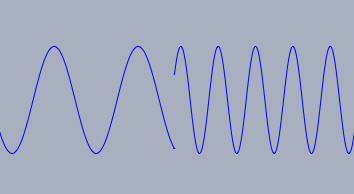
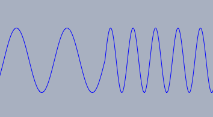
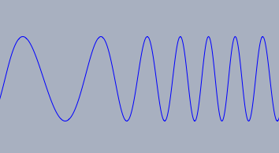

## Sampled-Audio Functions

The Sampled-Audio functions part of Syntherella provides a possibility to create specific wave forms that are played by the built-in speaker of a computer.
By this it is possible to explore the interrelations of mathematics and the very fundamental structures of *sound*.

Syntherella provides essentially three specialized functions that cover different scenarios.

* **`playfunction(…)`** allows to form a sound wave by specifying its underlying function.

* **`playlist(…)`** plays a sound specified by a list of samples that specify the wave.

* **`playsin(…)`** plays a *sin(x)* wave with specified frequency.
Harmonics can also be specified.

Before we will describe these statements in detail we will give a brief explanation (in a nutshell) of these statements and the subtleties that are relevant for the generation of an audio signal.

In all three functions the amplitude of the overall signal is restricted to the range (-1.0…1.0).
Moreover the sum of all accumulated audio signals must stay in this range.
We start our explanations with the `playsin(‹real›)` function.
In its simplest form it starts the audio-rendering of a sine wave of a given frequency.
So `playsin(440)` generates a sine tone with 440Hz that is played for exactly one second.
One might try to use the following piece of code to produce a simple chord:

    > playsin(440);
    > playsin(440*5/4);
    > playsin(440*3/2);

However the overall amplitude would exceed the possible range.
Scaling down each signal by a factor of `1/3` will solve the problem.
This can be achieved by the `amp->‹real›` modifier.
This modifier scales the amplitude of each signal.
The resulting code will look as follows:

    > playsin(440,amp->1/3);
    > playsin(440*5/4,amp->1/3);
    > playsin(440*3/2,amp->1/3);

Everytime the function `playsin` is called a new tone is added to the already existing sounds.
If the function `playsin` is called a second time while a tone is already playing the old tone still continues while a new tone is started.
This may very soon lead to a situation where the dynamics range -1.0…1.0 is exceeded.
There is a modifier `line->‹int›` that helps to prevent such situations.
Specifying `line->1` associates the tone to an output line that can carry at most one tone.
So for instance the code

    > playsin(440,line->1);
    > wait(200);
    > playsin(550,line->1);
    > wait(200);
    > playsin(660,line->1);

starts to play a first tone with 440Hz, after 0.2 seconds replaces it with another tone of 550Hz and after another 0.2 starts another tone that is played for a full second.
There is one more subtlety that is also resolved by the `line` modifier.
When one tone is replaced by another you may a priori not take it for granted that the new tones starts in reasonable phase position relative to the first one.
The `line` modifier takes care of this issue automatically.
Rather than simply replacing one wave by another, it changes the timing of the underlying waves.
It even goes one step further and makes a smooth transition between the two frequencies.
The differences are shown in the images below.

|  |  |  |
| -------------------------- | -------------------------- | -------------------------- |
| Without phase correction   | Phase corrected            | Smooth transition          |

------

------

#### Playing a periodic signal defined by overtones: `playsin(‹real›)`

**Description:**
In its simplest form this operator plays the sound of a sine wave with constant amplitude and duration of one second.
The duration, amplitude and sound characteristics can be altered by suitable modifiers.

**Modifiers:**
The command has several modifiers.

| Modifier     | Parameter              | Effect                                  |
| ------------ | ---------------------- | --------------------------------------- |
| `amp`        | `0.0 … 1.0`            | global amplitude (volume) of the sample |
| `damp`       | `‹real›`               | factor for exponential damping          |
| `harmonics`  | `‹list›`               | spectrum of the tone                    |
| `duration`   | `‹real›`               | duration for playing                    |
| `stop`       | `‹real›`               | same as duration                        |
| `line`       | `‹number› or ‹string›` | a sound-line associated to the tone     |
| `partials`   | `‹list›`               | scale each harmonic by a factor         |
| `attack`     | `‹number›`             | time in seconds for tone to fade in     |
| `release`    | `‹number›`             | time in seconds for tone to fade out    |
| `restart`    | `‹boolean›`            | set this to false to only adjust frequency and gain of playing tone |
| `pan`        | `‹number›`             | panning between left (-1) or right (+1) |
| `phaseshift` | `‹number› or ‹list›`   | shift phase of each harmonic wave by value in [0,2*pi] |
| `precompute` | `‹boolean›`            | play all harmonics with one oscillator (with precomputed wave) to save resources, only works without partials and constant harmonics |

**Examples:**
The simplest usage of `playsin` is for instance given by

    > playsin(440)

This plays a sine wave tone of 440Hz.
Changing this to

    > playsin(440,damp->3,stop->5)

creates a tone that lasts 5 seconds (`stop->5`) and has some exponential damping (`damp->3`).
One can add also harmonics to make the sound more complex.
Harmonics are specified by a list of amplitudes that specify the amplitude of the different overtones.
The code

    > playsin(440,damp->3,stop->5,harmonics->[0.5,0.3,0.2,0.1])

produces a wave form of the type
*0.5*sin(440*2*pi*x)+0.3*sin(2*440*2*pi*x)+0.2*sin(3*440*2*pi*x)+0.1*sin(4*440*2*pi*x).*

Again this will be exponentially damped.

------

#### Playing sample defined by a function: `playfunction(‹funct›)`

**Description:**
Takes a function as input and interpretes it as a wave form.
The time unit is such that one unit in the function correspond to one second.

**Modifiers:**
The command has several modifiers.

| Modifier   | Parameter              | Effect                                  |
| ---------- | ---------------------- | --------------------------------------- |
| `amp`      | `0.0 … 1.0`          | global amplitude (volume) of the sample |
| `damp`     | `‹real›`               | factor for exponential damping          |
| `start`    | `‹real›`               | start position of sample                |
| `stop`     | `‹real›`               | end position of sample                  |
| `duration` | `‹real›`               | duration for playing                    |
| `line`     | `‹number› or ‹string›` | a sound-line associated to the tone     |
| `silent`   | `‹boolean›`            | suppress playing                        |
| `export`   | `‹boolean›`            | export sample data                      |

**Examples:**
The following piece of code produces a sine wave of 440Hz.

    > playfunction(sin(440*x*pi*2))

The following piece of code produces an exponentially damped noise signal.

    > playfunction(random(),damp->8)

By specifying `start` and `stop` one can exactly determine the region of a function that is used for a sound sample.
This region may even be very short.
Using the `duration` modifier one can force that the sample is played over and over.
Thi following piece of code samples exactly one sine wave and plays it over and over for one second.

    > playfunction(sin(1000*x*2*pi),stop->1/1000,duration->1)

The data generated by the function sampling can also be exported to an array.
The sample rate is 44100 samples per second.
The exporting can even be done silently.
For instance, the following code creates a list of 44 sample points of a sine wave.

    > sample=playfunction(sin(1000*x*2*pi),stop->1/1000,
    >                     silent->true,export->true)

The list created by this statement can in turn be used by the `playwave` operator that is able to play sampled audio data.
This could be done for instance by

    > playwave(sample,duration->1)

------

#### Playing sample defined by a list: `playwave(‹list›)`

**Description:**
This statement creates a sound that is driven by a list that contains sample data.
The vales of the samples are assumed to lie in the range *-1.0…1.0*.
The sample rate is 44100 samples per second.
Usually the sample is played over and over for one second.
The play time may be modified by the `duration` modifier.

**Modifiers:**
The command has several modifiers.

| Modifier   | Parameter              | Effect                                  |
| ---------- | ---------------------- | --------------------------------------- |
| `amp`      | `0.0 … 1.0`          | global amplitude (volume) of the sample |
| `damp`     | `‹real›`               | factor for exponential damping          |
| `duration` | `‹real›`               | duration for playing                    |
| `line`     | `‹number› or ‹string›` | a sound-line associated to the tone     |

**Example:**
The following piece of code produces three samples that are played by the `playwave` operator.
Although an explicit duration is given after the time specified in the `wait` each sample is replace by the next one since all samples use the same line.
Before the `playwave` function proceeds to the next sample it is made sure that the actual sample was completed.

    > sample0=apply(1..200,sin(#*2*pi/200));
    > sample1=apply(1..100,sin(#*2*pi/100));
    > sample2=apply(1..50,sin(#*2*pi/50));
    > playwave(sample0,duration->1,line->1);
    > wait(400);
    > playwave(sample1,duration->1,line->1);
    > wait(400);
    > playwave(sample2,duration->1,line->1);

------

#### Stopping sampled audio: `stopsound()`

**Description:**
This statement immediately terminates all sampled sound audio.
