##  The Coordinate System of CindyScript

There is an important feature of CindyScript that immediately changes the appearance of drawings treated by the script in a controlled and global way.
Usually the coordinate system of CindyScript is the same as the coordinate system of the geometric construction.
However it is possible to transform the coordinate system by special operators.
Then all drawing is performed with respect to this modified reference frame.
Care has to be taken when using the transformations: if many of them are applied it may be difficult to determine, where an actual drawing is performed.
In order to still make an easy use of the transformation operators CindyScript provides two operators `gsave` and `grestore`.
Similar to PostScript like languages these operators push/pop the actual state of the drawing engine to a stack.
This state contains (besides the graphical default appearance information) the present coordinate transformation.
So a temporal use of coordinate systems may be enclosed by a `gsave()`...`grestore()` construction.
We first introduce the operators and than give a combined example.

**Caution:**
In the current version of Cinderella 2.6 the application of the transformations is not yet implemented for circles.
For circles only euclidean transformations (rotations, translations, reflections, scalings) are supported.
Affine and projective transformations will be provided in a later release.

------

#### Translating the coordinate system: `translate(‹list›)`

**Description:**
This operator assumes that `‹list›` is of the form `[‹real›,‹real›]` and translates the drawing coordinate system by this vector.

------

#### Rotating the coordinate system: `rotate(‹real›)`

**Description:**
This operator takes a real number `‹real›` and rotates the current drawing coordinate system by an angle determined by this number.
The anlge is given in rad.
If one wants to use angles in degree one can do this by the `°` operator (this operator multiplies a number by `pi/180`.
So `rotate(30°)` rotates the coordinate system by 30°.

------

#### Scaling the coordinate system: `scale(‹real›)`

**Description:**
This operator takes a real number `‹real›` and scales the current drawing coordinate system by this factor.

**Examples:**
The following table shows the effect of applying diverse transformations before invoking a code that draws of a square with vertex coordiantes `[0,0],[0,1],[1,1],[1,0]`.

| 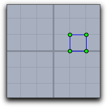 | 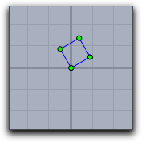 | 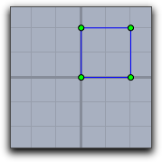 |
| ---------------------- | ---------------------- | ---------------------- |
| `translate([1,0]);`    | `rotate(30°);`         | `scale(2));`           |

The following table shows different combinations of transformations.
The order of the operations may seem a little bit counterintuitive.
It results from the fact that the operators transforms the coordinate system rather than the objects that are drawn.

| 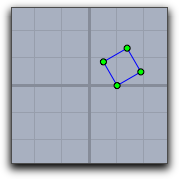           | 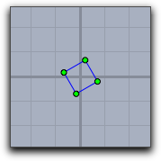                 | 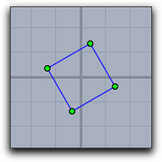                            |
| -------------------------------- | -------------------------------------- | ------------------------------------------------- |
| `translate([1,0]); rotate(30°);` | `rotate(30°); translate([-0.5,-0.5]);` | `rotate(30°); scale(2)); translate([-0.5,-0.5]);` |

Recursive or iterated application of transformations can lead to surprising effects.
The picture below was generated by the following piece of code (assuming that `square` is a list of objects that draw the unit square).

    > repeat(90,
    > drawall(square);
    > translate((1,1));
    > scale(0.92);
    > rotate(30°);
    > )

| 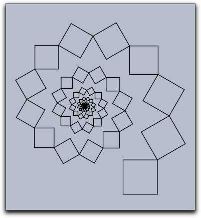 |
| ----------------------------------- |
| ****                                |

------

#### Relating to a projective basis: `setbasis(‹basis›)`

**Description:**
In the geometric part of Cinderella you can [set a basis to which all drawing is related](Setting_a_Basis).
These bases can be translational bases, similarity bases, affine bases, or even projective bases.
Such basis operations can also be used in CindyScript.
The `setbasis(‹basis›)` operator sets the drawing basis to a basis defined in Cinderella.
The argument has to be the label of the basis in Cinderella.
After applying the setbasis operator all prior coordinate transformations in CindyScript are obsoleted.
However, they can be stored by `gsave` and restored by `grestore`.

**Example:**
In the following example a basis `Bas0` was defined to be a projective basis related to the points A, B, C and D.
This means that with respect to this basis the the corners `[0,0],[0,1],[1,1],[1,0]` of the unit quadrangle are the points A, B, C and D.
The first line of the code applies the basis transformation.
The next three lines draw a grid within the unit square.
The resulting image is shown below.

    > setbasis(Bas0);
    > x=(0..10)/10;
    > drawall(apply(x,([#,0],[#,1])));
    > drawall(apply(x,([0,#],[1,#])));

| 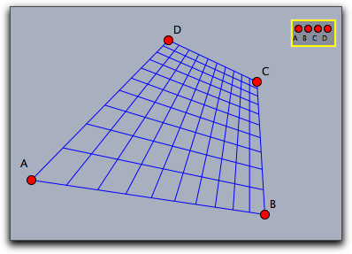 |
| --------------------------- |
| ****                        |

**See also:**
[Bases in Cinderella](Setting_a_Basis)

------

#### Relating to a translation basis: `setbasis(‹vec1›)`

#### Relating to a similarity basis: `setbasis(‹vec1›,‹vec2›)`

#### Relating to an affine basis: `setbasis(‹vec1›,‹vec2›,‹vec3›)`

#### Relating to a projective basis: `setbasis(‹vec1›,‹vec2›,‹vec3›,‹vec4›)`

**Description:**
it is also possible to relate the internal drawing basis of CindyScript directly to a basis specified by points.
This avoids the explicit creation of a basis in Cinderella.
This can be easily done by providing points of the base frame of the basis.

**Example:**
The following piece of code together with the picture below demonstrates this feature.
in the code `sq` is first defined as a macro to draw a square grid.
The grid is drawn with respect to several bases.

    > sq:=(draw([0,0],[1,0]);
    >      draw([0,0.25],[1,0.25]);
    >      draw([0,0.5],[1,0.5]);
    >      draw([0,0.75],[1,0.75]);
    >      draw([0,1],[1,1]);
    >      draw([0,0],[0,1]);
    >      draw([0.25,0],[0.25,1]);
    >      draw([0.5,0],[0.5,1]);
    >      draw([0.75,0],[0.75,1]);
    >      draw([1,0],[1,1]));
    > setbasis(A);
    > sq;
    > setbasis(B,C);
    > sq;
    > setbasis(D,E,F);
    > sq;
    > setbasis(G,H,L,K);
    > sq;

| 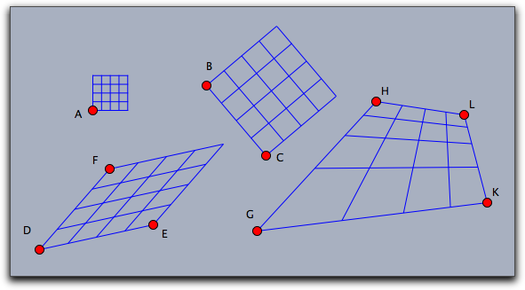 |
| ---------------------------- |
| ****                         |

------

------

## The Appearance and Basis Stack

Performing transformations of the coordinate system influences the global behavior of drawing operations that are performed.
Very often such a change of the coordinate system is only intended for a certain drawing operation after which the coordinate system should be set to its old state again.
CindyScript has a mechanism that serves for such services.

The `gsave()` operator stores all informations in the graphic state (coordinate transformations, sizes, colors, opacity) to a stack.
While the `grestore()` operator reverses this effect by popping the information from the stack.
Thus within a sequence `gsave()`...`grestore()` any coordinate transformations can be made without having effect to the remaining code.

------

#### Storing the graphics state: `gsave()`

**Description:**
This operator stores all informations that may influence the current graphics operations to a stack.
The informations include the coordinate system, sizes for points, lines and text as well as colors and opacities.

------

#### Restoring the graphics state: `grestore()`

**Description:**
This operation pops the last stored graphics state from the stack and restores it to the drawing engine.

------

#### Resetting the graphics state: `greset()`

**Description:**
This operator clears the graphics information to a stack and sets the coordinate system, all sizes, colors and the opacity back to the initial value.

**See also:**
[Appearance of Objects](Appearance_of_Objects)

------

------

## Layers

In a sense there is a third dimension in drawings generated by CindyScript.
Each drawing is associated to a specific layer.
Layers are specified by numbers.
When the drawing is generated the layers are painted in the order of the associated numbers.
If no layer was specified then all Cindy script drawings are performed in a background layer, that is below all geometric elements.
By default, all layers are cleared right before the *draw* part of CindyScript.
However, it is also possible to mark a layer to be not *auto cleared* which makes it possible to produce background graphics that have to be calculated only once.

#### Setting the drawing layer: `layer(‹int›)`

**Description:**
This statement sets the drawing layer to a specified level.
By default the layer is cleared right before the *draw* event takes place.

**Example:**
The following piece of code draws four overlapping circles in the usual drawing order.

    > cir(x,y):=(
    >   fillcircle((x,y),3,color->(1,.8,0));
    >   drawcircle((x,y),3,color->(0,0,0),size->3);
    > );
    > cir(0,0);
    > cir(1,1);
    > cir(2,2);
    > cir(3,3)

If one calls a layer statement before each individual drawing, it is possible to reverse the order in which the circles are drawn onto the screen, as the next example demonstrates.

    > cir(x,y):=(
    >   fillcircle((x,y),3,color->(1,.8,0));
    >   drawcircle((x,y),3,color->(0,0,0),size->3);
    > );
    > layer(6);
    > cir(0,0);
    > layer(5);
    > cir(1,1);
    > layer(4);
    > cir(2,2);
    > layer(3);
    > cir(3,3)

| 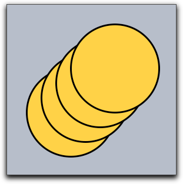 | 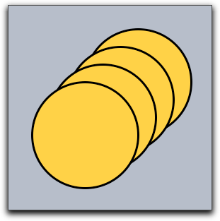     |
| ------------------------ | ---------------------------- |
| usual drawing            | drawing with reversed layers |

------

#### Clearing a layer: `clearlayer(‹int›)`

**Description:**
This function clears the given layer and sets it as the current active one.

------

#### Remove all drawings in a layer: `clrscr()`

**Description:**
This statement immediately clears all drawings that were performed in a screen.
It is sometimes useful to use this statement to make sure that a drawing is really in an empty state.
In particular it may become necessary if the `repaint()` statement is called from inside other scriptslots, or if the autoclear flag of a layer is set to false.

------

#### Automatic clearing of layers: `autoclearlayer(‹int›,‹boolean›)`

**Description:**
The autoclear flag of a layer can be set using this function.
By default, every layer is cleared automatically during construction recalculations.
You can turn this of by setting the autoclear flag to `false`.

If a layer is not cleared automatically, all drawing commands will be preserved.
Cinderella does not store a bitmap, but actually redoes all drawings on every step, so you might run into performance problems if you add more and more drawing commands to a layer.

**Example:**
You can use non-clearing layers to draw background or foreground graphics once in the *init* slot instead of drawing them every time in the *draw* slot of the [construction](The_CindyScript_Editor).

    > autoclearlayer(-4,false);
    > layer(-4);
    > repeat(1000,
    >    p = [random(20)-5,random(20)-5];
    >    color([random(),random(),random()]);
    >    fillpolygon(apply([[0,0],[1,0],[1,1],[0,1]],p+#),alpha->.2);
    > );
    > layer(0);

The code above in the *init* slot produces a random background once on layer -4.
As the autoclear flag is set to false, this background will stay during all other operations, as demonstrated below.
If you want to achieve the same effect in the *draw* slot you have to store all random polygons and their colors to recreate them on every cycle.

| 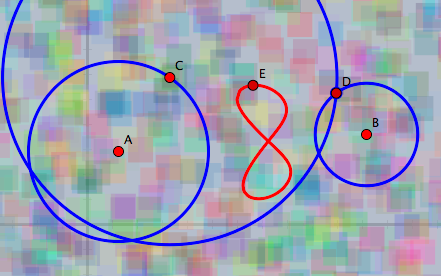 |
| -------------------------------------- |
| **A random background**                |

------

------

#### Determining screen bounds: `screenbounds()`

**Description:**
If you work only with a finite part of the projective plane and do not use a [spherical view](Views) it makes sense to ask for the screen bounds.
This function returns a list of four points in homogeneous coordinates that define a rectangle covering all visible views.

This function is best used with only one Euclidean view for a construction.

#### Determining screen resolution: `screenresolution()`

**Description:**
In contrast to hyperbolic and spherical views, Euclidean views have the same screen resolution everywhere.
This function gives the number of pixels between the origin and point `[0,1]`.
If several Euclidean views for the same construction are open, the function will return the maximum of all individual screen resolutions.

**Example:**
You can create a checkerboard pattern by coloring pixels.
The code below will color every other pixel independently of the current zoom.
Please be aware that we do not recommend to work on the pixel level, but there may be situations that justify this.
In most cases, the [`colorplot` function](Function_Plotting#colorplot) is easier to use and a lot faster.

    > upperleft=(screenbounds()_1).xy;
    > lowerright=(screenbounds()_3).xy;
    > width in pixels=screenresolution()*(lowerright.x-upperleft.x);
    > height in pixels=screenresolution()*(upperleft.y-lowerright.y);
    > repeat(width in pixels/2, x,
    >  start->upperleft.x, stop->lowerright.x,
    >  repeat(height in pixels/2, y,
    >    start->upperleft.y, stop->lowerright.y,
    >    draw((x,y),border->false,size->.5,color->[0,0,0]);
    >  )
    > )
