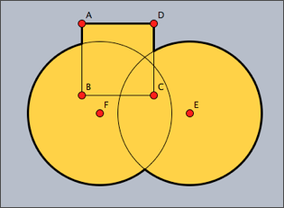
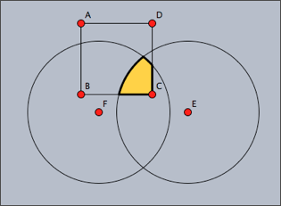
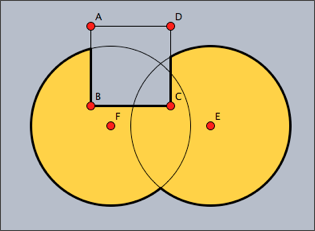
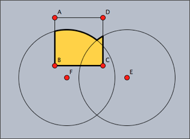
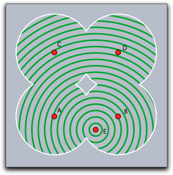
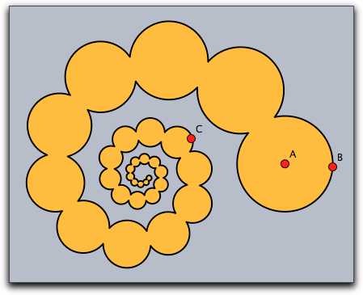

## Shapes

Besides elementary drawing operations for lines, polygons, and circles, CindyScript also offers the possibility to combine these objects into more complicated objects called shapes.
Shapes are not directly visible, but may be used for filling, outline drawing or clipping.
They can be combined using logical operations like union, intersection or set difference.
We first list the elementary operators and then explain their usage in a more elaborate example.

------

### Shape primitives

#### A circular shape: `circle(‹point›,‹radius›)`

**Description:**
This operator creates a circular shape of a given `‹radius›` around a given `‹point›`.

------

#### A polygonal shape: `polygon(‹list›)`

**Description:**
This operator creates a polygonal shape defined by a list of positions given in `‹list›`.

------

#### A half-plane shape: `halfplane(‹line›,‹point›)`

**Description:**
This operator creates a half-plane shape.
The half-plane is defined by its supporting line `‹line›` and a point `‹point›` contained in the half-plane, which determines on which side of the supporting line the half-plane lies.
`‹line›` may either be a three-dimensional vector of homogeneous coordinates, or a reference to a line object.

------

#### The shape of the screen: `screen()`

**Description:**
This operator creates a rectangular shape that is large enough to cover all active drawing surfaces.

------

### Combining shapes

Primitive shapes can be combined to form new shapes using three logical operators.

| `‹shape1›++‹shape2›` | creates the union of two shapes        |
| -------------------- | -------------------------------------- |
| `‹shape1›~~‹shape2›` | creates the intersection of two shapes |
| `‹shape1›--‹shape2›` | creates the difference of two shapes   |

------

### Using shapes

Shapes can be used for filling, outline drawing and clipping.

------

#### Fill a shape: `fill(‹shape›)`

**Description:**
This operator fills a shape with a specified color.

**Modifiers:**
This operator supports the following modifiers:

| Modifier | Parameter                   | Effect                                  |
| -------- | --------------------------- | --------------------------------------- |
| `color`  | `[‹real1›,‹real2›,‹real3›]` | sets the fill color to an RGB value     |
| `alpha`  | `‹real›`                    | sets the opacity to the value `‹alpha›` |

------

#### Draw a shape: `draw(‹shape›)`

**Description:**
This operator draws the outline of a shape.

**Modifiers:**
This operator is a further polymorphic extension to the usual draw operator and supports the same modifiers.

------

#### Set clippath: `clip(‹shape›)`

**Description:**
This operator sets the clip path to the given shape.
All subsequent drawing operations are clipped with respect to this clip path.
The clip path is pushed on the appearance stack, thus it can be removed again by statements like `grestore()` or `greset()`.

------

### Examples

The following examples illustrate the use of shapes.
The following code defines three different shapes, a quadratic one and two circular ones.
These are then combined into a more complex shape using logical operations.
The complex shape is filled and outlined.
The original shapes are outlined by a thinner line.

    > shape1=circle(E,4);
    > shape2=circle(F,4);
    > shape3=polygon([A,B,C,D]);
    > color((0,0,0));
    > shape=shape1++shape2++shape3;
    > fill(shape,color->(1,0.8,0));
    > draw(shape,size->3);
    > draw(shape1);
    > draw(shape2);
    > draw(shape3);
    >

The resulting image is shown as the first picture below.
The other three images are created using other combinations of the shapes.

|  |  |
| ------------------------- | ------------------------- |
|
| shape1++shape2++shape3    | shape1~~shape2~~shape3    |
|                           |
|  |  |
| shape1++shape2--shape3    | shape1++shape2~~shape3    |

The following code snippet demonstrates the usage of shapes as a clipping path.
First of all, four circles and their union are defined as a shape.
Then this shape is used as a clipping path for another drawing (concentric circles around point *E*).

    > r=3;
    > shape=circle(A,r)++circle(B,r)++circle(C,r)++circle(D,r);
    > clip(shape);
    > repeat(60,i,
    >   drawcircle(E,i/2,color->(0,.6,0),size->3);
    > );
    > greset();
    > draw(shape,color->(1,1,1),size->2);
    >

|  |
| ------------------------ |
| ****                     |

Shapes can become rather complicated objects, as the following iterative example shows.
A word of caution may be appropriate here: The more complicated shape become, the more computational resources they consume.
The use of overly complex shapes can slow down Cinderella considerably.

    > a=complex(A);
    > b=complex(B);
    > z=complex(C);
    > shape=circle((0,0),0);
    > repeat(50,
    >   shape=shape++circle(gauss(a),|a-b|);
    >   a=a*z;
    >   b=b*z;
    > );
    > fill(shape,color->(1,0.7,0));
    > draw(shape,color->(0,0,0),size->2);
    >

|  |
| ------------------------ |
| ****                     |
