##  TeX Rendering

Starting with version 2.4 of Cinderella the text rendering became significantly more powerful.
It is now also possible to render formulas using a variant of the TeX typesetting language [[Knu93]](References.md).
This language is standard for mathematical documents and allows for the description of very complex formulas.
Currently Cinderella covers about 95% of the formatting capabilities of the TeX formula language.
We here only report on the most important formatting issues.
We also report on the major differences to standard TeX.

TeX rendering can also be used in texts for element captions and in usual geometric text objects.

###  Activating TeX Rendering

Within a usual string the TeX formula rendering can be activated by enclosing the formula by dollar signs: `$…here is the formula text…$`.
The following statement produces a formula that already covers some interesting features of TeX rendering:

    > drawtext(
    >   (0,0),
    >   "Sum formula: $\sum_{i=1}^n i^2 = { 2\cdot n^3+ 4\cdot n^2 +n\over 6 }
    > );

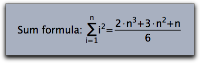

The TeX renderer tries to do its best even if uncommon font families are chosen for the rendering of formulas.

    > drawtext(
    >   (0,0),
    >   "Sum formula: $\sum_{i=1}^n i^2 =
    >                { 2\cdot n^3+ 3\cdot n^2 +n\over 6 }$",size->20,
    >   family->"Lucida Calligraphy"
    > );

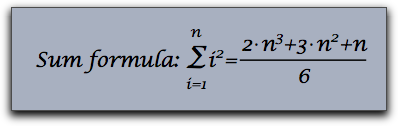

###  Subscripts and Superscripts

Perhaps the most simple and most common usage of TeX rendering is to equip labels with subscripts or superscripts.
This can be done by the using the `_` and the `^` signs, respectively.
If the sub- or superscripts are again more complicated formulas then they have to be enclosed in curly brackets.
Unlike in usual TeX sub- or superscripts that only consist of numbers do not have to be enclosed in curly brackets.
The following piece of code exemplifies various usages of sub- and superscripts.

    > textsize(20);
    > drawtext((0,0), "$A_1$");
    > drawtext((2,0), "$A_123$");
    > drawtext((4,0), "$A_1^12$");
    > drawtext((6,0), "$A_{1_2}^{1/2}$");
    > drawtext((8,0), "$A_{1_2}^{\sqrt{x^2+y^2}}$");

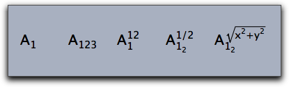

###  Special Formula Elements

The TeX renderer is capable of rendering special formula signs like sums, square roots and integrals.
The following sample gives an impression of how these objects can be rendered.

    > textsize(20);
    > drawtext((0,0), "$\sum_{i=1}^n (i^2+1)");
    > drawtext((3,0), "$\sqrt{x^2+y^2}");
    > drawtext((6,0), "$\int_a^b f(x)dx");

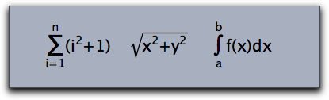

TeX control commands must be preceded by a `\` sign.
Observe that `\sum` and `\int` automatically generate a reasonable placement of upper and lower indices.
Besides `\sum` and `\int`, there are also other symbols available that treat upper and lower indices in a special way.
Here comes a complete list of them:

`\prod`, `\coprod`, `\bigcup`, `\bigcap`, `\bigwedge`, `\bigvee`, `\bigoplus`,
`\bigotimes`, `\bigodot`, `\biguplus`, `\int`, `\iint`, `\iiint`, `\ont`

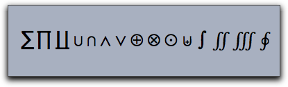

### Brackets

The Cinderella TeX implementation allows for the use of four types of brackets in formulas:

*  Round bracktes: `(…)`
*  Square braclets: `[…]`
*  Curly brackets: `\{…\}`
*  Vertical lines: `|…|`

Since Curly brackets have a special semantic meaning in TeX formulas they have to be preceded by a backslash.
In formulas it is often necessary to use brackets of different sizes.
For this purpose each bracket can be preceded by one of the modifying commands `\big`, `\Big`, `\bigg`, `\Bigg`.
They produce brackets of different sizes as the following piece of code exemplifies.

    > drawtext((0,0),size->16,
    > "$\Bigg( \bigg( \Big( \big( (\ldots)
    >            \big) \Big) \bigg) \Bigg)$");
    > drawtext((5,0),size->16,
    > "$\Bigg[ \bigg[ \Big[ \big[ [\ldots]
    >            \big] \Big] \bigg] \Bigg]$");
    > drawtext((10,0),size->16,
    > "$\Bigg\{ \bigg\{ \Big\{ \big\{ \{\ldots\}
    >            \big\} \Big\} \bigg\} \Bigg\}$");
    > drawtext((15,0),size->16,
    > "$\Bigg| \bigg| \Big| \big| |\ldots|
    >            \big| \Big| \bigg| \Bigg|$")

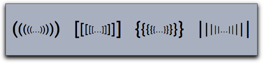

There is also a more versatile way of creating a huge bracket.
Using the command `\left` and `\right` one can generate brackets that fit the size of the enclosed formula exactly, as shown in the next example:

    > drawtext((0,0),size->16,
    > "$\left[\sum_{i=1}^n \left({\sqrt sin(i)\right)\right]^2$")

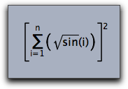

The `\left` and `\right` statements must be properly nested.
If one wants to suppress an opening or closing brackets one can use `\left.` or `\right.` .

###  Formulas with Special Layout

Some formulas like for instance *fractions* force a special layout that places the different parts of the formulas at special locations.
Cinderella TeX Statements that support this kind of rendering are

`\frac,\over,\choose,\binom`

Their usage is shown in the next example:

    > drawtext((0,0),size->16,"${1+n^2\over 1-n^2}$");
    > drawtext((3,0),size->16,"${2\choose 3}$");
    > drawtext((6,0),size->16,"$\frac{a+b}{x^2}$");
    > drawtext((9,0),size->16,"$\binom{a+b}{x^2}$");

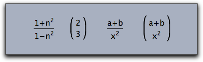

###  Whitespace

Usual blanks and newlines are only used as syntactic separators in formulas and do not have any influence on the layout of the formula.
To introduce whitespace the commands `\`, `\;`, `\quad`, `\qquad`, `\!` are used.
They produce a whitespace measured in units of an “m” of the current font.

*  `\qquad`: whitespace of 2.0 units
*  `\quad`: whitespace of 1.0 unit
*  `\;`: whitespace of 5/18 units
*  `\,`: whitespace of 3/18 units
*  `\!`: negative whitespace of -5/18 units

    > drawtext((0,0),size->16,"$A\!A A \,A\;A\quad A \qquad A$")

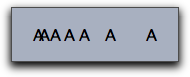

###  Over- and Underlining

Cinderella TeX supports several statements that allow to put decorations like arrows and lines on top of or below a formula.
The supported commands are

`\overline, \underline, \overleftarrow, \overrightarrow, \vec, \hat, \tilde`

The arguments of these statements have to be enclosed in curly brackets.
Here are a few formulas that use these features:

    > drawtext((0,0),size->16,"$\overline{A}\;\cap\;\overline{B}\;=\;
    >                       \overline{A\;\cup\; B}$");
    > drawtext((6,0),size->16,"$|\overrightarrow{(x,y)}|\;= \;
    >                       \sqrt{x^2+y^2}$");
    > drawtext((13,0),size->16,"$\tilde{X}+\hat{Y}\;=\;
    >                       \underline{X\oplus Y}$");

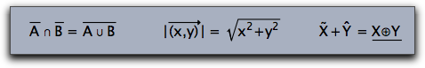

###  Vectors and Matrices

Matrices and Vectors are essential for mathematical formulas.
They can also be rendered by Cinderella's TeX implementation.
The most basic way to introduce a matrix (or a vector) is by using the `\begin{array}{…}…\end{array}` statement.
An array consists of a sequence of rows seperated by `\\`.
Each row consists of the entries of the row separated by `&`.
The second pair of curly brackets in the statement above contains formatting information for each column.
Here

* `r` means right align,
* `l` means left align,
* `c` means center align.

In the following example the `array` statement is combined with enclosing brakets to generate a matrix-like object.

    > drawtext((0,0),
    > "$M\;=\;\left(
    > \begin{array}{lcr}
    >  1+1&2&3\\
    >  1&2+2&3\\
    >  1&2&3+3\\
    >  \end{array}
    > \right)
    > $"
    > ,size->20);

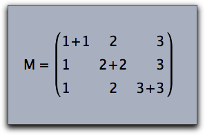

Arrays can also be used to create formulas with several cases, as the following example shows:

    > drawtext((0,0),
    > "$sign(x)\;:=\;\left\{
    > \begin{array}{ll}
    >   1&if \quad x>0\\
    >  -1&if \quad x<0\\
    >   0&if \quad x=0\\
    >  \end{array}
    > \right.
    > $"
    > ,size->20);

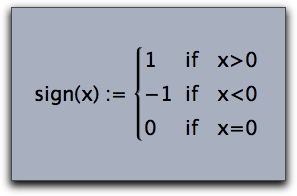

Cinderella also supports matrix operators that do not need the formatting informations and that generate the enclosing brackets automatically.
The five types of admissible matrices are illustrated in the code below:

    > drawtext((0,0), "$\begin{matrix} a-\lambda & b\\
    >                         c & b-\lambda\\ \end{matrix}$",);
    > drawtext((4,0), "$\begin{pmatrix}a-\lambda & b\\
    >                         c & b-\lambda\\ \end{pmatrix}$");
    > drawtext((8,0), "$\begin{bmatrix}a-\lambda & b\\
    >                         c & b-\lambda\\ \end{bmatrix}$");
    > drawtext((12,0),"$\begin{Bmatrix}a-\lambda & b\\
    >                         c & b-\lambda\\ \end{Bmatrix}$");
    > drawtext((16,0),"$\begin{vmatrix}a-\lambda & b\\
    >                         c & b-\lambda\\ \end{vmatrix}$");

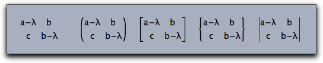

###  Color

Cinderellas TeX supports colored text via a special command `\color{…}`.
The currently predefined colors are:

`white, black, red, green, blue, darkred, darkgreen, darkblue, magenta, yellow, cyan, orange`

Using the color statement influences color of the subformula in which it it used.

    > drawtext((0,0),size->20,color->(0,0,0),
    >   "Sum formula: $
    > \sum_{\color{darkgreen}i=1}^{\color{darkgreen}n} {\color{darkred}i^2}
    > \quad = \quad
    > {\color{blue}{ 2\cdot n^3+ 4\cdot n^2 +n\over 6 }}$"
    > );

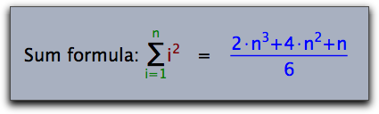

###  Plain Text

Sometimes it may be useful to use a passage of normal text within a formula.
This can be done by the `\mbox{…}` statement.
The following example illustrates its usage:

    > drawtext((0,0),size->20,color->(0,0,0),
    >   "$
    > \sum_{\mbox{All i not equal to j}}(i^2+j^2)
    > $"
    > );

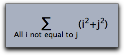

###  Special Characters

In mathematical formulas one needs many special characters.
The following list gives an overview of all characters that are associated to special TeX statements.

####  Greek letters

|   |          |   |             |   |          |   |          |
| - | -------- | - | ----------- | - | -------- | - | -------- |
| α | \alpha   | β | \beta       | γ | \gamma   | δ | \delta   |
| ∊ | \epsilon | ε | \varepsilon | ζ | \zeta    | η | \eta     |
| θ | \theta   | ϑ | \vartheta   | ι | \iota    | κ | \kappa   |
| λ | \lambda  | λ | \lamda      | μ | \mu      | μ | \my      |
| ν | \nu      | ν | \ny         | ξ | \xi      | ο | \omicron |
| π | \pi      | ϖ | \varpi      | ρ | \rho     | ϱ | \varrho  |
| σ | \sigma   | ς | \varsigma   | τ | \tau     | υ | \upsilon |
| υ | \ypsilon | φ | \phi        | χ | \chi     | ψ | \psi     |
| ω | \omega   | Α | \Alpha      | Β | \Beta    | Γ | \Gamma   |
| Δ | \Delta   | Ε | \Epsilon    | Ζ | \Zeta    | Η | \Eta     |
| Θ | \Theta   | Ι | \Oota       | Κ | \Kappa   | Λ | \Lambda  |
| Λ | \Lamda   | Μ | \Mu         | Μ | \My      | Ν | \Nu      |
| Ν | \Ny      | Ξ | \Xi         | Ο | \Omicron | Π | \Pi      |
| Ρ | \Rho     | Σ | \Sigma      | Τ | \Tau     | Υ | \Upsilon |
| Υ | \Ypsilon | Φ | \Phi        | Χ | \Chi     | Ψ | \Psi     |
| Ω | \Omega   |

####  Arrows

|   |                     |   |                    |   |                      |   |                     |
| - | ------------------- | - | ------------------ | - | -------------------- | - | ------------------- |
| ← | \leftarrow          | → | \rightarrow        | → | \to                  | ↔ | \leftrightarrow     |
| ⇐ | \Leftarrow          | ⇒ | \Rightarrow        | ⇔ | \Leftrightarrow      | ↦ | \mapsto             |
| ↩ | \hookleftarrow      | ↼ | \leftharpoonup     | ↽ | \leftharpoondown     | ↪ | \hookrightarrow     |
| ⇀ | \rightharpoonup     | ⇁ | \rightharpoondown  | ← | \longleftarrow       | → | \longrightarrow     |
| ↔ | \longleftrightarrow | ⇐ | \Longleftarrow     | ⇒ | \Longrightarrow      | ⇔ | \Longleftrightarrow |
| ⇖ | \longmapsto         | ↑ | \uparrow           | ↓ | \downarrow           | ↕ | \updownarrow        |
| ⇑ | \Uparrow            | ⇓ | \Downarrow         | ⇕ | \Updownarrow         | ↗ | \nearrow            |
| ↘ | \searrow            | ↙ | \swarrow           | ↖ | \nwarrow             | ↝ | \leadsto            |
| ⇠ | \dashleftarrow      | ⇇ | \leftleftarrows    | ⇆ | \leftrightarrows     | ⇚ | \Lleftarrow         |
| ↞ | \twoheadleftarrow   | ↢ | \leftarrowtail     | ⇋ | \leftrightharpoons   | ↰ | \Lsh                |
| ↫ | \looparrowleft      | ↶ | \curvearrowleft    | ↺ | \circlearrowleft     | ⇢ | \dashrightarrow     |
| ⇉ | \rightrightarrows   | ⇄ | \rightleftarrows   | ⇛ | \Rrightarrow         | ↠ | \twoheadrightarrow  |
| ↣ | \rightarrowtail     | ⇌ | \rightleftharpoons | ↱ | \Rsh                 | ↬ | \looparrowright     |
| ↷ | \curvearrowright    | ↻ | \circlearrowright  | ⊸ | \multimap            | ⇈ | \upuparrows         |
| ⇊ | \downdownarrows     | ↿ | \upharpoonleft     | ↾ | \upharpoonright      | ⇃ | \downharpoonleft    |
| ⇂ | \downharpoonright   | ⇝ | \rightsquigarrow   | ↭ | \leftrightsquigarrow | ← | \leftarrow          |
| ↑ | \uparrow            | → | \rightarrow        | ↓ | \downarrow           | ↔ | \leftrightarrow     |
| ↕ | \updownarrow        | ↖ | \nwarrow           | ↗ | \nearrow             | ↘ | \searrow            |
| ↙ | \snarrow            | ⇐ | \Leftarrow         | ⇑ | \Uparrow             | ⇒ | \Rightarrow         |
| ⇓ | \Downarrow          | ⇔ | \Leftrightarrow    | ⇕ | \Updownarrow         | ⇖ | \Nwarrow            |
| ⇗ | \Nearrow            | ⇘ | \Searrow           | ⇙ | \Snarrow             |

####  Math characters

|   |                     |   |                |   |                   |   |                    |
| - | ------------------- | - | -------------- | - | ----------------- | - | ------------------ |
| ≤ | \leq                | ≪ | \ll            | ≺ | \prec             | ≼ | \preceq            |
| ⊂ | \subset             | ⊆ | \subseteq      | ⊏ | \sqsubset         | ⊑ | \sqsubseteq        |
| ∈ | \in                 | ⊢ | \vdash         | ∣ | \mid              | ⌣ | \smile             |
| ≥ | \geq                | ≫ | \gg            | ≻ | \succ             | ≽ | \succeq            |
| ⊃ | \supset             | ⊇ | \supseteq      | ⊐ | \sqsupset         | ⊒ | \sqsupseteq        |
| ∋ | \ni                 | ⊣ | \dashv         | ∥ | \parallel         | ⌢ | \frown             |
| ∉ | \notin              | ≡ | \equiv         | ≐ | \doteq            | ∼ | \sim               |
| ≃ | \simeq              | ≈ | \approx        | ≅ | \cong             | ⋈ | \Join              |
| ⋈ | \bowtie             | ∝ | \propto        | ⊨ | \models           | ⊥ | \perp              |
| ≍ | \asymp              | ≠ | \neq           | ± | \pm               | × | \times             |
| ∪ | \cup                | ⊔ | \sqcup         | ∨ | \vee              | ⊕ | \oplus             |
| ⊙ | \odot               | ⊗ | \otimes        | △ | \bigtriangleup    | ⊲ | \lhd               |
| ⊴ | \unlhd              | ∓ | \mp            | ÷ | \div              | ∖ | \setminus          |
| ∩ | \cap                | ⊓ | \sqcap         | ∧ | \wedge            | ⊖ | \ominus            |
| ⊘ | \oslash             | ○ | \bigcirc       | ▽ | \bigtriangledown  | ⊳ | \rhd               |
| ⊵ | \unrhd              | ◁ | \triangleleft  | ▷ | \triangleright    | ⋆ | \star              |
| ∗ | \ast                | ∘ | \circ          | ∙ | \bullet           | ⋄ | \diamond           |
| ⊎ | \uplus              | † | \dagger        | ‡ | \ddagger          | ≀ | \wr                |
| ∑ | \sum                | ∏ | \prod          | ∐ | \coprod           | ∨ | \int               |
| ⋃ | \bigcup             | ⋂ | \bigcap        | ⊔ | \bigsqcup         | ∮ | \oint              |
| ⋁ | \bigvee             | ⋀ | \bigwedge      | ⊕ | \bigoplus         | ⊗ | \bigotimes         |
| ⊙ | \bigodot            | ⊎ | \biguplus      | … | \dots             | ⋯ | \cdots             |
| ⋮ | \vdots              | ⋱ | \ddots         | ℏ | \hbar             | ℓ | \ell               |
| ℜ | \Re                 | ℑ | \Im            | א | \aleph            | ℘ | \wp                |
| ∀ | \forall             | ∃ | \exists        | ℧ | \mho              | ∂ | \partial           |
| ′ | \prime              | ∅ | \emptyset      | ∞ | \infty            | ∇ | \nabla             |
| △ | \triangle           | □ | \Box           | ◇ | \Diamond          | ⊥ | \bot               |
| ⊤ | \top                | ∠ | \angle         | √ | \surd             | ♢ | \diamondsuit       |
| ♡ | \heartsuit          | ♣ | \clubsuit      | ♠ | \spadesuit        | ¬ | \neg               |
| ♭ | \flat               | ♮ | \natural       | ♯ | \sharp            | Ϝ | \digamma           |
| ϰ | \varkappa           | ב | \beth          | ד | \daleth           | ג | \gimel             |
| ⋖ | \lessdot            | ≤ | \leqslant      | ≦ | \leqq             | ⋘ | \lll               |
| ≲ | \lesssim            | ≶ | \lessgtr       | ⋚ | \lesseqgtr        | ≼ | \preccurlyeq       |
| ⋞ | \curlyeqprec        | ≾ | \precsim       | ⋐ | \Subset           | ⊏ | \sqsubset          |
| ∴ | \therefore          | ⌣ | \smallsmile    | ⊲ | \vartriangleleft  | ⊴ | \trianglelefteq    |
| ⋗ | \gtrdot             | ≧ | \geqq          | ⋙ | \ggg              | ≳ | \gtrsim            |
| ≷ | \gtrless            | ⋛ | \gtreqless     | ≽ | \succcurlyeq      | ⋟ | \curlyeqsucc       |
| ≿ | \succsim            | ⋑ | \Supset        | ⊐ | \sqsupset         | ∵ | \because           |
| ∥ | \shortparallel      | ⌢ | \smallfrown    | ⊳ | \vartriangleright | ⊵ | \trianglerighteq   |
| ≑ | \doteqdot           | ≓ | \risingdotseq  | ≒ | \fallingdotseq    | ≖ | \eqcirc            |
| ≗ | \circeq             | ≜ | \triangleq     | ≏ | \bumpeq           | ≎ | \Bumpeq            |
| ∼ | \thicksim           | ≈ | \thickapprox   | ≊ | \approxeq         | ∽ | \backsim           |
| ⊨ | \vDash              | ⊩ | \Vdash         | ⊪ | \Vvdash           | ∍ | \backepsilon       |
| ∝ | \varpropto          | ≬ | \between       | ⋔ | \pitchfork        | ◀ | \blacktriangleleft |
| ▷ | \blacktriangleright | ∔ | \dotplus       | ⋉ | \ltimes           | ⋓ | \Cup               |
| ⊻ | \veebar             | ⊞ | \boxplus       | ⊠ | \boxtimes         | ⋋ | \leftthreetimes    |
| ⋎ | \curlyvee           | ⋅ | \centerdot     | ⋈ | \rtimes           | ⋒ | \Cap               |
| ⊼ | \barwedge           | ⊟ | \boxminus      | ⊡ | \boxdot           | ⋌ | \rightthreetimes   |
| ⋏ | \curlywedge         | ⊺ | \intercal      | ⋇ | \divideontimes    | ∖ | \smallsetminus     |
| ⊝ | \circleddash        | ⊚ | \circledcirc   | ⊛ | \circledast       | ℏ | \hbar              |
| ℏ | \hslash             | □ | \square        | ■ | \blacksquare      | Ⓢ | \circledS          |
| △ | \vartriangle        | ▲ | \blacktriangle | ∁ | \complement       | ▽ | \triangledown      |
| ▼ | \blacktriangledown  | ◊ | \lozenge       | ◆ | \blacklozenge     | ★ | \bigstar           |
| ∠ | \angle              | ∡ | \measuredangle | ∢ | \sphericalangle   | ‵ | \backprime         |
| ∄ | \nexists            | Ⅎ | \Finv          | ∅ | \varnothing       | ð | \eth               |
| ℧ | \mho                | &#x7c; | \vert          | ‖ | \Vert             | ℂ | \C                 |
| ℇ | \vareps             | ℍ | \H             | ℑ | \Im               | ℓ | \ell               |
| ℕ | \N                  | ℙ | \P             | ℚ | \Q                | ℜ | \Re                |
| ℝ | \R                  | ℤ | \Z             | ± | \pm               | ∓ | \mp                |
| ★ | \star               | ∗ | \ast           | • | \bullet           | · | \centerdot         |
| ℵ | \aleph              | ∈ | \in            | ∉ | \not\in           | ∋ | \ni                |
| ∌ | \not\ni             | ∖ | \backslash     | ∖ | \setminus         | ∕ | \slash             |
| ∀ | \forall             | ╳ | \times         | ∩ | \cap              | ∪ | \cup               |
| ⋅ | \cdot               | ∞ | \infty         | ⇒ | \implies          | ⋮ | \vdots             |
| ⋱ | \ddots              | ⋯ | \cdots         | … | \ldots            |

####  Unicode

In the rare case that a certain character is not provided by the standard TeX commands there is also a way to include a unicode character in a TeX formula.
This can be done by using one of the two TeX statements `\unicode{…}` or `\unicodex{…}`.
The first of these statements expects a decimal number that specifies the unicode character.
The second statement expects a hexadecimal number.
The following (slightly advanced) example first composes a string of unicode statements using the `sum(…)` function.
Then it renders the resulting string as a TeX formula

    > chess=sum(0..11,i,"\;\unicode{"+(9812+i)+"}");
    > drawtext((0,0),size->30,"$"+chess+"$");

The resulting picture is shown below:

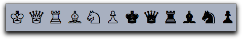
