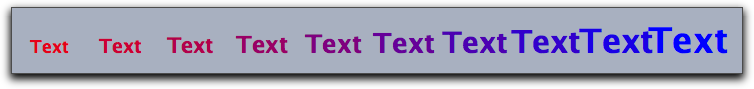
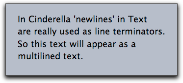
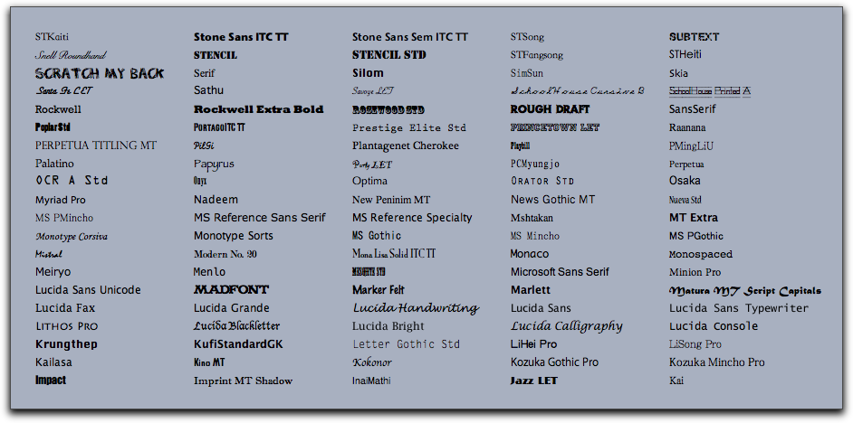
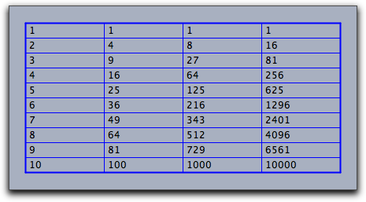
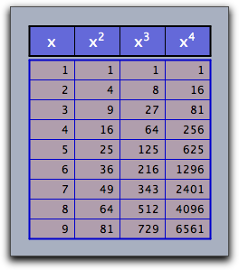

##  Texts and Tables

With CindyScript you can produce controlled and styled text for a drawing.
The essential functionality is covered by the `drawtext` operator.
Furthermore, with `drawtable` a table output can be generated.
Using texts and tables in scripts is very useful, since one can use the script language to control when and where text is displayed in a construction.
This is a very important tool for providing explanatory texts and functional exercises that react to input.

#### Drawing Text: `drawtext(‹vec›,‹expr›)`

**Description:**
The `drawtext(‹vec›,‹string›)` operator plots a text `‹string›` at a specified position that is given by the position vector `‹vec›`.
This position vector can be given either in Euclidean *xy*-coordinates or in homogeneous coordinates.

**Example:**
The line `drawtext(``(0,0),"Hello World")` prints the string "Hello World" with lower left corner at the position (0, 0).

**Modifiers:**
The `drawtext` operator supports several operators for the modification of appearance and position.

| Modifier  | Parameter                | Effect                                                   |
| --------- | ------------------------ | -------------------------------------------------------- |
| `size`    | `‹real›`                 | sets the text size                                       |
| `color`   | `[‹real›,‹real›,‹real›]` | sets the text color                                      |
| `alpha`   | `‹real›`                 | sets the text opacity                                    |
| `xoffset` | `‹real›`                 | set an *x* offset in pixels between text and base point  |
| `yoffset` | `‹real›`                 | set a *y* offset in pixels between text and base point   |
| `offset`  | `[‹real›,‹real›]`        | set an *xy* offset in pixels between text and base point |
| `align`   | `"left", "right", "mid"` | determines where the text alignment should be            |
| `bold`    | `‹bool›`                 | flag for bold text                                       |
| `italics` | `‹bool›`                 | flag for italics text                                    |
| `family`  | `‹string›`               | specifying the font family                               |

Besides the available font families also the three strings `serif`, `sansserif`
and `monospaced` are allowed, that always produce corresponding standard font types.

**Example:**
The code

    > x=1..10;
    > forall(x,i,
    >   drawtext((i,0),"Text",
    >   size->2*i+15,
    >   bold->true,
    >   color->(1-i/10,0,i/10))
    > )

produces the picture below.

|  |
| ----------------------- |
| ****                    |

If the string expression contains a &lt;newline&gt; chacracter then this line-break is literally interpreted.
By this it is easy to produce multilined text, as the following piece of code shows.

    > drawtext((0,0),size->18,
    > "In Cinderella 'newlines' in Text
    > are really used as line terminators.
    > So this text will appear as a
    > multilined text.")

|  |
| -------------------------- |
| ****                       |

------

#### Available font families: `fontfamilies()`

**Description:**
This operator produces a list of all font families that are available on your computer.
Usually this will be quite a lot.
The following piece of code displays the names of some of these font families in their own font style.

    > families=fontfamilies();
    > i=0;
    > while(length(families)>i,i=i+1;
    >    drawtext((mod(i,5)*7,round(i/5)),families_i,family->families_i);
    > )

|  |
| ----------------------- |
| ****                    |

------

#### Unicode Characters: `unicode(‹string›)`

**Description:**
Cinderella can display any Unicode Character in text strings.
To access a unicode character the statement `unicode(‹string›)` accepts a unicode description (a number) given as a string of digits.
It returns a string with the corresponding unicode character.
By default the base of the unicode description is 16.
So hexadecimal descriptions are usually accepted as input.
The base can be changed by a modifier.

The base of the unicode description can be changed with the `base` modifier.

**Example:**
Both `unicode("0041")` and `unicode("65",base->10)` produce the character "A".

------

#### Test whether a string can be displayed: `candisplay(‹string›)`

**Description:**
This operator tests, whether a given string can be displayed in the currently chosen font.
It returns a boolean value.

------

#### Drawing tables: `drawtable(‹vec›,‹list›)`

One- and two-dimensional lists can be easily drawn in a geometric view as tables.
In the simplest form one has only to provide the list and a position where the table should be drawn.
Modifiers can be used to fine tune the appearance of the table.

**Example:**
The following code produces the picture below:

    > x=1..10;
    > table=apply(x,(#,#^2,#^3,#^4));
    > drawtable((0,0),table);

|  |
| ------------------------- |
| ****                      |

**Modifiers:**
The `drawtable` operator supports several modifiers to control the graphical appearance of the table.
A summary of the modifiers is given in the following table:

| Modifier    | Parameter                | Effect                                                               |
| ----------- | ------------------------ | -------------------------------------------------------------------- |
| `width`     | `‹int›`                  | the width of the cells in pixels                                     |
| `height`    | `‹int›`                  | the width of the cells in pixels                                     |
| `flip`      | ``                       | exchanges the role of rows and columns                               |
| `border`    | `‹bool›`                 | turns on/off drawing of lines and borders                            |
| `size`      | `‹real›`                 | sets the text size                                                   |
| `color`     | `[‹real›,‹real›,‹real›]` | sets the text color                                                  |
| `alpha`     | `‹real›`                 | sets the text opacity                                                |
| `offset`    | `[‹real›,‹real›]`        | sets an *xy* offset in pixels between text and base point            |
| `align`     | `"left", "right", "mid"` | determines the horizontal text alignment within a cell               |
| `back`      | `‹bool›`                 | turns on/off the drawing of a table background                       |
| `back`      | `[‹real›,‹real›,‹real›]` | turns on the drawing of table background and sets it to an RGB color |
| `backalpha` | `‹real›`                 | sets opacity of the table background                                 |

**Example:**
The following code is a more elaborate example using the `drawtable` operator.
modifiers are used to create a nice appearance of the tables.
A second table is used to create a heading for the table.

    > x=1..9;
    > tab=apply(x,(#,#^2,#^3,#^4));
    > tab1=("x","$x^2$","$x^3$","$x^4$");
    > linecolor((0,0,.8));
    > drawtable((0,0),tab,
    >   width->50,
    >   height->22,
    >   back->(1,0,0),
    >   backalpha->0.1,
    >   align->"right",
    >   size->12
    > );
    > linecolor((0,0,0));
    > drawtable((0,8.1),tab1,flip->true,
    >   width->50,
    >   height->33,
    >   back->(0,0,1),
    >   backalpha->0.4,
    >   align->"mid",
    >   size->16,
    >   color->(1,1,1)
    > );

|  |
| ------------------------- |
| ****                      |
