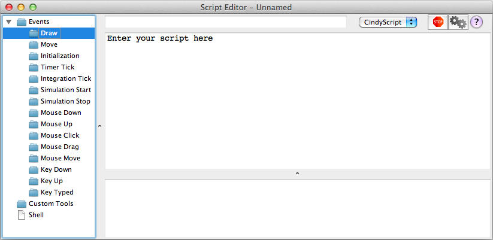

##  Entering CindyScript Code

###  The CindyScript Editor

To enter [CindyScript](CindyScript) one can use the editor that is available from the menu *Scripting/Edit Scripts*.
Here we explain briefly how to use the editor.

####  The Input Window

|  |
| ------------------------------ |
| **The Script Editor**          |

The script editor shows a three pane view.
On the left you see a an overview over all occasions (see below) and the associated scripts.
On the right you see, below a panel that features a start, stop and help button as well as a field to enter script names, a large text area which is used to edit (i.e.
type) scripts, and a smaller text area that shows any output from the scripts.

####  Occasions

Cinderella is highly interactive, and that is the reason for many "occasions" that are suited for triggering the execution of [CindyScript](CindyScript) commands.
On the left side of the script editor you see the available occasions.

Usually, you write scripts for the "Draw" occasion.
These are executed whenever the [view](Views) is rendered.
To edit a script, first click on "Draw".

|          |
| ------------------------------------------- |
| **Entering scripts for the draw occasion.** |

The edit area will display the message "Enter your script here".
Click there, and start entering text.

|  |
| -------------------------------------- |
| ****                                   |

In the view you will notice a diagonal of green points that were created by the script.

|  |
| ----------------------------------- |
| ****                                |

You find an overview over all occasions in [the introduction to CindyScript](CSFundamentals).

###  The Shell

You can also enter [CindyScript](CindyScript) commands and have them executed immediately.
Just choose the "Shell" item from the left panel, and type the commands into the text area on the right.
Pressing shift+enter will execute the command you typed, and you will see the in- and output in the lower text area.
You can use shift-up and shift-down to scroll through a history of commands entered.

|  |
| ------------------------------------ |
| ****                                 |

###  The Command Line

Sometimes it is very convenient to manipulate constructions using CindyScript commands.
You can either do this using the shell window as described above, or, for short commands, you can use the command line integrated into the construction view.
To enable it, choose "Scripting/Command Line" from the menu, or press the corresponding keyboard shortcut Ctrl-Enter (Windows and Unix) or CMD-Enter (Mac OS X).

|    |
| ------------------------------------------ |
| **Using the command line to move a point** |

The command line is located below the status line.
You can enter arbitrary CindyScript functions and evaluate them by pressing the enter key.
If you press shift-enter, the code will be evaluated in the same way, but the command line text field will not be cleared.
You can use this in case you want to issue several similar commands or if you look for the correct syntax by trial-and-error.

If you check the **permanent**-checkbox to the right of the command line, then the code will be stored in the draw occasion and thus will be evaluated whenever the construction is redrawn.
You can access the code by opening the script editor as explained above.

As a quick example we show how to move a point **C** permanently to the midpoint of two points **A** and **B**: Draw the three points, activate the command line, enter `C.xy=(A+B)/2`, and check the **permanent** checkbox.

|  |
| -------------------------------------- |
| **Using the **permanent** checkbox**   |

After pressing enter, **C** will move to the midpoint of **A** and **B** and stays there, even if **A** or **B** moves.
Checking the Script Editor reveals the automatically generated draw occasion script named CommandLine.

|                  |
| --------------------------------------------------- |
| **The automatically generated command line script** |

###  CindyScript and the Inspector

Many text input fields of the [Inspector](Inspector) window accept CindyScript code as input.
The script will only be evaluated once – if you want to make permanent changes you have to use either the command line or the draw occasion in the Script Editor.
After pressing enter, you can still see your [CindyScript](CindyScript) code, but if the input field looses the input focus its value will be replaced with the evaluation result.

|  |
| -------------------------------------- |
| ****                                   |

###  Clickable Buttons

Text objects can be transformed into a clickable button by checking the **Use as button** box in the inspector.
You can attach CindyScript code to the button that will be executed every time the user clicks on it.
As the field for script code is very small we recommend to just call functions defined in the *init* script of the construction.

|  |
| ---------------------------------- |
| ****                               |

###  Other Languages

You can choose the programming language used to interpret a script using the choice box in the top panel.
Available languages are [CindyScript](CindyScript), Python, JRuby and CDY, the internal language that is used to store constructions.
However, currently we only support CindyScript, and this is also the only language you can use in [Cinderella applets](HTML_Export).

|  |
| ---------------------------------------- |
| ****                                     |
