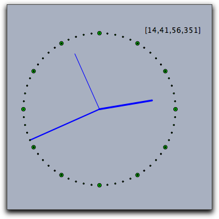

## Timing and Animations

###  Time and Date

CindyScript has an internal clock that provides access to the current date and time.
The clock can be also used to synchronize some automated animations.
Furthermore, an operator is provided that is synchronized with the current timestamp of a running animation or physics simulation.

#### Accessing time: `time()`

**Description:**
This operator returns a list `[h,m,s,ms]` of four integers.
The four values correspond to "hour," "minute," "second," "millisecond" on the computer's clock.

**Example:**
The following code produces a simple clock on a Cinderella view.
The variable `t` contains the time information.
The subsequent code is used to produce a clocklike drawing on the view.
An auxiliary function `p(w)` is defined that produces points on the unit circle.
The code must be placed in the "Tick" section of CindyScript in order for it to run continuously.

    > t=time();
    >
    > p(x):=[sin(2*pi*x),cos(2*pi*x)];
    > O=[0,0];
    > S=p(t_3/60)*4;
    > M=p(t_2/60)*5;
    > H=p((t_1*60+t_2)/(12*60))*3.5;
    > draw(O,S);
    > draw(O,M,size->2);
    > draw(O,H,size->3);
    > apply(1..12,draw(p(#/12)*5));
    > apply(1..60,draw(p(#/60)*5,size->1));
    >
    > drawtext((3,5),t);
    >

|  |
| ------------------------ |
| ****                     |

------

#### Accessing date: `date()`

**Description:**
This operator returns a list `[y,m,d]` of three integers.
The three values correspond to "year," "month," and "day" on the computer's calendar.

------

#### Timestamp: `seconds()`

**Description:**
Returns the time elapsed since the last evaluation of `resetclock()`.
The time is scaled in a way such that one unit corresponds to one second.
The time's resolution is on the millisecond scale.

------

#### Resetting the internal seconds: `resetclock()`

**Description:**
Resets the value of the `seconds()` operator.

------

#### Accessing the timestamp of a simulation: `simulationtime()`

**Description:**
This operator gives a handle to the running time clock synchronized with the progression of an animation or simulation.

**Caution:**
This operator is still experimental.

------

#### Pause the script for a specified time: `wait(‹real›)`

**Description:**
Will completely halt every script execution for a number of milliseconds as given by the parameter.

**Example:**
The following code produces an acoustic jingle.

    > repeat(25,i,
    >   playtone(72+i);
    >   wait(100);
    > )
    >

------

------

###  Animation Control

#### Starting the animation: `playanimation()`

**Description:**
This statement starts the animation.
Also physics simulation in [CindyLab](CindyLab) depend on running animations.

------

#### Pausing the animation: `pauseanimation()`

**Description:**
This statement pauses the animation.

------

#### Stopping the animation: `stopanimation()`

**Description:**
This statement stops the animation.
Stopping an animation also causes the geometric elements to be restored to there original position.

------
