#  Tiny Code Examples

In this section we give a very short demonstration of different CindyScript programming techniques.
Each example presents a small task and a CindyScript implementation that handles it.

------

#####  Center of Gravity

Setting a point *D* to the center of gravity of three other points.
Changing its color on a condition.

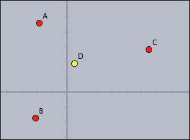

    > //in draw
    > D.xy=(A+B+C)/3;
    > D.color=if(D.x>0,
    >    (1,1,0),
    >    (0,0,1)
    > )

The code is straight forward.
Observe that for setting the coordinate of *D* the assignment is made to `D.xy`.
The conditional at the end returns color values depending on the position of *D*.

------

#####  Selecting and Clustering

Separating points above and below the *x*-axis, and drawing the two clusters.

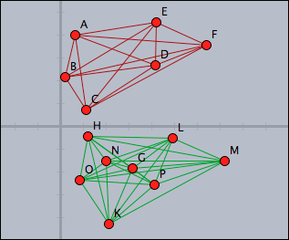

    > //in draw
    > pts=allpoints();
    > above=select(pts,p,p.y>0);
    > below=pts--above;
    > segs=pairs(above);
    > drawall(segs,color->(0.6,0,0));
    > segs=pairs(below);
    > drawall(segs,color->(0,0.6,0))

The points above the *x*-axis are distinguished by using the `select` operator with a suitable condition.
The points below the *x* axes are calculated by using a set difference.
The lines collecting the two clusters can be easily calculated by using the `pairs` operator that calculates all possible pairs in a set.

------

#####  Computing and Drawing a Convex Hull

Calculate the convex hull of all points in a drawing.
Observe the use of the `~›` operator to deal with numeric instabilities.

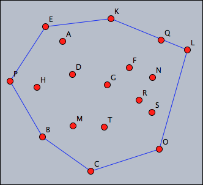

    > //in draw
    > pts=allpoints();
    > leftof(A,B):=select(pts,p,area(A,B,p)~>0);
    > rightof(A,B):=select(pts,p,area(A,B,p)~<0);
    > isedge(A,B):=(leftof(A,B)==[]%rightof(A,B)==[]);
    > segments=pairs(pts);
    > hull=select(segments,seg,isedge(seg_1,seg_2));
    > drawall(hull);

Calculating the convex hull here is performed by a very nice geometric principle: a segment in the convex hull has all the other points on one of its sides.
Here two functions `leftof` and `rightof` are defined that separate the two sides of a segment.
Based on this a predicate `isedge` is defined, that test whether a pair of points forms an edge of the convex hull.
(Notice the usage of the fuzzy comparison `~‹0` to avoid numerical instability).
Finally, all edges of the convex hull are selected and drawn.

------

#####  Creating an Analogue Clock

Create a clock that shows hours, minutes and seconds.
For this, draw a few arrows whose endpoints have appropriate names and enter the following script.

    > //in timerstep
    > t=time();
    > 
    > p(x):=(sin(2*pi*x),cos(2*pi*x));
    > B.xy=p(t_3/60)*4;
    > C.xy=p(t_2/60)*5;
    > D.xy=p((t_1*60+t_2)/(12*60))*3.5;
    > 
    > apply(1..12,i,draw(p(i/12)*5));
    > apply(1..60,i,draw(p(i/60)*5,size->1));
    > 
    > drawtext((3,5),t);

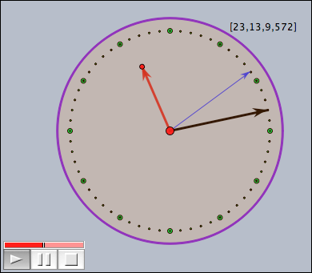

The dots are drawn by the script.
The circle was drawn using a geometric object.

This clock takes advantage of the fact that the `time` operator gives access to the system time of the computer.
The calculations are done in a way that the second hand jumps, while the other two hand seem to move contineously.

------

#####  Closest Point

Mark the point closest to *A* by a large green dot.

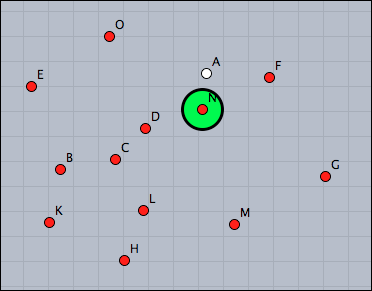

    > //in draw
    > pts=allpoints();
    > s=sort(pts,|#-A|);
    > p=s_2;
    > draw(p,size->20);

Observe that we have to use the second closest point in the script, since *A* is closest to itself.
Another solution would be to remove *A* from the list before sorting it:

    > //in draw
    > pts=allpoints()--[A];
    > s=sort(pts,|#-A|);
    > p=s_1;
    > draw(p,size->20);

------

#####  Simple Ornament

Draw a simple ornament by moving points.
The color of the strokes should resemble the color of the points.

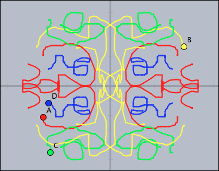

    > //in draw
    > forall(pts,p,
    >    p:"trace"=p:"trace" ++ [p.xy]
    > );
    > 
    > tr0=[[1,0],[0,1]];
    > tr1=[[-1,0],[0,1]];
    > tr2=[[-1,0],[0,-1]];
    > tr3=[[1,0],[0,-1]];
    > 
    > trs=[tr0,tr1,tr2,tr3];
    > 
    > forall(trs,t,
    >  forall(pts,p,
    >    connect((p:"trace")*t,color->p.color,size->2);
    >  );
    > );
    > 
    > //in init
    > pts=allpoints();
    > forall(pts,p,p:"trace"=[]);

Observe that each point stores its own trace in the key variable `"trace"`.
The transformations are performed by two-dimensional matrix multiplications.
By changing the values (and number) of the matrices one can easily crete much more complicated ornaments.

------

#####  Linear Regression

Calculate and draw the line of linear regression to all points.
Mark the squares corresponding to the underlying least square approximation.

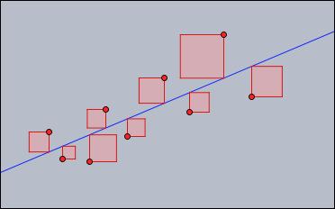

    > //in draw
    > 
    > //Least-square line
    > pts=allpoints();
    > m=apply(pts,(1,#.x));
    > y=apply(pts,#.y);
    > ma=transpose(m)*m;
    > mb=transpose(m)*y;
    > mainv=inverse(ma);
    > v=mainv*mb;
    > f(x):=v_2*x+v_1;
    > plot(f(x));
    > 
    > //Draw the squares
    > 
    > sq(x,y1,y2):=(
    >    d=y2-y1;
    >    p=((x,y1),(x,y2),(x+d,y2),(x+d,y1),(x,y1));
    >    drawpoly(p,color->(1,0.5,0.5),alpha->0.4);
    >    connect(p,color->(.8,0,0));
    > );
    > 
    > forall(pts,sq(#.x,#.y,(f(#.x))));

The code makes use of high level matrix calculations to find the linear regression line.
The calculation follows the standard procedure for this calculation given in a basic course on linear algebra.
By almost literally the same code it is even possible to calculate approximations (least square) by a whole set of base functions.

#####  Sunflower

Create a nice version of the sunflower applet from the tutorial.

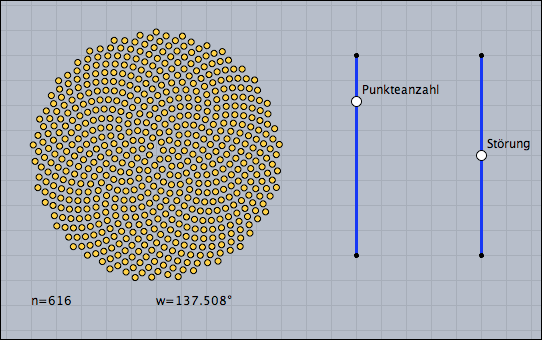

    > //in draw
    > n=round(100*|B,E|);
    > d=0.01*(|D,F|/|D,C|-.5);
    > ang=137.508°+d;
    > repeat(n,i,
    >   w=ang*i;
    >   r=sqrt(i)*.2;
    >   p=(sin(w),cos(w))*r;
    >   draw(p,color->(1,0.8,0));
    > );
    > drawtext((-5,-6),"n="+n);
    > drawtext((0,-6),"w="+180*ang/pi+"¡");

This code relies on the effect that a very certain angle `ang=137.508°` produces a dense packing under the growth behavior of a sunflower.
The example also illustrates that disturbing this angle a bit immediately leads to very prominent spirals, where the packing is not very isotropic.

------

#####  Function Plotter

Implement a function plotter with a freely enterable function and adjustable parameters.

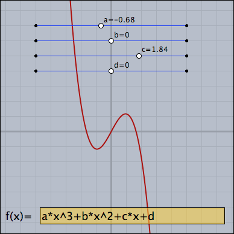

    > //in draw
    > 
    > //Parameter sliders
    > a=K.x;
    > b=L.x;
    > c=M.x;
    > d=N.x;
    > drawtext(K+(0.2,0.2),"a="+a);
    > drawtext(L+(0.2,0.2),"b="+b);
    > drawtext(M+(0.2,0.2),"c="+c);
    > drawtext(N+(0.2,0.2),"d="+d);
    > 
    > //Parse and plot
    > f(x):=parse(Text0.val);
    > plot(f(x),color->red(0.6),size->2);

The function is entered in a Cinderella input field called *Text0*.
The text in this input field is directly parsed.
The parameters are taken from the geometrically drawn sliders.

------

#####  Color Mixing

Simulate additive color mixing of three light bulbs (red, green and blue).
The lamps are be represented by geometric points *A*, *B* and *C*.

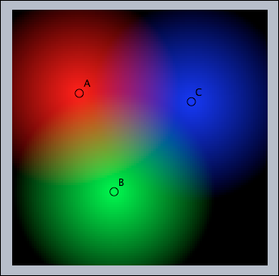

    > //in draw
    > 
    > colorplot(
    >  (1-|#,A|/4,
    >   1-|#,B|/4,
    >   1-|#,C|/4),
    >  (-5,-5),(5,5),pxlres->3
    > )

This color mixer is indeed extremely simple.
It makes use of the fact that one can directly calculate the slots of an RGB color vector.
The `colorplot` command does essentially all the rest of the work.

------

#####  Julia Sets

Calculate and draw the Julia set, a well known fractal, determined by the complex number represented by the point *C*.

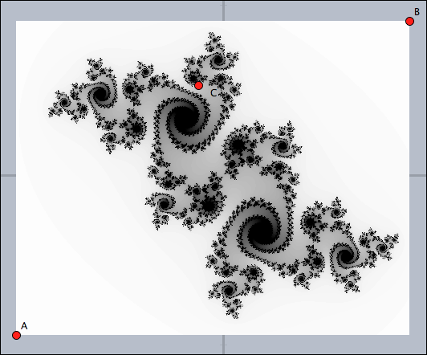

    > //in draw
    > 
    > g(z,c):=z^2+c;
    > 
    > julia(z):=(
    >   iter=0;
    >   while(iter<100 & |z|<2,
    >     z=g(z,complex(C.xy));
    >     iter=iter+1;
    >   );
    >   1-iter/100;
    > );
    > 
    > colorplot(julia(complex(#))
    >    ,A,B,startres->16,pxlres->1);

Again using the `colorplot` command is the most powerful approach to this task.
The function `julia` above iteratively calculates the color of each pixel.
Using `startres` and `pxlres` ensures a fluent user experience.

------

#####  Swarm Simulation

Simulate a swarm of fish.
Each fish should try to swim in the same direction as its neighbors and try to swim to the approximate place where the neighbors are.
All fish should avoid an obstacle given by a point *U*.
To try this create some masses and make sure that one is labelled *U* or change the according line in the script.
Also build a fence with bouncers around the “aquarium”.

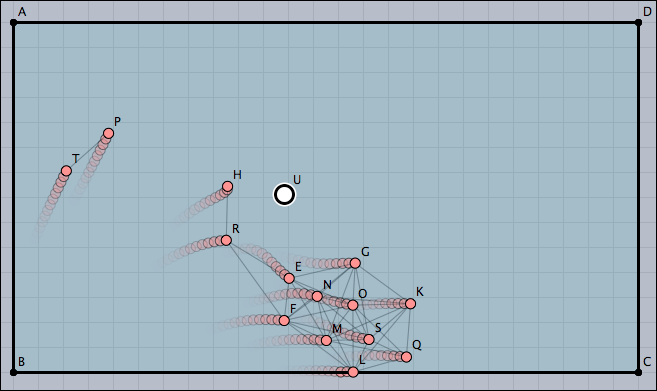

    > //in draw
    > 
    > ms=allmasses()--[U];
    > lim=0.5;
    > apply(ms,m,
    >   near=select(ms,p,|p-m|<4);
    >   avg=sum(near,m,m.v)/length(near);
    >   m.v=m.v+.2*(avg);
    >   if(|m.v|>lim,m.v=lim*m.v/|m.v|);
    >   //Draw connections
    >   apply(near,draw(#,m,color->(0,0,0),alpha->0.2));
    > );

Here all fish (as well as the obstacle) are modeled by masses with a positive charge.
By this they push each other away.
The script makes corrections to the velocity of each point.
The behavior generated by this very simple algorithm is amazingly rich and looks quite convincing.
