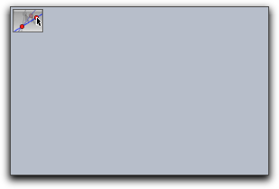
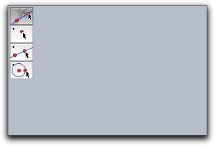
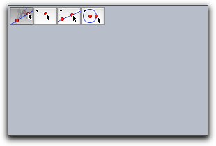
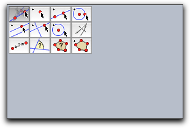
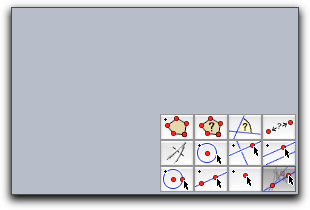

## User Input

Sometimes it is necessary to handle user input by mouse or the keyboard explicitly.
There are special evaluation times “Mouse Down”, “Mouse Up”, “Mouse Click”, “Mouse Drag”, and “Key Typed” for this (see [Entering Program Code](Entering_Program_Code.md)).
These evaluation times are captured exactly when the corresponding events occur.
If one wants to react to the corresponding event data, there are several operators that read the input data.

### Mouse and Key

#### Mouse position: `mouse()`

**Description:**
Returns a vector that represents the current position of the mouse or of a single contact on a touch-capable device.
The vector is given in two-dimensional Euclidean coordinates.

The modifier `id` can be used to access the position of a particular multi-touch-event. Hence, `mouse(id->multiid())` returns the position of the current touch. See also the section on [Single and multi-touch](#single-and-multi-touch)

---

---

#### Key input: `key()`

**Description:**
Returns a string that contains the last typed character.

---

#### Is a certain key pressed: `iskeydown(‹int›)`

**Not available in CindyJS yet!**

**Description:**
This operator returns a boolean value that is true if a certain key is pressed.
The key in question is specified by the integer in the argument.
This operator can be used to determine for instance the _shift_ key is pressed.
The codes for keys are usually 65, 66, 66, …
for 'A', 'B', 'C',…
Codes for 'shift', 'crtl' and 'alt' are usually 16, 17, 18.

---

#### List of all pressed keys: `keydownlist()`

**Not available in CindyJS yet!**

**Description:**
This operator returns a list of the codes of all pressed keys.
An interesting application of the keydown list id given in the chapter on MIDI functions, where you find an example [keyboard piano](MIDI_Functions.md#a-keyboard-piano).

---

---

### Single and multi-touch

Single-touch events are accessible [as it was a mouse](#mouse$0). On multi-touch devices, only contacts that were initialized as unique single touches are handled as the mouse with the corresponding `mousedown`, possible multiple `mousedrag` and `mouseup`-events. Subsequent contacts are ignored as corresponding mouse-events. This guarantees that the mouse-events always appear in this order.

CindyJS can also handle inputs from touch-based devices through scripting. The modification of geometric objects, if not manually scripted, is currently not implemented in a multi-touch way.

Any contact with the surface gives rise to a sequence of a single _multidown_-event, possible multiple _multidown_-events, and a final _multiup_-event. Possibly with multiple fingers involved, there is no guarantee on the order of all fired events anymore. However, every particular contact is associated with an id that is unique during the contact. This id can be accessed through `multiid()`. The mouse with a pressed button also triggers the sequence of these multi-events and will always have the id 0.
The `multidown`-script is invoked after a finger got down (or the mouse got pressed). `multidrag` is invoked when a finger on the screen (or the mouse with a pressed button) moves and `multiup` is invoked if a finger (or the mouse button) is released. The scripts are invoked in this sequence for a particular touch with fixed id.

#### Getting the current multi-id: `multiid()`

This function returns the unique id of the current touch. For the mouse and during the executions from scripts different from the `multidown`, `multidrag` and `multiup` it will be `0`.
For any contact with the screen, the id is initialized to the unique smallest positive integer that is not used for any other touch at the moment. The id will remain constant and until the corresponding finger is released. `multiid()` returns the id of the current contact.

---

#### Obtain a list of all active touch events: `multiidlist()`

`multiidlist()` returns the list of the ids of all active touch events. If the (physical) mouse is down, then `0` is contained in the list.

The positions of the touches can be read through [mouse()](#mouse$0) with the modifier `id`.

---

---

### AMS Data on Gravity

On Apple hardware, CindyScript can access the gravity sensor of a laptop and determine its relative orientation in space.
The gravity sensor returns a three dimensional vector.

#### Getting raw AMS data: `amsdata()`

**Not available in CindyJS yet!**

**Description:**
This operator returns the raw data of the AMS sensor.

---

#### Getting calibrated AMS data: `calibratedamsdata()`

**Not available in CindyJS yet!**

**Description:**
This operator returns a calibrated version of the AMS sensor data.
The calibrated data is a vector of unit length that represents the orientation of the computer in space.

---

---

### Creating Custom Toolbars in a View

Cinderella can be used to export interactive worksheets to an html page.
Very often it is desirable not only to export an interactive construction but also a set of construction tools along with it (like buttons for constructing points, lines or circles).
By using the following set of CindyScript operations it is easily possible to create (and remove) custom toolbars that reside within an applet window.

Toolbars are in particular important for creating interactive student exercises.

---

#### Creating a custom toolbar: `createtool(‹string›,‹int›,‹int›)`

**Description:**
Shorthand for `createtool([[‹string›]],‹int›,‹int›)` to create a single tool.

#### Creating a custom toolbar: `createtool(‹list›,‹int›,‹int›)`

**Description:**
Creates one or many tool buttons in a CindyJS view.
The first argument is either a string that describes a single construction tool or a list or matrix of strings that describe an entire toolbar.
The other two arguments describe the position relative to a corner of the screen in pixel distances.
Normally a `createtool` statement is located in the `init` script.

The following string identifiers that correspond to the construction tools are available in Cinderella or CindyJS.
Those in parentheses are not supported by CindyJS yet.

-   **General:**
    `"Move"`,
    `"Delete"`
-   **Points:**
    `"Point"`,
    `"Intersection"`,
    `"Mid"`,
    (`"Center"`)
-   **Lines:**
    `"Line"`,
    `"Segment"`,
    (`"Line Through"`),
    `"Parallel"`,
    `"Orthogonal"`,
    (`"Angle Bisector"`)
-   **Circles:**
    `"Circle"`,
    (`"Circle by Radius"`),
    `"Compass"`,
    (`"Circle by 3"`),
    (`"Arc"`)
-   **Conics:**
    (`"Conic by 5"`),
    (`"Ellipse"`),
    (`"Hyperbola"`),
    (`"Parabola"`)
-   **Special:**
    (`"Polar Point"`),
    (`"Polar Line"`),
    (`"Polygon"`),
    (`"Reflection"`),
    (`"Locus"`)
-   **Measure:**
    (`"Distance"`),
    (`"Angle"`),
    (`"Area"`)

It is also possible to add construction tools from CindyLab:

-   **Local:**
    (`"Mass"`),
    (`"Velocity"`),
    (`"Rubberband"`),
    (`"Spring"`),
    (`"Coulomb"`)
-   **Environments:**
    (`"Gravity"`),
    (`"Sun"`),
    (`"Floor"`),
    (`"Bouncer"`),
    (`"Magnet"`)

The position of the tools is fixed relative to the construction view.
By default the upper left corner is chosen.
By using the modifyer `reference` one can also choose the other corners.
Allowed values for this modifier are `"UL", "UR", "LL", "LR"`.
Here the first letter stands for _upper/lower_ and the second letter stands for _left/right_.

**Modifiers:**
The createtool operator can handle the modifiers summarized in the following table:

| Modifier    | Parameter  | Effect                                     |
| ----------- | ---------- | ------------------------------------------ |
| `reference` | `‹string›` | reference position                         |
| `flipped`   | `‹bool›`   | `flipped->true` exchanges rows and columns |
| `space`     | `‹int›`    | spacing (in pixels) between tools          |
| `toolbar`   | `‹string›` | id of the HTML element to receive buttons  |

**Examples:**
The simplest usage is for instance given by the following piece of code.
The tool created by

    > createtool("Move",2,2);

More complicated examples that create toolbars with several tools are given below

    > createtool(["Move","Point","Line","Circle"],2,2);

    > createtool(["Move","Point","Line","Circle"],2,2,flipped->true);

    > createtool(
    >  [
    >   ["Move","Point","Line","Circle"],
    >   ["Parallel","Orthogonal","Circle by Radius","Compass"],
    >   ["Distance","Angle","Area","Polygon"],
    >  ]
    > ,2,2,flipped->false);

    > createtool(
    > …same as example above…
    > ,reference->"LR");

---

#### Removing a tool from a custom toolbar: `removetool(‹string›)`

**Not available in CindyJS yet!**

**Description:**
Removes a tool from the custom toolbar.

---

#### Removing all custom toolbars: `removetools()`

**Not available in CindyJS yet!**

**Description:**
Removes all tools from the custom toolbar.
